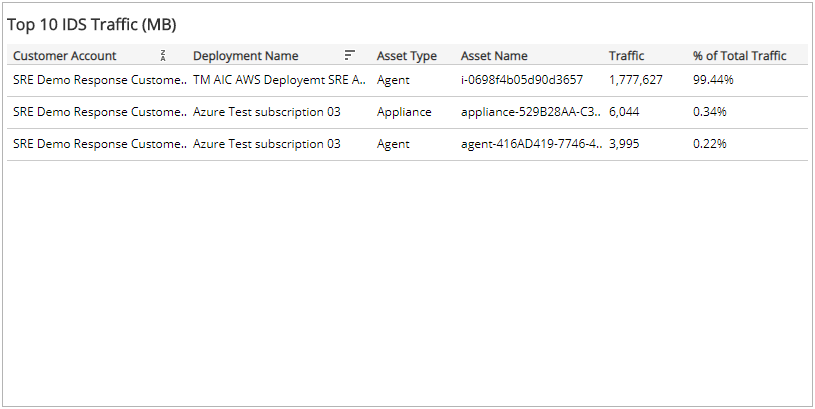
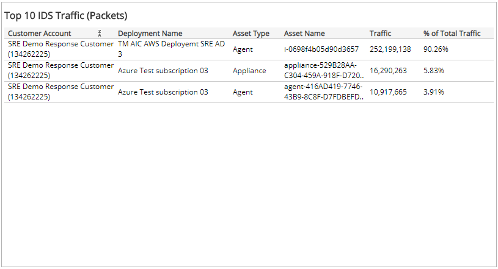

# Top 10 IDS Assets

This report provides visibility into the top 10 sources of IDS traffic volume processed in your environment, listed by megabytes and packets. Use this report to support IDS configuration and optimization efforts in your environment.

To access the Top 10 IDS Assets Traffic report:

1. In the Alert Logic console, click the menu icon (), and then click **Validate**.
2. Click **Reports**, and then click **Service**.
3. Under **Capability Usage**, click **VIEW**.
4. Click **Top 10 IDS Assets**.

## Filter the report

To refine your findings, filter your report by  **Date Range**, **Customer Account**, **Deployment Name**, and **Asset Type**.

### Filter the report using drop-down menus

By default, Alert Logic includes **(All)** filter values in the report.

**To add or remove filter values: **

1. Click the drop-down menu in the filter, and then select or clear values.
2. Click **Apply**.

### Top 10 IDS Traffic in Megabytes section

The list displays the assets that processed the most IDS traffic volume, measured in megabytes, during the selected period. The list is organized by customer account, deployment name, asset type, asset name, traffic in MBs, and percentage of the total traffic.

### Top 10 IDS Traffic in Packets section

The list displays the assets that processed the most IDS traffic volume, measured in packets, during the selected period. The list is organized by customer account, deployment name, asset type, asset name, traffic in packets, and percentage of the total traffic.

