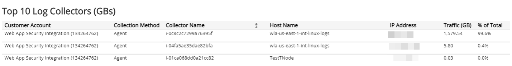
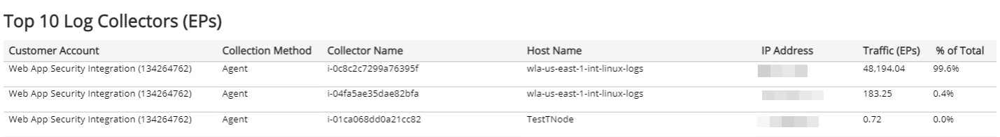
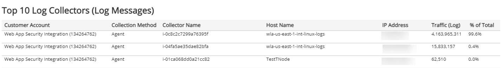

# Top 10 Log Collectors

The Top 10 Log Collectors report provides visibility into the log collector volume with top ten collector lists measured by GBs, EPs, or log messages. Use this report to support log collection configuration and optimization efforts in your environment.

To access the Top 10 Log Collectors report:

1. In the Alert Logic console, click the menu icon (), and then click **Validate**.
2. Click **Reports**, and then click **Service**.
3. Under **Capability Usage**, click **VIEW**.
4. Click **Top 10 Log Collectors**.

## Filter the report

To refine your findings, filter your report by  **Month**, **Customer Account**, and **Deployment Name**.

### Filter the report using drop-down menus

By default, Alert Logic includes **(All)** filter values in the report.

**To add or remove filter values: **

1. Click the drop-down menu in the filter, and then select or clear values.
2. Click **Apply**.

### Top 10 Log Collectors (GBs) section

The list displays the collectors that processed the most volume, measured in gigabytes, during the selected period. The list is organized by customer account, collection method, collector name, host name, IP address, traffic in GBs, and percentage of the total traffic.

### Top 10 Log Collectors (EPs) section

The list displays the collectors that processed the most volume, measured in events per second, during the selected period. The list is organized by customer account, collection method, collector name, host name, IP address, traffic in EPs, and percentage of the total traffic.

### Top 10 Log Collectors (Log Messages) section

The list displays the collectors that processed the most volume measured in log messages during the selected period. The list is organized by customer account, collection method, collector name, host name, IP address, traffic in log messages, and percentage of the total traffic.

