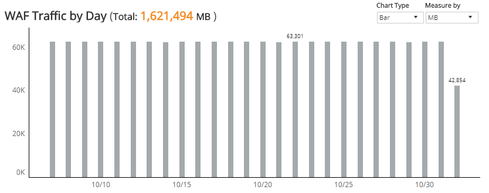
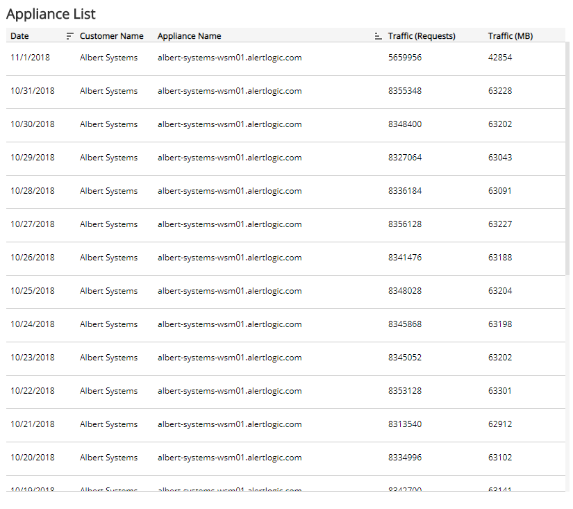

#  WAF Traffic

The WAF Traffic report provides visibility into WAF traffic volume and requests processed in your environment, including WAF traffic per day measured by request or data size (in MB), and an appliance list with traffic requests and data size. Use this report to support WAF configuration and optimization efforts in your environment.

To access the WAF Traffic report:

1. In the Alert Logic console, click the menu icon (), and then click **Validate**.
2. Click **Reports**, and then click **Service**.
3. Under **Capability Usage**, click **VIEW**.
4. Click **WAF Traffic**.

## Filter the report

To refine your findings, filter your report by  **Date Range**, **Customer Account**, and **Appliance Name**.

### Filter the report using drop-down menus

By default, Alert Logic includes **(All)** filter values in the report.

**To add or remove filter values: **

1. Click the drop-down menu in the filter, and then select or clear values.
2. Click **Apply**.

## WAF Traffic by Day section

The bar graph displays the daily traffic volume in the selected filters. You can display the data as a line or bar chart. Click the **Chart Type** drop-down on the top right of the graph, and then select the chart type you want to see. You can also view the data measured  by request or data size (in MB). Click the **Measure by** drop-down, and then select how you want the data measured.

## Appliance List section

The list displays the daily traffic volume by request and megabytes processed by the WAF appliances in your environment for the selected period. The list is organized by date, customer name, appliance name, traffic requests, and traffic (in MB).

