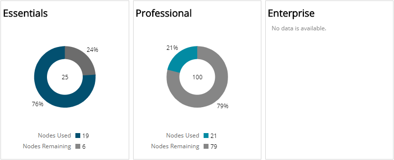
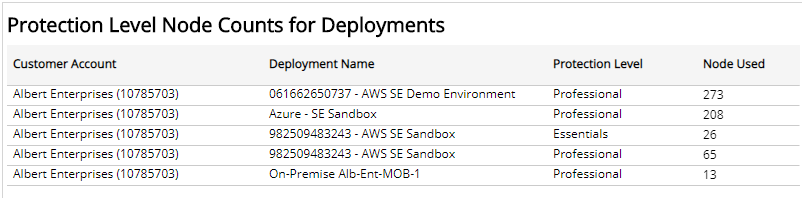
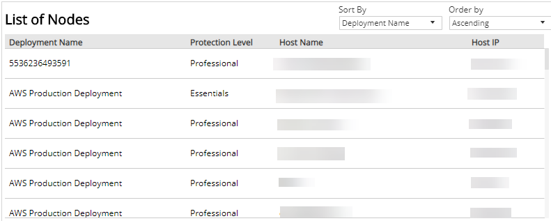

# Entitlement Summary

The Entitlement Summary report provides a daily summary of your entitlement and usage, including count and percentage of nodes used, nodes remaining, and list of deployments with the protected node counts.

Use this report to confirm entitlement node counts are consistent with what you purchased, determine subscription levels of protection are correct, and make adjustments to optimize usage and predict costs.

To access the Entitlement Summary report:

1. In the Alert Logic console, click the menu icon (), and then click **Validate**.
2. Click **Reports**, and then click **Service**.
3. Under **Entitlement**, click **VIEW**.
4. Click **Entitlement Summary**.

## Filter the report

To refine your findings, filter your report by  **Date Range**, **Customer Account**, and **Deployment Name**.

### Filter the report using drop-down menus

By default, Alert Logic includes **(All)** filter values in the report.

**To add or remove filter values: **

1. Click the drop-down menu in the filter, and then select or clear values.
2. Click **Apply**.

## Protection Level Nodes section

This section provides color-coded donut charts for each protection level—Essentials, Professional, and Enterprise—that indicate the percentage of nodes being used and the percentage of nodes remaining in the selected filters. The total count of nodes used and nodes remaining are provided in the color-code legend.

If you have  usage-based billing (UBB), the chart always displays 100 percent for nodes being used and zero for nodes remaining in the selected filters.

If you are not entitled to a protection level, or if you do not have usage-based billing, the chart appears blank.

## Protection Level Nodes Counts for Deployments section

This section displays the list of deployments in your environment with the node counts for each protection level. The list is organized by customer account, deployment name, protection level, and the number of protected nodes used in each deployment in the selected filters.

## List of Nodes

This section shows a current list of protected nodes in your deployments for the selected date range. By default, the list is sorted by deployment name and organized in ascending order. You can set the list to sort by any of the following items:

* Deployment name
* Protection level
* Host name
* Host IP

You can also use the drop-down list to organize the list by **Ascending** or **Descending** order.  The list is organized by deployment, protection level, host name, and host IP.

