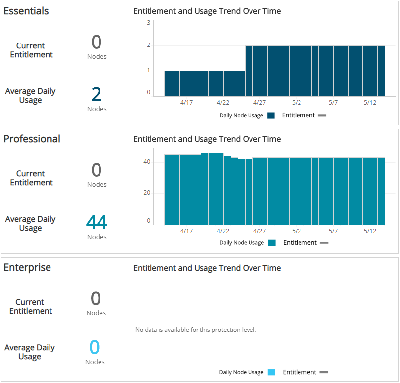
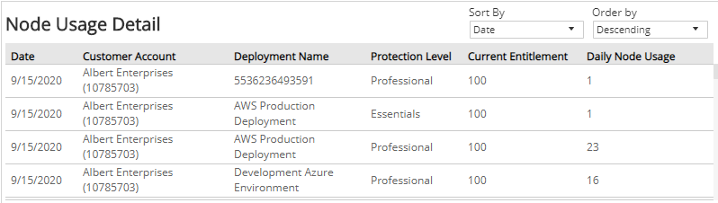

# Entitlement Usage Trends

The Entitlement Usage Trends report provides a summary of your entitlement usage, including nodes used trends and entitlement change trends.

Use this report to confirm entitlement node count changes are consistent with what you purchased, determine subscription levels of protection are aligned with changes in your environment, and identify patterns to keep cost predictable.

To access the Entitlement Usage Trends report:

1. In the Alert Logic console, click the menu icon (), and then click **Validate**.
2. Click **Reports**, and then click **Service**.
3. Click **Entitlement**, and then click **Entitlement Usage Trends**.

## Filter the report

To refine your findings, filter your report by  **Entitlement Day**, **Customer Account**, and **Deployment Name**.

### Filter the report using drop-down menus

By default, Alert Logic includes **(All)** filter values in the report.

**To add or remove filter values: **

1. Click the drop-down menu in the filter, and then select or clear values.
2. Click **Apply**.

## Entitlement and Usage Trend Over Time section

This section provides the current entitlement of nodes, the average daily node usage,  a bar graph with the daily node usage count, and a line to illustrate your entitlement trend over time for each protection level (Essentials, Professional, Enterprise).

If you have  usage-based billing (UBB), the bar graph shows the daily nodes usage without an entitlement trend line. The graph displays only the average daily node usage, and the current entitlement count is always zero.

## Node Usage Detail section

This sections lists details about your entitlements and daily node usage for each deployment  for the selected date range. By default, the list is sorted by date and organized in descending order. You can set the list to sort by any of the following items:

* Date
* Customer account
* Deployment name
* Protection level
* Current entitlement
* Daily node usage

You can also use the drop-down list to organize the list by **Ascending** or **Descending** order.  The list is organized by date, customer account, deployment, protection level, current entitlement, and daily node usage.

