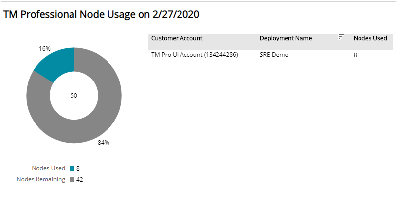
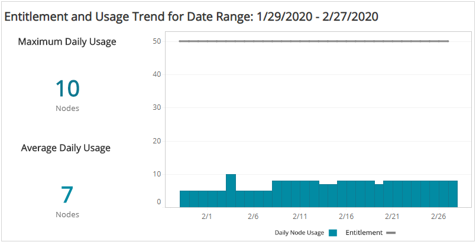

# TM Professional Entitlement Summary

The TM Professional Entitlement Summary report provides a daily summary of your TM Professional entitlement and usage, including count of nodes used, nodes remaining, usage for your deployments, and trends of nodes used and entitlement changes.

Use this report to confirm entitlement node counts are consistent with what you purchased,  make adjustments to optimize usage, and predict costs.

To access the TM Professional Entitlement Summary report:

1. In the Alert Logic console, click the menu icon (), and then click **Validate**.
2. Click **Reports**, and then click **Service**.
3. Under **Entitlement**, click **VIEW**.
4. Click **TM Professional Entitlement Summary**.

## Filter the report

To refine your findings, filter your report by  **Date Range**, **Customer Account**, and **Deployment Name**.

### Filter the report using drop-down menus

By default, Alert Logic includes **(All)** filter values in the report.

**To add or remove filter values: **

1. Click the drop-down menu in the filter, and then select or clear values.
2. Click **Apply**.

## TM Professional Node Usage section

This section provides a color-coded donut chart that indicates  the percentage of nodes being used and the percentage of nodes remaining in the selected filters. The total count of nodes used and nodes remaining are provided in the color-coded legend.

## Entitlement and Usage Trend

This section provides the current maximum daily node usage, the average daily node usage,  a bar graph with the daily node usage count, and a line to illustrate your entitlement trend over the selected date range. In addition, the list of deployments in your environment is provided with the node counts for each protection level. The list is organized by customer account, deployment name, and the number of protected nodes used in each deployment in the selected filters.

