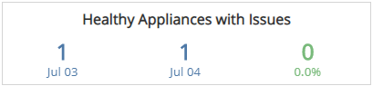
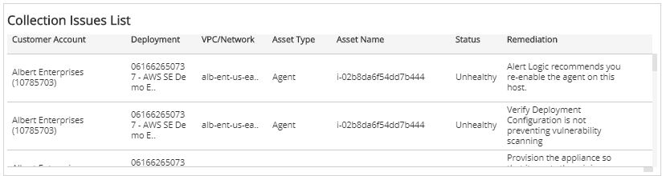

# Collection Issues Digest

The Collection Issues Digest report provides insight into the daily issues related to log data collection and Network IDS traffic, including a comparison of health statuses, top five lists, and a list of open remediations to fix configuration issues. Use this report to fix collection issues and support optimization efforts in your environment.

To access the Collection Issues Digest report:

1. In the Alert Logic console, click the menu icon (), and then click **Validate**.
2. Click **Reports**, and then click **Service**.
3. Under **Health**, click **VIEW**
4. Click **Collection Issues Digest**.

## Filter the report

To refine your findings, filter your report by  customer account, platform, deployment name, date, and status.

### Filter the report using drop-down menus

By default, Alert Logic includes **(All)** filter values in the report.

**To add or remove filter values: **

1. Click the drop-down menu in the filter, and then select or clear values.
2. Click **Apply**.

## Healthy Appliances with Issues section

This section provides the count of appliances with issues in healthy statuses for the selected date and the day before, and the percentage change between the two dates.

## Healthy Agents with Issues section

This section provides the count of agents with issues in healthy statuses for the selected date and the day before, and the percentage change between the two dates.

## Unhealthy Appliances section

This section provides the count of appliances in unhealthy statuses for the selected date and the day before, and the percentage change between the two dates.

## Unhealthy Agents section

This section provides the count of agents in unhealthy statuses for the selected date and the day before, and the percentage change between the two dates.

## Top Appliance Remediations section

The list displays the open remediations impacting collection on the most appliances on the selected date. The list is organized by the remediation summary, appliance count, and the percentage of the total remediations, along with a  percentage bar.

## Top Agent Remediations section

The list displays the open remediations impacting the most agents on the selected date. The list is organized by the remediation summary, agent count, and the percentage of the total remediations, along with a  percentage bar.

## Top Impacted Deployments (Appliance) section

The list displays the deployments with appliances with the most open configuration remediations on the selected date. The list is organized by customer account, deployment name, remediation count, and the percentage of the total remediations, along with a  percentage bar.

## Top Impacted Deployments (Agent) section

The list displays the deployments with agents with the most open configuration remediations on the selected date. The list is organized by customer account, deployment name, remediation count, and the percentage of the total remediations, along with a  percentage bar.

## Collection Issues List section

The list displays the open configuration remediations to fix collection issues with the appliances and agents in your deployments for the selected date. The list is organized by customer account, deployment name, VPC or network name, asset type, asset name, status, and the remediation summary.

