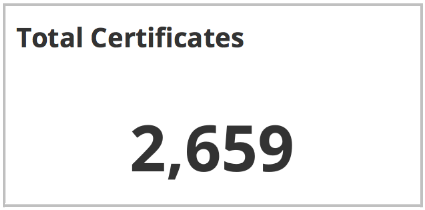
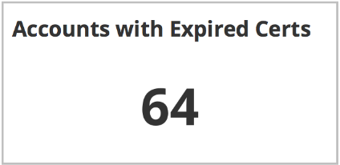
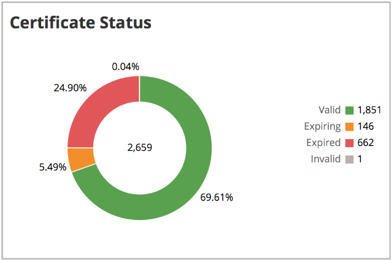
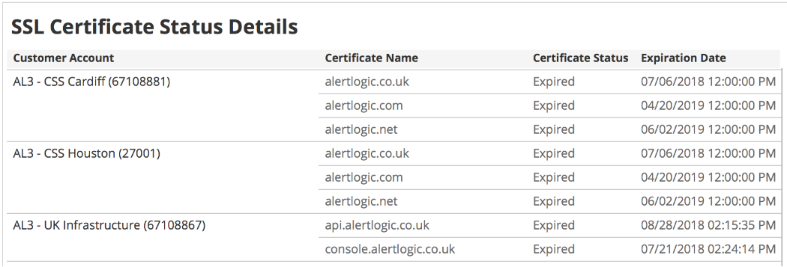

# SSL Certification Expiration Status

The SSL Certification Expiration Status report provides insights into the statuses of SSL keys and certificates that are used on Alert Logic appliances to decrypt network traffic. Use this report to be aware of approaching expiration dates of SSL keys and certificates, and then take appropriate actions to avoid expired certificates and degraded performance.

For information about managing SSL keys and certificates, see [Certificates and Keys](../../../../configure/certificates-keys.md).

To access the SSL Certification Expiration Status report:

1. In the Alert Logic console, click the menu icon (), and then click **Validate**.
2. Click **Reports**, and then click **Service**.
3. Under **Health**, click **VIEW**.
4. Click **SSL Certification Expiration Status**.

## Filter the report

To refine your findings, filter your report by  customer account and certificate status.

### Filter the report using drop-down menus

By default, Alert Logic includes **(All)** filter values in the report.

**To add or remove filter values: **

1. Click the drop-down menu in the filter, and then select or clear values.
2. Click **Apply**.

## Total Certificates section

This section provides the total count of all the SSL certificates that are used on Alert Logic appliances to decrypt network traffic.

## Accounts with Expired Certs section

This section provides the total count of your managed accounts with expired SSL certificates.

## Certificate Status section

This section provides  a color-coded donut chart with the following statuses of the SSL certificates in your managed accounts:

* **Valid**—Certificates in this status will expire in more than 30 days.
* **Expiring**—Certificates in this status will expire within the next 30 days.
* **Expired**—Certificates in this status have expired.
* **Invalid**—Certificates in this status have failed decoding.

## SSL Certificate Status Details section

The list displays the status details for the SSL certificates. The list is organized by the customer account, certificate name, status, and expiration date.

