# Monthly Health Summary

The Monthly Health Summary report provides insight into the monthly issues in your environment related to your protected network health status, data collection and network IDS traffic, and hosts missing agents. This report is composed of three sections: Network Health Status, Collection Issues, and Missing Agent. Use this report to improve network protection, fix configuration issues, and support optimization efforts in your environment.

To access the Monthly Health Summary report:

1. In the Alert Logic console, click the menu icon (), and then click **Validate**.
2. Click **Reports**, and then click **Service**.
3. Under **Health**, click **VIEW**
4. Click **Monthly Health Summary**.

## Filter the report

To refine your findings, filter your report by  customer account, deployment name, and month.

### Filter the report using drop-down menus

By default, Alert Logic includes **(All)** filter values in the report.

**To add or remove filter values: **

1. Click the drop-down menu in the filter, and then select or clear values.
2. Click **Apply**.

## Network Health Status

The Network Health Status section provides the monthly counts and percentage changes of your network statuses, and the top networks impacted by open configuration remediations.

### Healthy Networks section

This section provides the total count of networks in healthy statuses for the last day of the previous month and the selected month, and the total change with the percentage change between the two months.

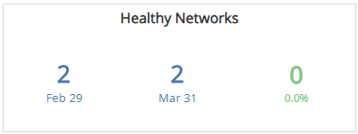

### Unhealthy Networks section

This section provides the total count of networks in unhealthy statuses for the last day of the previous month and the selected month, and the total change with the percentage change between the two months.

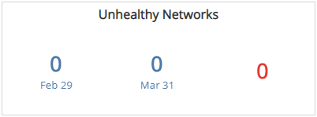

### Top 10 Impacted Networks section

The list displays the networks with the most open configuration remediations for the selected month. The list is organized by customer account, deployment name, VPC or network name, remediation count, and the percentage of the total remediations, along with a  percentage bar.

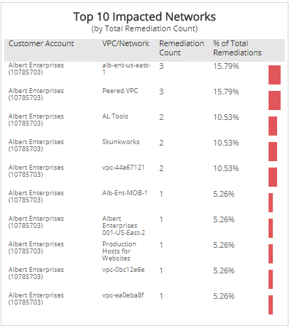

## Collection Issues 

The Collection Issues section provides the monthly counts and percentage changes of your appliances and agents, and top lists of impacted agents, appliances, and deployments with the most missing open configuration remediations.

### Healthy Appliances with Issues section

This section provides the total count of appliances with issues in healthy statuses for the previous month and the selected month, and the total change with the percentage change between the two months.

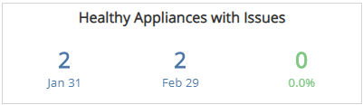

### Healthy Agents with Issues section

This section provides the total count of agents with issues in healthy statuses for the previous month and the selected month, and the total change with the percentage change between the two months.

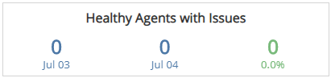

### Unhealthy Appliances section

This section provides the total count of appliances in unhealthy statuses for the previous month and the selected month, and the total change with the percentage change between the two months.

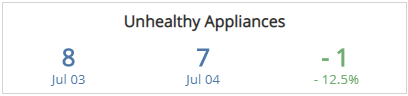

### Unhealthy Agents section

This section provides the total count of agents in unhealthy statuses for the previous month and the selected month, and the total change with the percentage change between the two months.

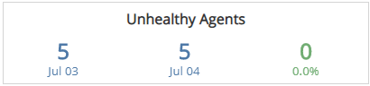

### Top Appliance Remediations section

The list displays the open configuration remediations impacting collection on the most appliances on the selected month. The list is organized by the remediation summary, appliance count, and the percentage of the total remediations, along with a  percentage bar.

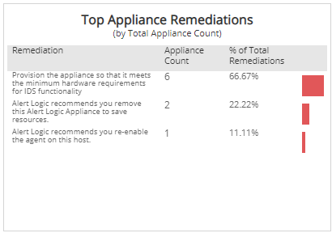

### Top Agent Remediations section

The list displays the open configuration remediations impacting the most agents on the selected month. The list is organized by the remediation summary, agent count, and the percentage of the total remediations, along with a  percentage bar.

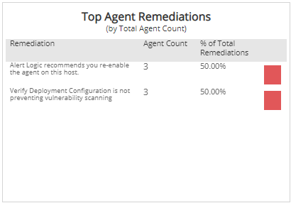

### Top Impacted Deployments (Appliance) section

The list displays the deployments with appliances with the most open configuration remediations on the selected month. The list is organized by customer account, deployment name, remediation count, and the percentage of the total remediations, along with a  percentage bar.

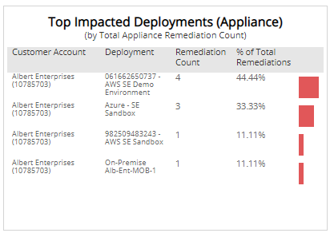

### Top Impacted Deployments (Agent) section

The list displays the deployments with agents with the most open configuration remediations on the selected month. The list is organized by customer account, deployment name, remediation count, and the percentage of the total remediations, along with a  percentage bar.

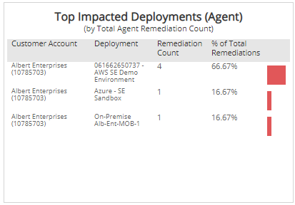

## Missing Agent

The Missing Agent section provides the monthly statuses, count and percentage changes of missing agents, and top lists of impacted deployments, platform, and hosts that are missing agents.

### Missing Agent Status section

This section provides  a color-coded donut chart with the monthly total host count, and the counts and percentages for hosts with agents installed and for hosts with agents missing for the selected month.

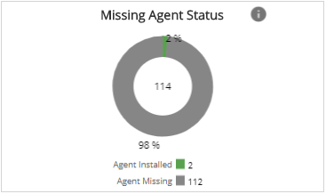

### Missing Agent Change section

This section provides the count of missing agent change for the previous month and the selected month, and the total change with the percentage change between the two months.

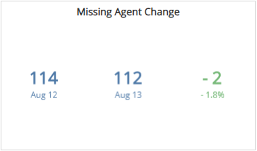

### Top Impacted Deployments section

This section displays the top ten impacted deployments with the most hosts missing agents on the selected month. The section lists the customer account, deployment name, missing agent counts, and percentages of total missing agents, along with a percentage bar, for the selected month.

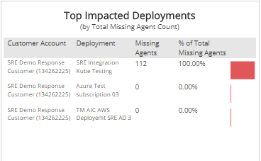

### Platforms section

The section lists the platform, missing agent counts, and percentages of total missing agents, along with a percentage bar, for the selected month.

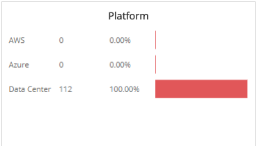

### List of Hosts with Missing Agent section

This list displays the hosts with the missing agents for the selected month. The list is organized by customer account, deployment name, VPC or network name, host, and status.

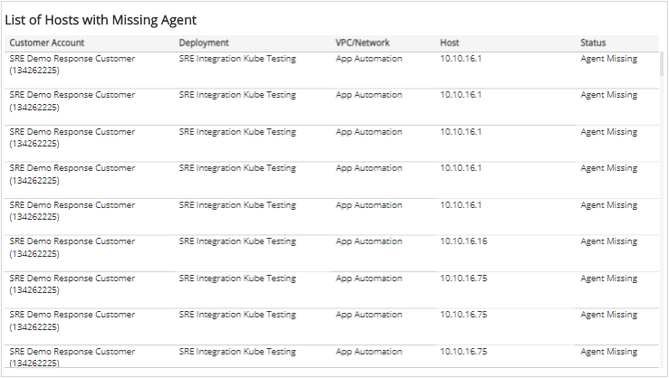
