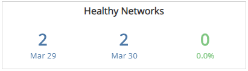
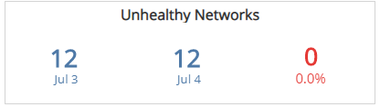
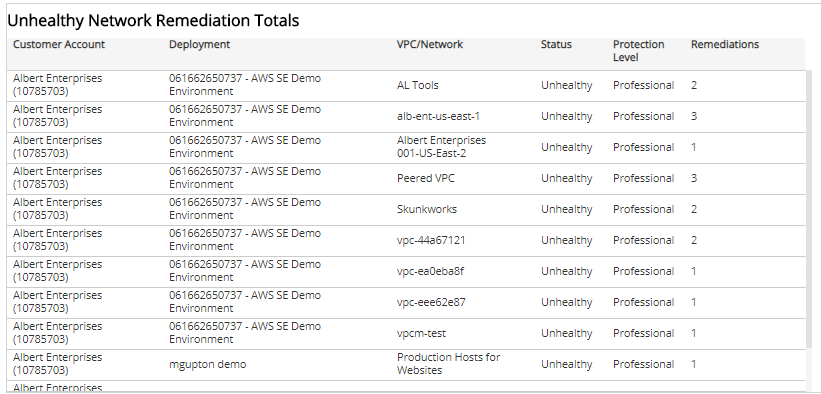

# Network Health Status Digest

The Network Health Status Digest report provides insight into the daily issues related to protected networks in your environment, including a comparison of health statuses, top ten lists, and total number of open remediations for each network. Use this report to improve network protection, fix configuration issues, and support optimization efforts in your environment.

To access the Network Health Digest report:

1. In the Alert Logic console, click the menu icon (), and then click **Validate**.
2. Click **Reports**, and then click **Service**.
3. Under **Health**, click **VIEW**
4. Click **Network Health Status Digest**.

## Filter the report

To refine your findings, filter your report by  customer account, protection level, deployment name, date, and status.

### Filter the report using drop-down menus

By default, Alert Logic includes **(All)** filter values in the report.

**To add or remove filter values: **

1. Click the drop-down menu in the filter, and then select or clear values.
2. Click **Apply**.

## Healthy Networks section

This section provides the count of networks in healthy statuses for the selected date and the day before, and the percentage change between the two dates.

## Unhealthy Networks section

This section provides the count of networks in unhealthy statuses for the selected date and the day before, and the percentage change between the two dates.

## Top 10 Impacted Networks section

The list displays the networks with the most open configuration remediations on the selected date. The list is organized by customer account, VPC or network name, remediation count, and the percentage of the total remediations, along with a  percentage bar.

## Top 10 Impacted Deployments section

The list displays the deployments with the most open configuration remediations on the selected date. The list is organized by customer account, deployment name, remediation count, and the percentage of the total remediations, along with a  percentage bar.

## Unhealthy Network Remediation Total section

The list displays the total count of open configuration remediations for each VPC or network in your deployments on the selected date. The list is organized by customer account, deployment name, VPC or network name, status, protection level, and total remediation count.

