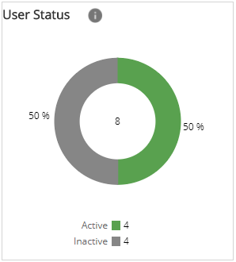
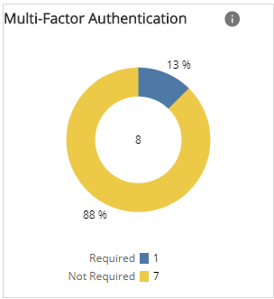
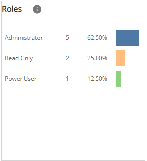
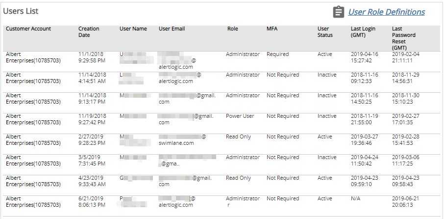

# Current Users

The Current Users report provides a visual overview of the users in your customer account by active or inactive status, user role, or multi-factor authentication settings. The report also provides a list of account details for each user.

Use this report to help manage user accounts for your organization. The Current Users report allows you to evaluate user settings to:

* Ensure user accounts that no longer require access to the Alert Logic console are either inactive or deleted
* Determine the roles assigned to each user account
* Determine whether multi-factor authentication (MFA) is enabled for user accounts

**To access the Current Users report**:

1. In the Alert Logic console, click the menu icon (), and then click **Validate**.
2. Click **Reports**, and then click **Service**.
3. Under **Users**, click **VIEW**.
4. Click **Current Users**.

## Filter the report

To refine your findings, you can filter your report by  **Customer Account**, **User Status**, and **Role**.

### Filter the report using drop-down menus

By default, Alert Logic includes **(All)** filter values in the report.

**To add or remove filter values: **

1. Click the drop-down menu in the filter, and then select or clear values.
2. Click **Apply**.

## User Status section

This section displays a chart with the count and percentage of active and inactive users for the selected accounts. Active users may log into the Alert Logic console. Inactive users may not log into the Alert Logic console, because an account administrator locked the user account. For more information, see [Customer Accounts, User Accounts, and User Roles](../../../../prepare/users-roles.md#top).

## Multi-Factor Authentication section

This section displays a chart with the count and percentage of user accounts for which multi-factor authentication (MFA) is required to log into the Alert Logic console. An account administrator can require users to log in with MFA, or individual users can set this option for their accounts. For more information about multi-factor authentication, see [Multi-factor Authentication](../../../../prepare/mfa.md).

## Roles section

This section displays  a chart with the count and percentage of users assigned each user role. Each user account is assigned a role that determines the account privileges for accessing features in the Alert Logic console. For more information about user roles, see [User Roles](../../../../prepare/users-roles.md#user-roles).

## Users List section

This section  displays all users in each customer account. The list is organized by customer account, user account creation date and time, user name, user email address, user role, whether MFA is required, the last login date and time, and the last password reset.

Click **User Role Definitions** for more information about user roles.

