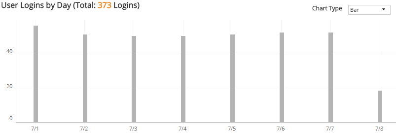
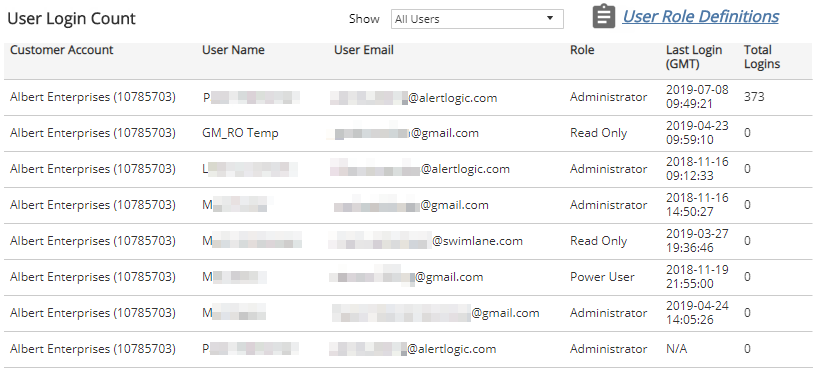

# User Login Trends

The User Login Trends report provides a visual overview and a detailed list of the users who log into the Alert Logic console, how often and when.

Use this report to identify patterns in user logins within your account.

**To access the User Login Trends report**:

1. In the Alert Logic console, click the menu icon (), and then click **Validate**.
2. Click **Reports**, and then click **Service**.
3. Under **Users**, click **VIEW**.
4. Click **User Login Trends**.

## Filter the report

To refine your findings, you can filter your report by  **Month**, **Customer Account**, and **Role**.

### Filter the report using drop-down menus

By default, Alert Logic includes **(All)** filter values in the report.

**To add or remove filter values: **

1. Click the drop-down menu in the filter, and then select or clear values.
2. Click **Apply**.

## User Logins by Day section

This section uses a chart to display the daily count and the total count of user logins for  the selected period. You can display the data as a line or bar chart. Click the **Chart Type** drop-down on the top right of the graph, and then select the chart type you want to see.

## User Login Count section

This list displays individual user logins for a selected filter in the **Show** drop-down menu :

* All Users
* Only Users with Logins
* Only Users without Logins

The list is organized by customer account, user name, user email account, user role, last login date and time, and total logins.

Click **User Role Definitions** for more information about user roles.

