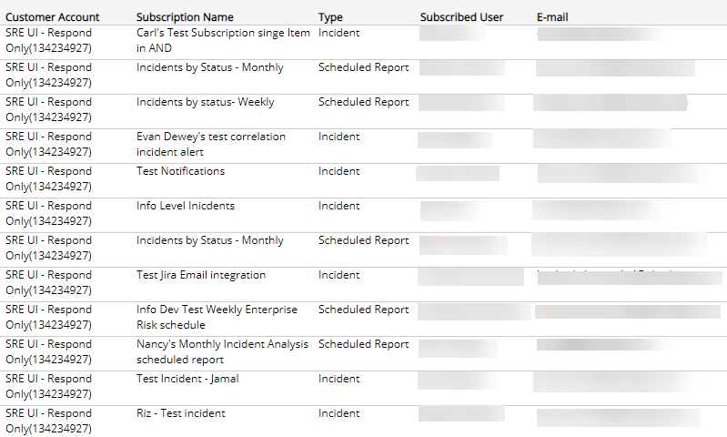

# Subscribed Notification Users

The Subscribed Notification Users report provides a list of users subscribed to receive notifications for specified customer accounts. These are users set up to receive automated email notifications from the [Notifications](../../../../configure/notifications.md) page.

**To access the Subscribed Notification Users report**:

1. In the Alert Logic console, click the menu icon (), and then click **Validate**.
2. Click **Reports**, and then click **Service**.
3. Under **Users**, click **VIEW**.
4. Click **Subscribed Notification Users**.

## Filter the report

To refine your findings, you can filter your report by  **Customer Account**.

### Filter the report using drop-down menus

By default, Alert Logic includes **(All)** filter values in the report.

**To add or remove filter values: **

1. Click the drop-down menu in the filter, and then select or clear values.
2. Click **Apply**.

The report lists all users in each customer account. The list is organized by customer account, subscription name, type of notification, subscribed user, and email.

