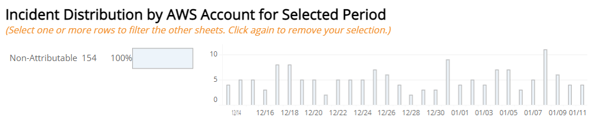
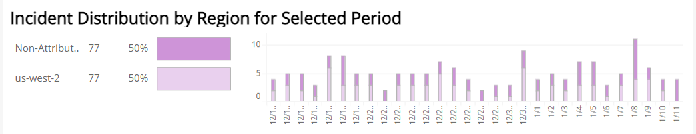
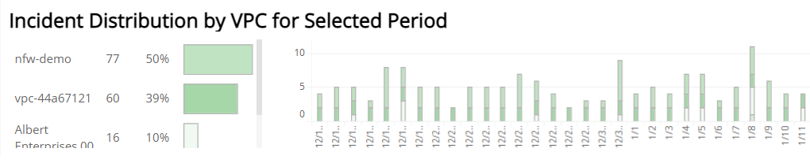
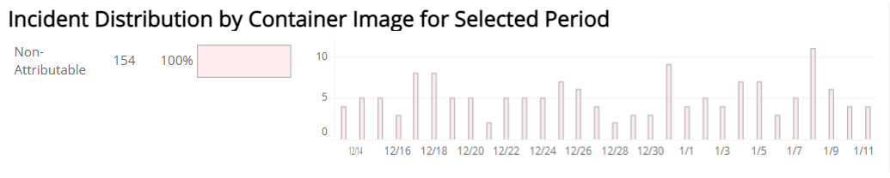
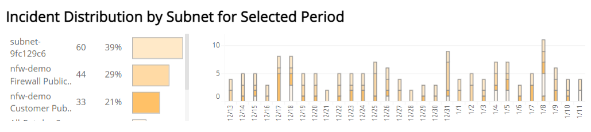
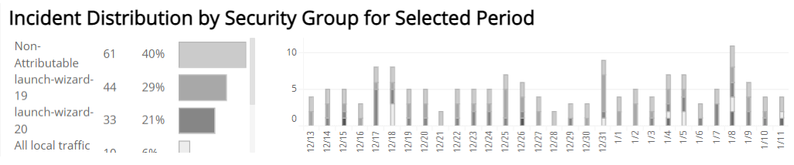

# AWS Targeted Deployment Trends

The AWS Targeted Deployment Trends report provides a bar and histogram chart that allows you to review trends in Amazon GuardDuty and Network IDS incidents for a date range by Amazon Web Services (AWS) account ID, region, VPC, container image,  subnet and Security Group.

For more information about incidents, see [Incidents](../../../incidents.md).

    You must integrate Amazon GuardDuty for associated incidents to be displayed in Alert Logic console. For more information, see [Integrate Amazon GuardDuty Findings into Alert Logic Incidents](../../../../configure/integrate-guard-duty-findings.md).    
**To access the AWS Targeted Deployment Trends Report**:

1. In the Alert Logic console, click the menu icon (), and then click **Validate**.
2. Click **Reports**, and then click **Threats**.
3. Under **AWS Incident Analysis**, click **VIEW**.
4. Click **AWS Targeted Deployment Trends**.

## Filter the report

To refine your findings, you can filter your report by **Date Range**, **Customer Account**, **Detection Source**, **Deployment Name**, **Top Tags**, **Threat Level**, **Classification**,and **Incident Type**.

### Filter the report using drop-down menus

By default, Alert Logic includes **(All)** filter values in the report.

**To add or remove filter values: **

1. Click the drop-down menu in the filter, and then select or clear values.
2. Click **Apply**.

### Filter the report using visuals

To refine your findings, click an item within a visual. To filter by multiple items, hold down **Ctrl** or **Command**, and then click each item in a visual that you want  to use to apply a filter. You can filter using visuals and items  selected in different sections. Click on an item again to remove a filter.

* **Bar graph example text**: To filter the report, click on a bar or hold **Ctrl** or **Command** and click  multiple bars to filter all sections by the selected Threat Level(s).
* **Line graph example text**: To filter the report, click on a point or choose an area on the line graph to filter the other sections by the selected week(s). Click a point or area on the line to filter all sections by your selection.
* **Pie chart**: To filter the report, select one or more sector to filter all sections on the page by your selection.
* **Histogram chart example text**: To filter the report, click on a bar or hold **Ctrl** or **Command** and click  multiple bars to filter all sections by the selected date(s).

## Incident Distribution by AWS Account for Selected Period

This section provides a bar and histogram chart of incidents by AWS account for the selected date range. The bar chart  displays the name, count, and proportion of incidents for each AWS account. The histogram displays incident count trends by AWS account.

## Incident Distribution by Region for Selected Period

This section provides a bar and histogram chart of incidents by region for the selected date range. The bar chart  displays the name, count, and proportion of incidents for each region. The histogram displays incident count trends by region.

## Incident Distribution by VPC for Selected Period

This section provides a bar and histogram chart of incidents by VPC for the selected date range. The bar chart  displays the name, count, and proportion of incidents for each VPC. The histogram displays incident count trends by VPC.

## Incident Distribution by Container Image for Selected Period

This section provides a bar and histogram chart of incidents by container image for the selected date range. The bar chart  displays the name, count, and proportion of incidents for each container image. The histogram displays incident count trends by Container Image.

## Incident Distribution by Subnet for Selected Period

This section provides a bar and histogram chart of incidents by subnet for the selected date range. The bar chart  displays the name, count, and proportion of incidents for each subnet. The histogram displays incident count trends by subnet.

## Incident Distribution by Security Group for Selected Period

This section provides a bar and histogram chart of incidents by Security Group for the selected date range. The bar chart  displays the name, count, and proportion of incidents for each Security Group. The histogram displays incident count trends by Security Group.

