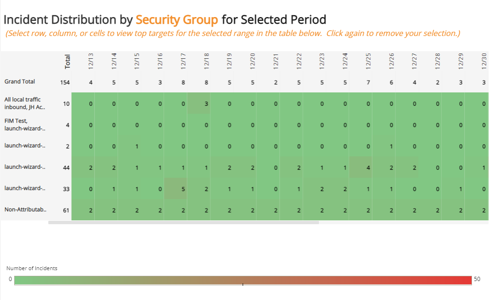
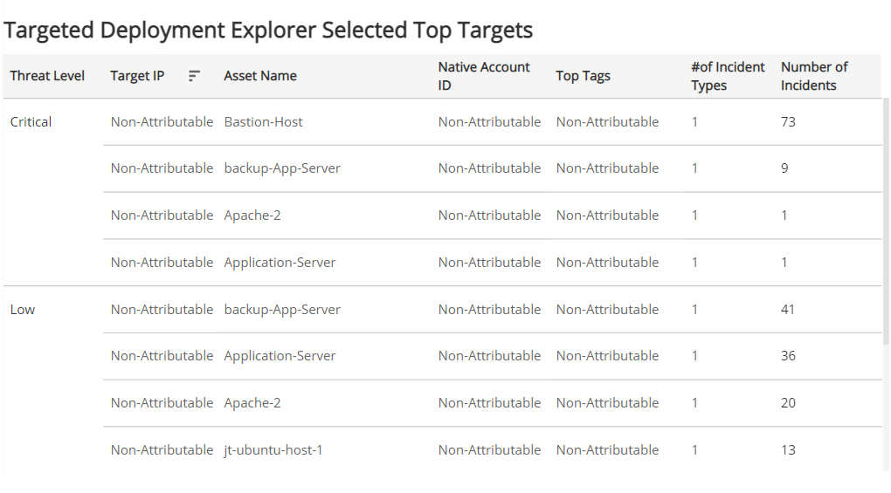

# Azure Targeted Deployment Explorer

The Azure Targeted Deployment Explorer report displays the Network IDS incident distribution by a selected  native account ID, region, VNet, container image name, Security Group, or subnet target type.

For more information about incidents, see [Incidents](../../../incidents.md).

**To access the Azure Targeted Deployment Explorer report**:

1. In the Alert Logic console, click the menu icon (), and then click **Validate**.
2. Click **Reports**, and then click **Threats**.
3. Under **Azure Incident Analysis**, click **VIEW**.
4. Click **Azure Targeted Deployment Explorer**.

## Filter the report

To refine your findings, you can filter your report by **Select Target Type**, **Date Range**,  **Customer Account**, **Detection Source**, **Deployment Name**, **Native ID**, **Region**,  **VNet**, **Container Image Name**, **Subnet**, **Top Tags**, **Threat Level**, **Classification**,  **Incident Type**,and **Security Group**.

### Filter the report using drop-down menus

By default, Alert Logic includes **(All)** filter values in the report.

**To add or remove filter values: **

1. Click the drop-down menu in the filter, and then select or clear values.
2. Click **Apply**.

### Filter the report using visuals

To refine your findings, click an item within a visual. To filter by multiple items, hold down **Ctrl** or **Command**, and then click each item in a visual that you want  to use to apply a filter. You can filter using visuals and items  selected in different sections. Click on an item again to remove a filter.

* **Bar graph example text**: To filter the report, click on a bar or hold **Ctrl** or **Command** and click  multiple bars to filter all sections by the selected Threat Level(s).
* **Line graph example text**: To filter the report, click on a point or choose an area on the line graph to filter the other sections by the selected week(s). Click a point or area on the line to filter all sections by your selection.
* **Pie chart**: To filter the report, select one or more sector to filter all sections on the page by your selection.
* **Histogram chart example text**: To filter the report, click on a bar or hold **Ctrl** or **Command** and click  multiple bars to filter all sections by the selected date(s).

## Incident Distribution by Target Type for Selected Period section

This section displays the daily incident distribution for the selected target type in the selected date range.

## Targeted Deployment Explorer Selected Top Targets section

This section lists detailed information about incidents selected using the [Filter the report](#Filter) using visuals feature in the Incident Distribution by Target Type for Selected Period section.

