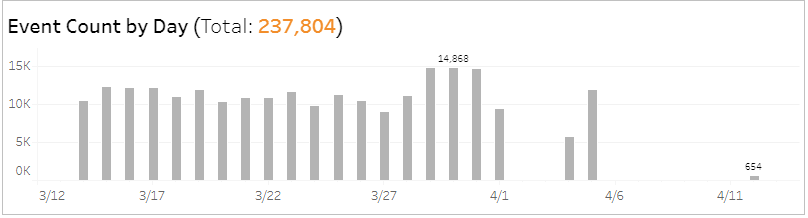
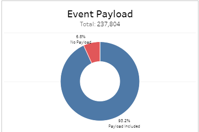
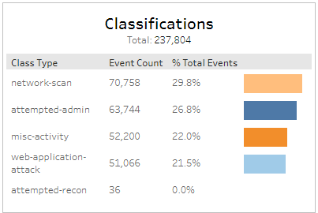
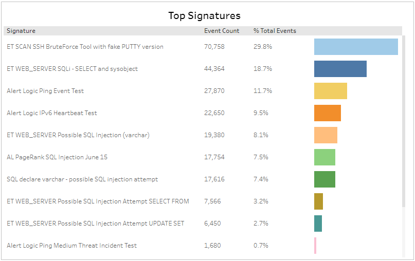

# Network IDS Events Explorer

The Network IDS Event Explorer report provides visibility into Network IDS events processed in your environment, including events per day, visualizations by payload and classification, and top signatures.

Use this report to validate your IDS events and focus efforts on  sources that were detected and processed in your environment.

To access the Network IDS Event Explorer report:

1. In the Alert Logic console, click the menu icon (), and then click **Validate**.
2. Click **Reports**, and then click **Threats**.
3. Under **Event Analysis**, click **VIEW**.
4. Click **Network IDS Event Explorer**.

## Filter the report

To refine your findings, filter your report by  **Date Range**, **Customer Account**, **Deployment Name**, **Appliance Name**, and **Event Payload**.

### Filter the report using drop-down menus

By default, Alert Logic includes **(All)** filter values in the report.

**To add or remove filter values: **

1. Click the drop-down menu in the filter, and then select or clear values.
2. Click **Apply**.

## Event Count by Day section

This section provides the daily event count, and the total count, in the selected period.

## Event Payload section

This section provides a color-coded pie chart with the percentage of events that included payload and the percentage of events that did not include payload in the selected filters.

## Classifications section

This section displays the classifications of events, the count for each event classification, and the percentage for each event classification  in a color-coded bar graph in the selected filters.

## Top Signatures section

This section displays the top signatures, the event count and the total percentage of events for each signature,  in a color-coded bar graph in the selected filters.

