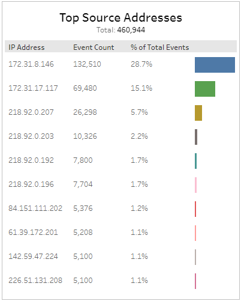
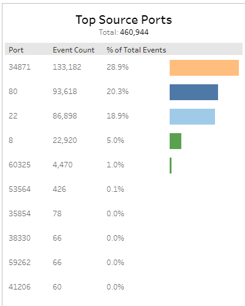
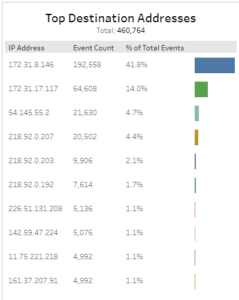
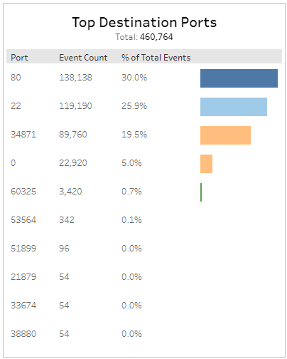
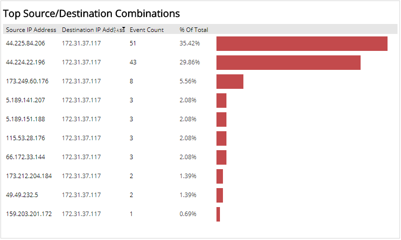

# Top Event Sources and Destinations

The Top Event Sources and Destinations report lists the top source and destination IP addresses and ports for IDS events in your environment. Use this report to validate your IDS events and focus efforts.

To access the Top Event Sources and Destinations report:

1. In the Alert Logic console, click the menu icon (), and then click **Validate**.
2. Click **Reports**, and then click **Threats**.
3. Under **Event Analysis**, click **VIEW**.
4. Click **Network IDS Event Explorer**.

## Filter the report

To refine your findings, filter your report by  **Date Range**, **Customer Account**, **Deployment Name**, and **Appliance Name**.

### Filter the report using drop-down menus

By default, Alert Logic includes **(All)** filter values in the report.

**To add or remove filter values: **

1. Click the drop-down menu in the filter, and then select or clear values.
2. Click **Apply**.

### Top Sources Addresses section

This section displays the ten most prevalent source IP addresses during the selected period. The section lists the source address, event count and the percentage of total events for each source IP address,  in a color-coded bar graph in the selected filters.

### Top Source Ports section

This section displays the ten most prevalent ports during the selected period. The section lists the source port number, event count and the percentage of total events for each source port,  in a color-coded bar graph in the selected filters.

### Top Destination Addresses section

This section displays the ten most prevalent destination IP addresses during the selected period. The section lists the destination address, event count and the percentage of total events for each destination IP address,  in a color-coded bar graph in the selected filters.

### Top Destination Ports section

This section displays the ten most prevalent destination ports during the selected period. The section lists the destination port number, event count and the percentage of total events for each destination port ,  in a color-coded bar graph in the selected filters.

## Top Source/Destination Combinations

This section lists the most prevalent source and destination IP addresses combinations, the event count, and the percentage of total events for each source and destination IP addresses combinations with a bar graph for the selected date.

