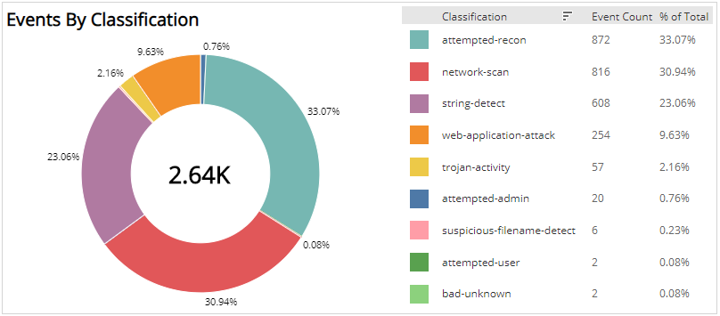

# Weekly Event Analysis

The Weekly Event Analysis provides visibility into Network IDS events processed in your environment, including event classification, top signatures, and events per day for the selected week. Use this report to validate your IDS events and focus efforts on  sources that were detected and processed in your environment.

This report presents data for an entire week, from Monday through Sunday, which immediately becomes available in the beginning of the following week.

To access the Weekly Event Analysis report:

1. In the Alert Logic console, click the menu icon (), and then click **Validate**.
2. Click **Reports**, and then click **Threats**.
3. Under **Event Analysis**, click **VIEW**.
4. Click **Weekly Event Analysis**.

## Filter the report

To refine your findings, filter your report by  **Select Week**, **Customer Account**, and **Deployment Name**.

### Filter the report using drop-down menus

By default, Alert Logic includes **(All)** filter values in the report.

**To add or remove filter values: **

1. Click the drop-down menu in the filter, and then select or clear values.
2. Click **Apply**.

## Events by Classification section

This section displays the classifications of events, the count, and the percentage for each event classification in a color-coded pie graph for the selected week.

## Top Signatures section

This section displays the top signatures, the event count, and the percentage of total events for each signature, and a color-coded bar graph for the selected week.

## Events by Day section

This section displays a bar graph of the daily event count, and a list with the count and percentage of total events on each day for the selected week.

## Top Source Addresses section

This section lists the most prevalent source IP address, the event count, and the percentage of total events for each source IP address with a color-coded bar graph for the selected week.

## Top Source Ports section

This section lists the most prevalent source ports, the event count, and the percentage of total events for each source port with a color-coded bar graph for the selected week.

## Top Destination Addresses section

This section lists the most prevalent destination IP addresses, the event count, and the percentage of total events for each destination IP address with a color-coded bar graph for the selected week.

## Top Destination Ports section

This section lists the most prevalent destination ports, the event count, and the percentage of total events for each destination port with a color-coded bar graph for the selected week.

## Top Source/Destination Combinations

This section lists the most prevalent source and destination IP addresses combinations, the event count, and the percentage of total events for each source and destination IP addresses combinations with a bar graph for the selected week.

