# Monthly Incident Account Summary

The Monthly Incident Summary report provides the current distribution and trending data for incidents detected across your customer accounts or deployments. Use the report to evaluate accounts or deployments by top incident count, threat level, count by week and threat level, detection source, escalation status, type, sub-type, top attackers, and top targets.

To access the Monthly Incident Account Summary report:

1. In the Alert Logic console, click the menu icon (), and then click **Validate**.
2. Click **Reports**, and then click **Threats**.
3. Under **Incident Account Summary**, click **VIEW**.
4. Click **Monthly Incident Account Summary**.

## Filter the report

To refine your findings, filter your report by **Select Month(s)**, **Customer Account**, **Deployment Name**, **Detection Source**, **Threat Level**, **Status**, and **Escalation Status**.

### Filter the report using drop-down menus

By default, Alert Logic includes **(All)** filter values in the report.

**To add or remove filter values: **

1. Click the drop-down menu in the filter, and then select or clear values.
2. Click **Apply**.

### Filter the report using visuals

To refine your findings, click an item within a visual. To filter by multiple items, hold down **Ctrl** or **Command**, and then click each item in a visual that you want  to use to apply a filter. You can filter using visuals and items  selected in different sections. Click on an item again to remove a filter.

* **Bar graph example text**: To filter the report, click on a bar or hold **Ctrl** or **Command** and click  multiple bars to filter all sections by the selected Threat Level(s).
* **Line graph example text**: To filter the report, click on a point or choose an area on the line graph to filter the other sections by the selected week(s). Click a point or area on the line to filter all sections by your selection.
* **Pie chart**: To filter the report, select one or more sector to filter all sections on the page by your selection.
* **Histogram chart example text**: To filter the report, click on a bar or hold **Ctrl** or **Command** and click  multiple bars to filter all sections by the selected date(s).

## Incidents by Top Customer Account or Deployment section

This section provides the total count of  incidents  by customer account or deployment for the selected month(s). Your default view is the count of incidents by customer account. Use the **Count By** drop-down list to see the count of incidents by deployment. To cross-filter the report, click on a bar or hold **Ctrl** or **Command** and click  multiple bars to filter all sections by the account(s) or deployment(s).

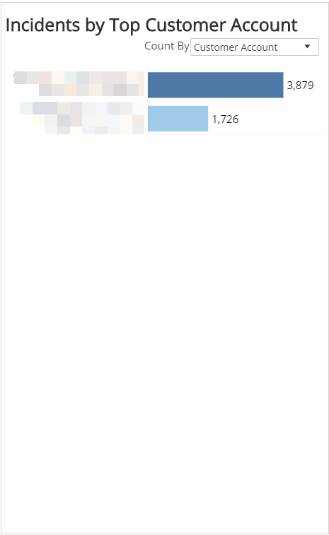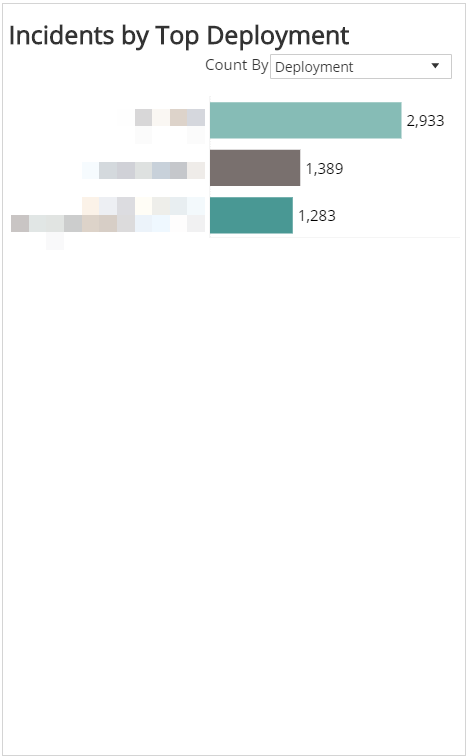

## Total Incidents section

This section provides the total incident count for the selected month(s).

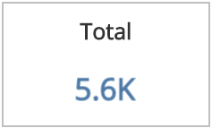

## Incident Threat Levels section

This section provides the total count of incidents by threat level for the selected month(s).

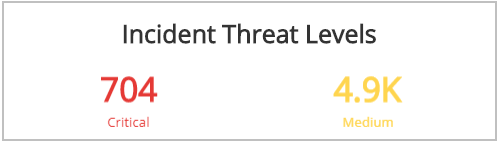

## Incident Count by Week and Threat Level section

This section provides the weekly count of incidents and threat level as a line graph to visualize trends for the selected month(s). To cross-filter the report, click on a point or hold **Ctrl** or **Command** and click points to select an area to filter all sections by the selected month(s).

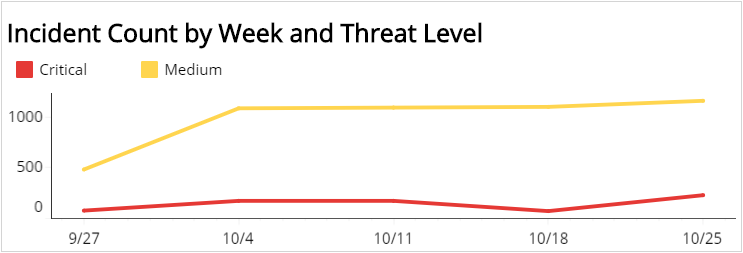

## Detection Source section

This section provides the count and percentages for incidents by detection source for the selected month(s). To cross-filter the report, click on a bar or hold **Ctrl** or **Command** and click  multiple bars to filter all sections by the selected detection source(s).

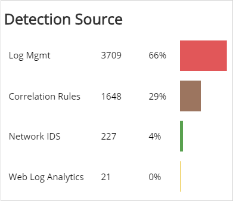

## Escalation Status section

This section provides the count and percentages for incidents by escalation status for the selected month(s).

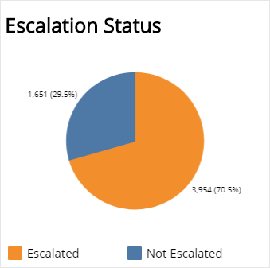

## Incident by MITRE Tactic section

This section provides the count and percentages for each incident by MITRE Tactic in a color-coded bar graph for the selected month.

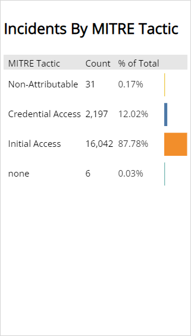

## Incident by MITRE Technique section

This section provides the count and percentages for each incident by MITRE Technique in a color-coded bar graph for the selected month.

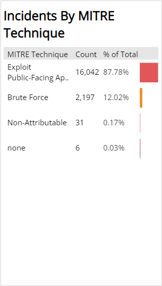

## Incident Type section

This section provides the count and percentages for incidents by type for the selected month(s). To cross-filter the report, click on a sector or hold **Ctrl** or **Command** and click  multiple sectors to filter all sections by the selected incident type(s).

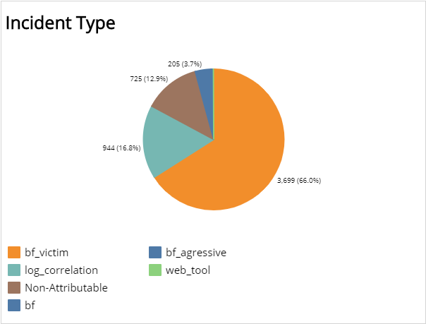

## Incident Sub-Type section

This section provides the count and percentages for incidents by sub-type for the selected month(s). To cross-filter the report, click on a sector or hold **Ctrl** or **Command** and click  multiple sectors to filter all sections by the selected sub-type(s).

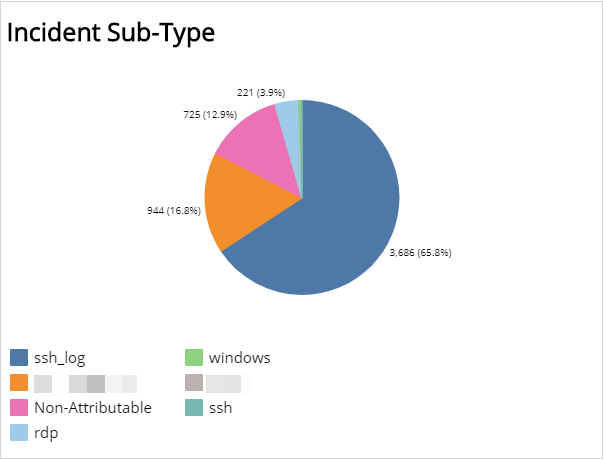

## Top Attackers section

This section   lists the top attackers for the selected month(s) and includes detailed information about Customer Account, Attacker, and incident counts and percentages.

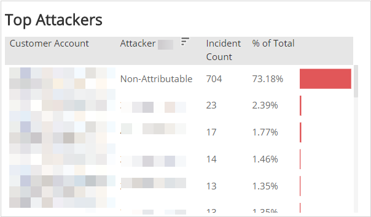

## Top Targets section

This section   lists the top targets for the selected month(s) and includes detailed information about Customer Account, Target, and incident counts and percentages.

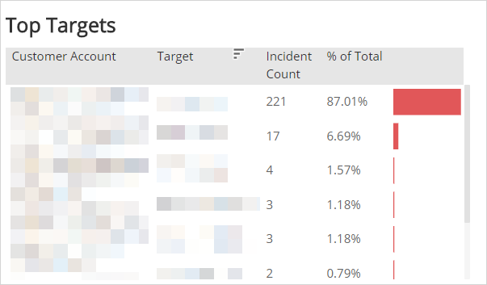
