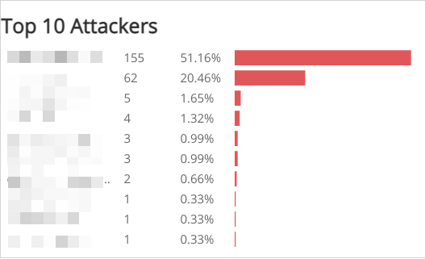
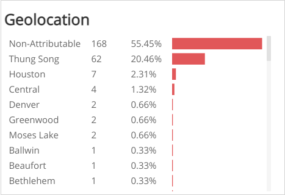
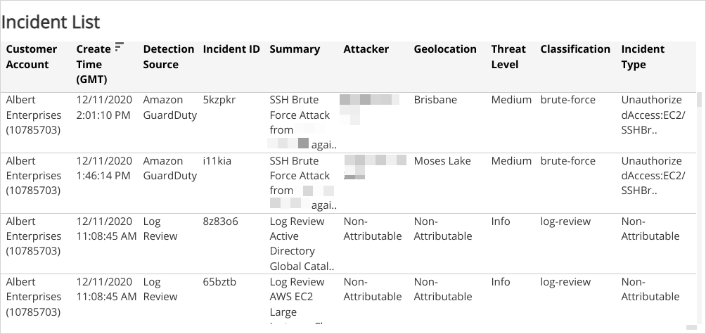

# Incident Attacker Explorer

The Incident Attacker Explorer provides visibility into the top 10 attackers and geolocations, with  visualizations and lists of incidents by threat level, classification, and incident type. Use this report to review attacks on your environment.

For more information about incidents, see [Incidents](../../../incidents.md).

**To access the Incident Attacker Explorer report**:

1. In the Alert Logic console, click the menu icon (), and then click **Validate**.
2. Click **Reports**, and then click **Threats**.
3. Under **Incident Analysis**, click **VIEW**.
4. Click **Incident Attacker Explorer**.

## Filter the report

To refine your findings, you can filter your report by **Date Range**, **Customer Account**,  **Deployment Name**, **Detection Source**, **Status**, and **Escalation Status**.

### Filter the report using drop-down menus

By default, Alert Logic includes **(All)** filter values in the report.

**To add or remove filter values: **

1. Click the drop-down menu in the filter, and then select or clear values.
2. Click **Apply**.

### Filter the report using visuals

To refine your findings, click an item within a visual. To filter by multiple items, hold down **Ctrl** or **Command**, and then click each item in a visual that you want  to use to apply a filter. You can filter using visuals and items  selected in different sections. Click on an item again to remove a filter.

* **Bar graph example text**: To filter the report, click on a bar or hold **Ctrl** or **Command** and click  multiple bars to filter all sections by the selected Threat Level(s).
* **Line graph example text**: To filter the report, click on a point or choose an area on the line graph to filter the other sections by the selected week(s). Click a point or area on the line to filter all sections by your selection.
* **Pie chart**: To filter the report, select one or more sector to filter all sections on the page by your selection.
* **Histogram chart example text**: To filter the report, click on a bar or hold **Ctrl** or **Command** and click  multiple bars to filter all sections by the selected date(s).

## Top 10 Attackers section

This section provides the 10 attacker counts and percentages, with a color-coded bar representing the count of incidents for the selected date range.

## Geolocation section

This section provides the geolocation associated with the attacker IP address.

## Threat Rating section

This section provides the count and percentages of incidents in each threat level generated from the most frequent attackers, shown in a color-coded bar graph for the selected date range.

## Incident by MITRE Tactic section

This section provides the count and percentages for each incident by MITRE Tactic in a color-coded bar graph for the selected date range.

## Incident by MITRE Technique section

This section provides the count and percentages for each incident by MITRE Technique in a color-coded bar graph for the selected date range.

## Classification section

This section provides the count and percentages for each incident classification generated from the most frequent attackers, shown in a color-coded bar graph for the selected date range.

## Incident Type section

This section provides the count and percentages for each incident type generated from the most frequent attackers, shown in a color-coded bar graph for the selected date range.

## Incident List section

This section provides a complete list of incidents for the selected date range with details about the Customer Account, Create Time, Detection Source, Incident ID, Summary, Attacker, Threat Level, Classification, and Incident Type.

