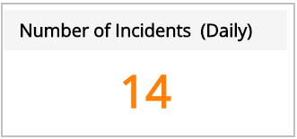
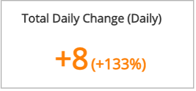
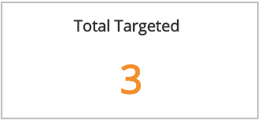
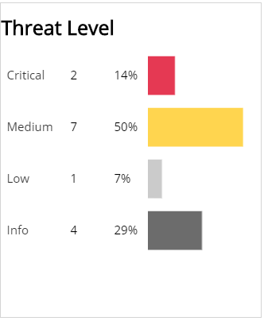
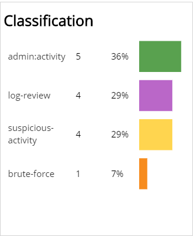
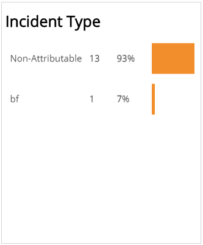
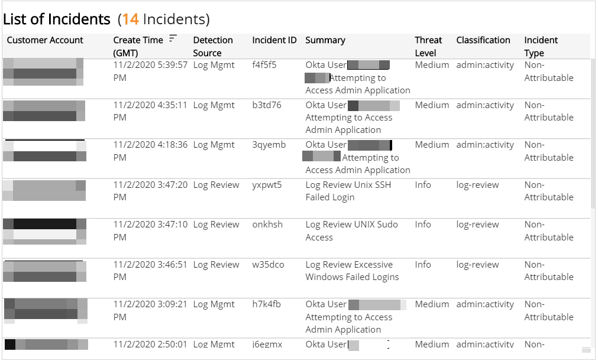

# Incident Daily Digest

The Incident Daily Digest report provides the incidents detected on the previous day for the selected detection types.   Use this report to evaluate daily incidents by threat level, classification, and type.

For more information about incidents, see [Incidents](../../../incidents.md).

To access the Incident Daily Digest report:

1. In the Alert Logic console, click the menu icon (), and then click **Validate**.
2. Click **Reports**, and then click **Threats**.
3. Under **Incident Analysis**, click **VIEW**.
4. Click **Incident Daily Digest**.

## Filter the report

Use the **View Previous Days (GMT)** drop-down menu to select which day to display activity for the report.

To refine your findings, filter your report by **Customer Account**, **Deployment Name**, **Detection Source**, **Status** and **Escalation Status**.

### Filter the report using drop-down menus

By default, Alert Logic includes **(All)** filter values in the report.

**To add or remove filter values: **

1. Click the drop-down menu in the filter, and then select or clear values.
2. Click **Apply**.

### Filter the report using visuals

To refine your findings, click an item within a visual. To filter by multiple items, hold down **Ctrl** or **Command**, and then click each item in a visual that you want  to use to apply a filter. You can filter using visuals and items  selected in different sections. Click on an item again to remove a filter.

* **Bar graph example text**: To filter the report, click on a bar or hold **Ctrl** or **Command** and click  multiple bars to filter all sections by the selected Threat Level(s).
* **Line graph example text**: To filter the report, click on a point or choose an area on the line graph to filter the other sections by the selected week(s). Click a point or area on the line to filter all sections by your selection.
* **Pie chart**: To filter the report, select one or more sector to filter all sections on the page by your selection.
* **Histogram chart example text**: To filter the report, click on a bar or hold **Ctrl** or **Command** and click  multiple bars to filter all sections by the selected date(s).

## Number of Incidents (Daily) section

This section provides the total count of  incidents for the selected day.

## Total Daily Change (Daily) section

This section provides the count and percentage change between the selected day and the previous day.

## Total Targeted section

This section provides the total count of assets targeted in the incidents for the selected day.

## Threat Level section

This section provides the count and percentages of incidents in each threat level for the selected day. To cross-filter the report, click on a bar or hold **Ctrl** or **Command** and click  multiple bars to filter all sections by the selected Threat Level(s).

## Classification section

This section provides the count and percentages for each incident classification in a color-coded bar graph for the selected day. To cross-filter the report, click on a bar or hold **Ctrl** or **Command** and click  multiple bars to filter all sections by the selected Classification(s).

## Incident Type section

This section displays a bar graph of the daily incident count and percentages by each type for the selected day. To cross-filter the report, click on a bar or hold **Ctrl** or **Command** and click  multiple bars to filter all sections by the selected incident type(s).

## List of Incidents section

This section provides a complete list of incidents for the selected day with detailed information about Customer Account, Create Time, Detection Source, Incident ID, Summary, Threat Level, Classification, and Incident Type.

