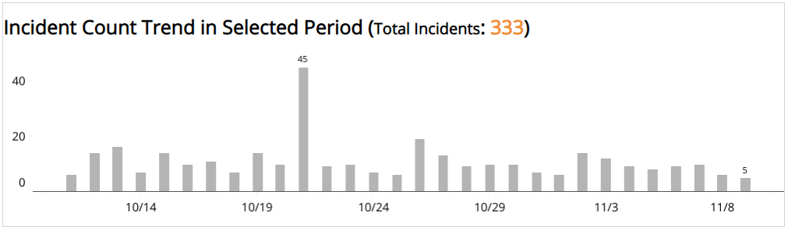
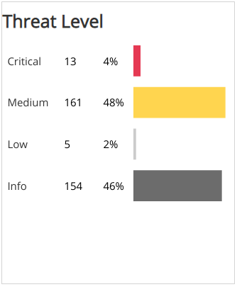
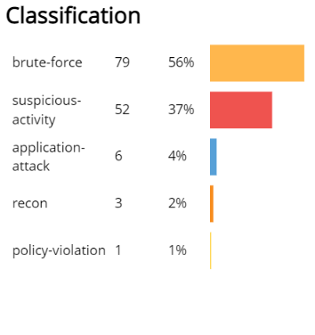
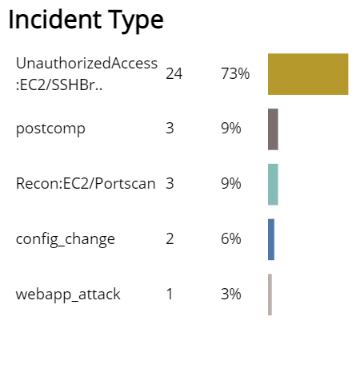
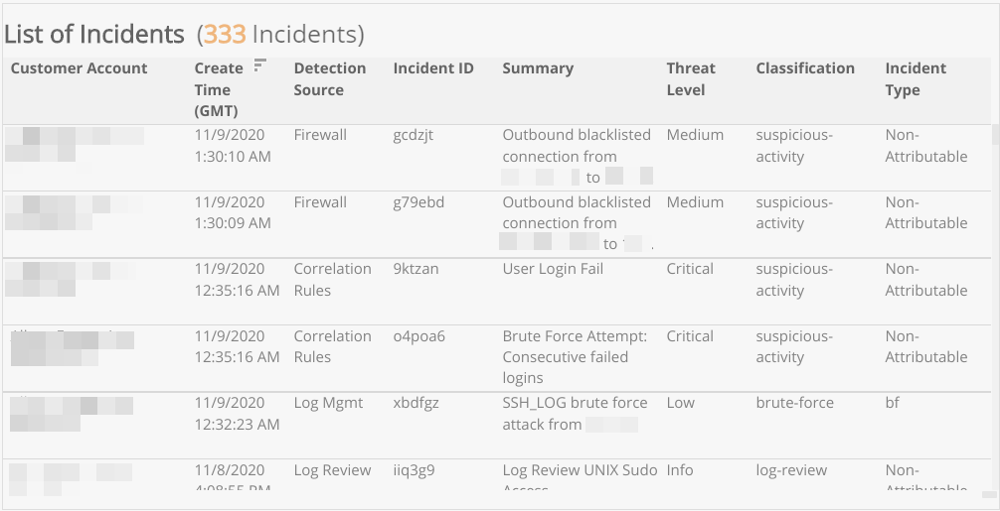

# Incident Daily Digest Trends

The  Incident Daily Digest Trends report provides a histogram chart that allows you to review trends in the daily incident digest results for a selected date range.   Use this report to evaluate trends in daily incident digest results by threat level, classification, and type.

For more information about incidents, see [Incidents](../../../incidents.md).

To access the Incident Daily Digest Trends report:

1. In the Alert Logic console, click the menu icon (), and then click **Validate**.
2. Click **Reports**, and then click **Threats**.
3. Under **Incident Analysis**, click **VIEW**.
4. Click **Incident Daily Digest Trends**.

## Filter the report

To refine your findings, filter your report by **Date Range**, **Customer Account**, **Deployment Name**, **Detection Source**, **Status** and **Escalation Status**.

### Filter the report using drop-down menus

By default, Alert Logic includes **(All)** filter values in the report.

**To add or remove filter values: **

1. Click the drop-down menu in the filter, and then select or clear values.
2. Click **Apply**.

### Filter the report using visuals

To refine your findings, click an item within a visual. To filter by multiple items, hold down **Ctrl** or **Command**, and then click each item in a visual that you want  to use to apply a filter. You can filter using visuals and items  selected in different sections. Click on an item again to remove a filter.

* **Bar graph example text**: To filter the report, click on a bar or hold **Ctrl** or **Command** and click  multiple bars to filter all sections by the selected Threat Level(s).
* **Line graph example text**: To filter the report, click on a point or choose an area on the line graph to filter the other sections by the selected week(s). Click a point or area on the line to filter all sections by your selection.
* **Pie chart**: To filter the report, select one or more sector to filter all sections on the page by your selection.
* **Histogram chart example text**: To filter the report, click on a bar or hold **Ctrl** or **Command** and click  multiple bars to filter all sections by the selected date(s).

## Incident Count Trend in Selected Period section

This section provides  a histogram chart of total daily incident count for the selected date range.

## Threat Level section

This section provides the count and percentages of incidents in each threat level for the selected date range. To cross-filter the report, click on a bar or hold **Ctrl** or **Command** and click  multiple bars to filter all sections by the selected Threat Level(s).

## Incident by MITRE Tactic section

This section provides the count and percentages for each incident by MITRE Tactic in a color-coded bar graph for the selected date range.

## Incident by MITRE Technique section

This section provides the count and percentages for each incident by MITRE Technique in a color-coded bar graph for the selected date range.

## Classification section

This section provides the count and percentages for each incident classification in a color-coded bar graph for the selected date range. To cross-filter the report, click on a bar or hold **Ctrl** or **Command** and click  multiple bars to filter all sections by the selected Classification(s).

## Incident Type section

This section displays a bar graph of the daily incident count and percentages by each type for the selected date range. To cross-filter the report, click on a bar or hold **Ctrl** or **Command** and click  multiple bars to filter all sections by the selected Incident Type(s).

## List of Incidents section

This section provides a complete list of incidents for the selected date range with detailed information about Customer Account, Create Time, Detection Source, Incident ID, Summary, Threat Level, Classification, and Incident Type.

