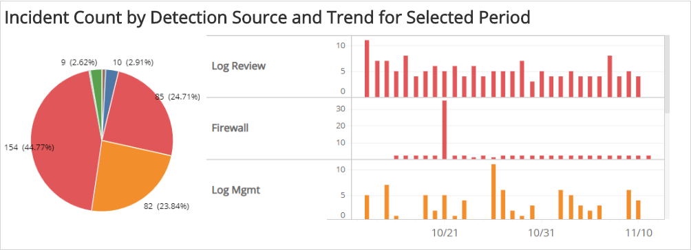
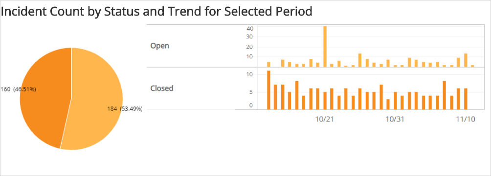
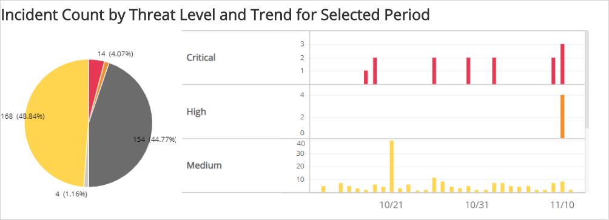
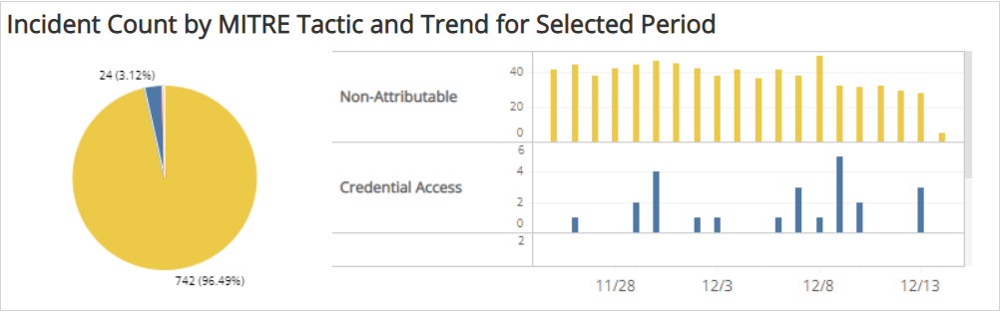
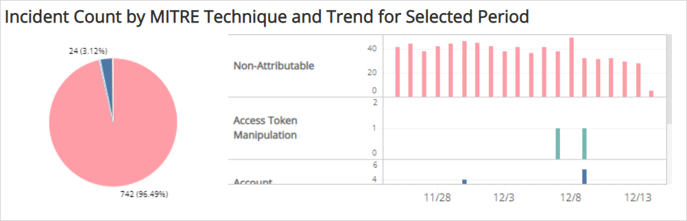
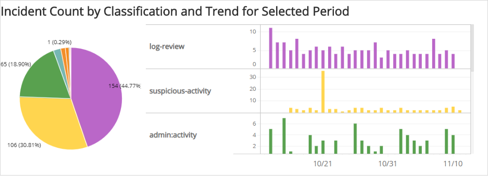
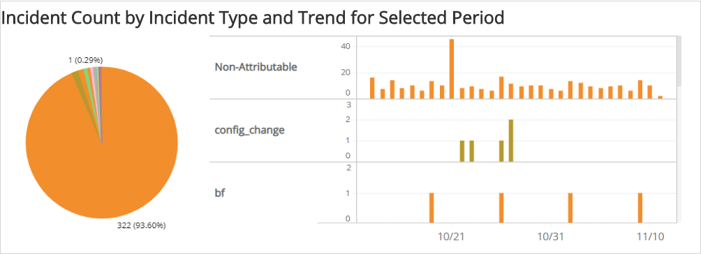
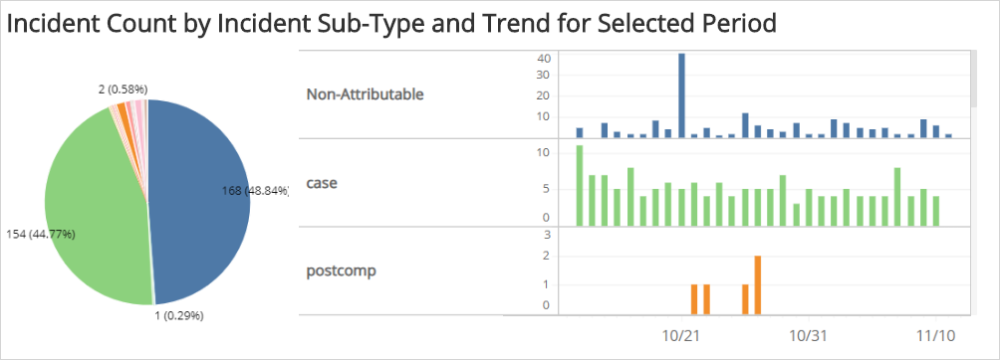

# Incident Distribution Explorer

The Incident Distribution Explorer report presents incident trends by detection source, status, threat level, classification, type, and sub-type for the selected date range. The report  presents the information in pie graphs and a series of histograms in each category for the selected date range.

For more information about incidents, see [Incidents](../../../incidents.md).

To access the Incident Distribution Explorer report:

1. In the Alert Logic console, click the menu icon (), and then click **Validate**.
2. Click **Reports**, and then click **Threats**.
3. Under **Incident Analysis**, click **VIEW**.
4. Click **Incident Distribution Explorer**.

## Filter the report

To refine your findings, filter your report by  **Date Range**, **Customer Account**, **Deployment Name**, **Detection Source**, **Status**, and **Escalation Status**.

### Filter the report using drop-down menus

By default, Alert Logic includes **(All)** filter values in the report.

**To add or remove filter values: **

1. Click the drop-down menu in the filter, and then select or clear values.
2. Click **Apply**.

### Filter the report using visuals

To refine your findings, click an item within a visual. To filter by multiple items, hold down **Ctrl** or **Command**, and then click each item in a visual that you want  to use to apply a filter. You can filter using visuals and items  selected in different sections. Click on an item again to remove a filter.

* **Bar graph example text**: To filter the report, click on a bar or hold **Ctrl** or **Command** and click  multiple bars to filter all sections by the selected Threat Level(s).
* **Line graph example text**: To filter the report, click on a point or choose an area on the line graph to filter the other sections by the selected week(s). Click a point or area on the line to filter all sections by your selection.
* **Pie chart**: To filter the report, select one or more sector to filter all sections on the page by your selection.
* **Histogram chart example text**: To filter the report, click on a bar or hold **Ctrl** or **Command** and click  multiple bars to filter all sections by the selected date(s).

## Total Incidents section

This section  provides the total  incident count for the selected filters and date range.

## Incident Count by Detection Source and Trend for Selected Period section

The section provides the distribution of incidents by detection source for the selected date range. The pie chart  presents the count and percentages for the  detection source category. The histogram presents the daily trend of incident counts by detection source. If you have multiple detection sources, you can use the scroll bar to the right of the histogram to view more detection sources.

## Incident Count by Status and Trend for Selected Period section

This section provides the distribution of incidents by status for the selected date range. The pie chart presents the count and percentages in the status category. The histogram  presents the daily trend of incident counts by status.

## Incident Count by Threat Level and Trend for Selected Period section

This section provides the distribution of incidents by threat level for the selected date range.

Incident threat levels convey the severity of each incident raised for protected assets, which allows you to assess and prioritize the actions to take toward threat remediation. Alert Logic categorizes incidents with the following icons and colors:

*  Critical
*  High
*  Medium
*  Low
*  Info

The pie chart presents the count and percentages for the  threat level category. The histogram presents the trend in daily incident counts by threat level. Use the scroll bar to the right of the histogram to view additional data.

## Incident Count by MITRE Tactic and Trend for Selected Period section

The section provides the distribution of incidents by MITRE Tactic for the selected date range. The pie chart  presents the count and percentages by MITRE Tactic. The histogram presents the daily trend of incident counts by MITRE Tactic. Use the scroll bar to the right of the histogram to view additional data.

## Incident Count by MITRE Technique and Trend for Select Period section

The section provides the distribution of incidents by MITRE Technique for the selected date range. The pie chart  presents the count and percentages by MITRE Technique. The histogram presents the daily trend of incident counts by MITRE Technique. Use the scroll bar to the right of the histogram to view additional data.

## Incident Count by Classification and Trend for Selected Period section

The section provides the distribution of incidents by classification for the selected date range. The pie chart  presents the count and percentages for the  classification category. The histogram presents the daily trend of incident counts by classification. Use the scroll bar to the right of the histogram to view additional data.

## Incident Count by Incident Type and Trend for Selected Period section

The section provides the distribution of incidents by type for the selected date range. The pie chart  presents the count and percentages for the  type category. The histogram presents the daily trend of incident counts by type. Use the scroll bar to the right of the histogram to view additional data.

## Incident Count by Sub-Type and Trend for Selected Period section

The section provides the distribution of incidents by sub-type for the selected date range. The pie chart  presents the count and percentages for the  sub-type category. The histogram presents the daily trend of incident counts by sub-type. Use the scroll bar to the right of the histogram to view additional data.

