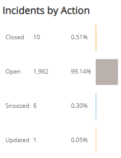
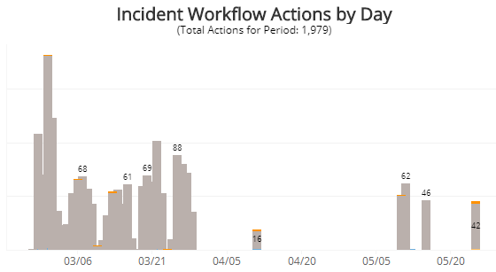
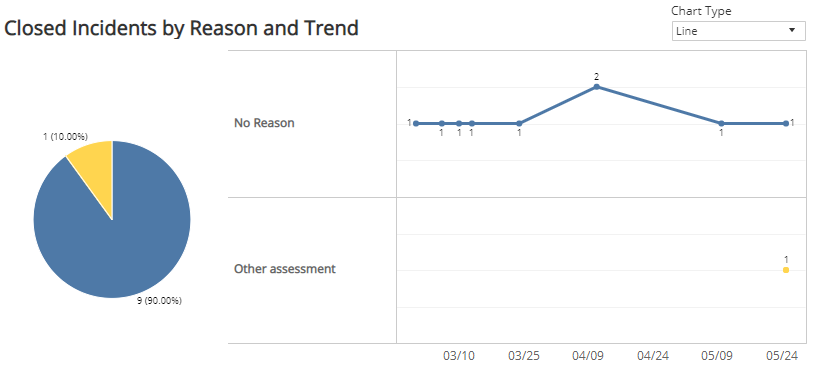
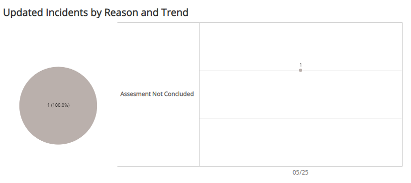

# Incident Workflow Explorer Report

The Incident Workflow Explorer report tracks and evaluates daily workflow actions performed in the Incidents console to determine how often incidents are suppressed from reports, the Incident summary page, and the Security Posture page.

For more information about incidents, see [Incidents](../../../incidents.md).

**To access the Incident Workflow Explorer**:

1. In the Alert Logic console, click the menu icon (), and then click **Validate**.
2. Click **Reports**, and then click **Threats**.
3. Under **Incident Analysis**, click **VIEW**.
4. Click **Incident Workflow Explorer**.

## Filter the report

To refine your findings, you can filter your report by **Create Time**, **Customer Account**,  **Deployment Name**, **Detection Source**, and **Escalation Status**.

### Filter the report using drop-down menus

By default, Alert Logic includes **(All)** filter values in the report.

**To add or remove filter values: **

1. Click the drop-down menu in the filter, and then select or clear values.
2. Click **Apply**.

## Incidents by Action section

This section provides the counts and percentages of total incidents you closed, open, updated, and snoozed for the filters you selected. The color-coded bar represents the number of times you performed that workflow action  in the selected filters.

## Incident Workflow Actions by Day section

This section displays a stacked histogram chart that displays the total daily workflow actions performed in the selected filters.

## Closed Incidents by Reason and Trend section

This section displays a color-coded pie chart with the counts and percentages of the feedback reasons specified when users closed incidents. The data next to the pie chart presents the trend over the selected time period of the feedback reasons those incidents were closed.

You can display the data as a line or bar chart. Click the drop-down on the top right of this section, and select the chart type you want to see.

## Updated Incidents by Reason and Trend section

This section displays a color-coded pie chart with the counts and percentages of the feedback reasons specified when users updated incidents. The data next to the pie chart presents the trend over the selected time period of the feedback reasons those incidents were updated.

You can display the data as a line or bar chart. Click the drop-down on the top right of the **Closed Incidents by Reason and Trend** section, and select the chart type you want to see.

