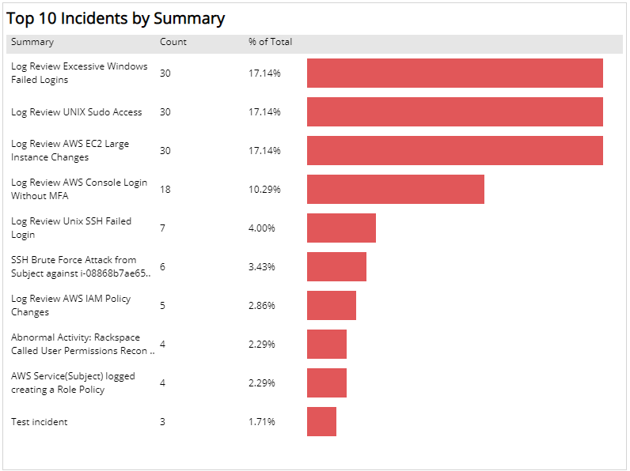
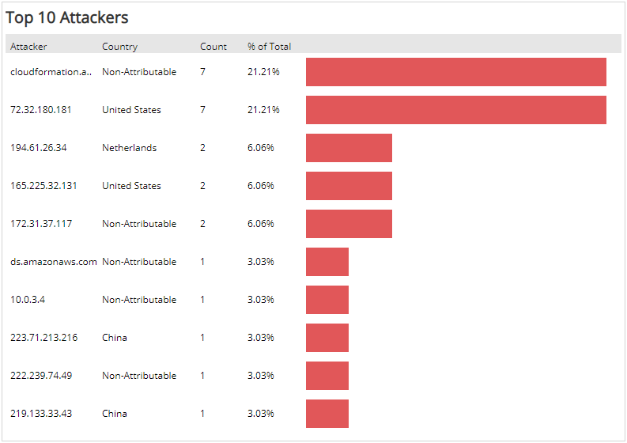
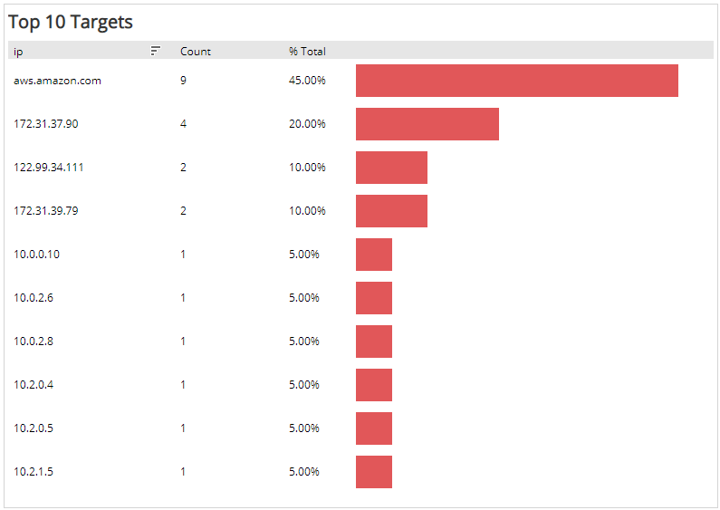

# Monthly Incident Analysis 

The Monthly Incident Analysis report provides visibility into threats and incidents in your environment, including  incident statuses, threat levels, classification, daily incident count, and top ten lists. Use this report to evaluate threats and incidents, and your response efforts, and learn about emerging threats.

For more information about incidents, see [Incidents](../../../incidents.md).

This report presents data for an entire month, which immediately becomes available in the beginning of the following month.

To access the Monthly Incident Analysis report:

1. In the Alert Logic console, click the menu icon (), and then click **Validate**.
2. Click **Reports**, and then click **Threats**.
3. Under **Incident Analysis**, click **VIEW**.
4. Click **Monthly Incident Analysis**.

## Filter the report

To refine your findings, filter your report by  **Select Month**, **Customer Account**, **Deployment Name**, and **Escalation Status**.

### Filter the report using drop-down menus

By default, Alert Logic includes **(All)** filter values in the report.

**To add or remove filter values: **

1. Click the drop-down menu in the filter, and then select or clear values.
2. Click **Apply**.

## Incident by Status section

This section provides the count and percentages for open, snoozed, and closed incidents for the selected month.

## Incident by Threat Level section

This section provides the count and percentages of incidents in each threat level for the selected month.

## Incident by MITRE Tactic section

This section provides the count and percentages for each incident by MITRE Tactic in a color-coded bar graph for the selected month.

## Incident by MITRE Technique section

This section provides the count and percentages for each incident by MITRE Technique in a color-coded bar graph for the selected month.

## Incident by Classification section

This section provides the count and percentages for each incident classification in a color-coded bar graph for the selected month.

## Incident by Day section

This section displays a bar graph of the daily incident count, and a list with the count, and total percentage of incidents on each day for the selected month.

## Top 10 Incidents by Summary 

This section lists the top ten incidents by threat summary, the incident count, and the percentage of total incidents for each threat summary with a bar graph representing the incident count for the selected month.

## Top 10 Attackers

This section lists the top ten attackers, the country of origin, incident count, and the percentage of total incidents for each attacker with a bar graph representing the incident count for the selected month.

## Top 10 Targets

This section lists the top ten IP address targets, the country of origin, and the percentage of total incidents for each targeted asset with a bar graph representing the incident count for the selected month.

