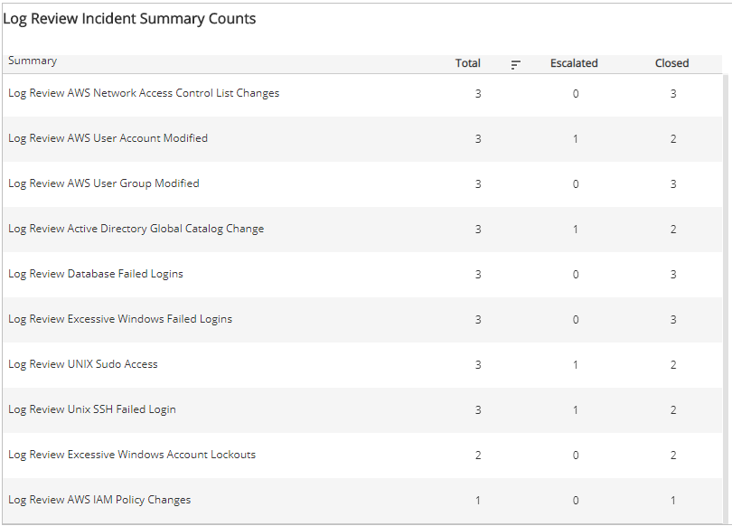
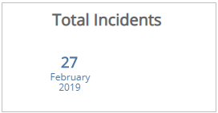
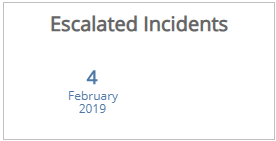
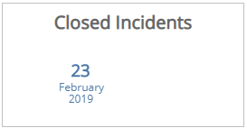
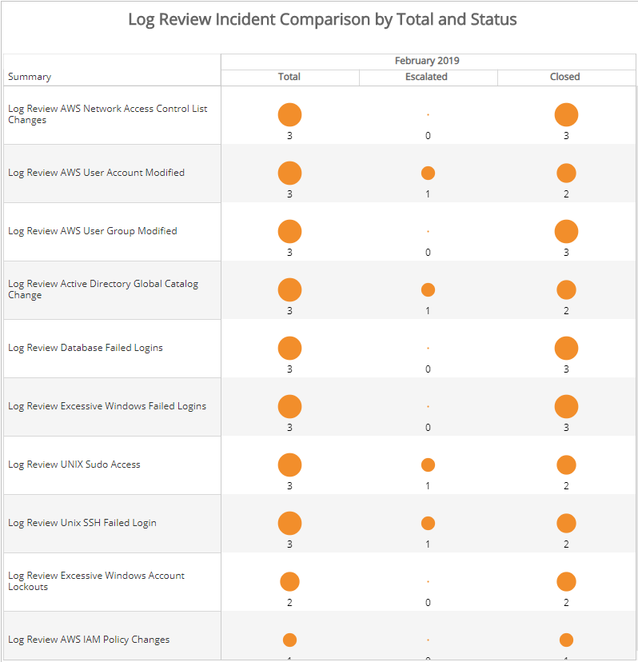

# Monthly Log Review Report

The Monthly Log Review report provides a monthly summary analysis of your Log Review incidents, including count and percentage of total incidents of each status, a daily histogram chart, and a comparison to the previous month.

This report is composed of the **Monthly Log Review** page and the **Log Review Comparison** page. To see the **Log Review Comparison** page, click the arrow icon () on the top right of the report.

**To access the Monthly Log Review report:**

1. In the Alert Logic console, click the menu icon (), and then click **Validate**.
2. Click **Reports**, and then click **Threats**.
3. Under **Log Review Analysis**, click **VIEW**.
4. Click **Monthly Log Review**.

## Filter the report

To refine your findings, you can filter your report by month and customer account.

### Filter the report using drop-down menus

By default, Alert Logic includes **(All)** filter values in the report.

**To add or remove filter values: **

1. Click the drop-down menu in the filter, and then select or clear values.
2. Click **Apply**.

## Status section

This section provides the status counts and percentages of total incidents that the Alert Logic Security Operations Center (SOC) analysts closed and escalated for the selected month.

## Log Review Incidents by Day and Status section

This section provides a stacked histogram chart that displays the daily status counts  of total incidents that the SOC analysts closed and escalated for the selected month.

## Log Review Incidents Summary Counts section

This section displays the total, escalated, and closed incident counts for each type of log review summary category for the selected month.

## Log Review Comparison page

To see the **Log Review Comparison** page, click the arrow icon () on the top right of the report.

### Total Incidents section

This section provides the total count of incidents for the selected month.

### Escalated Incidents section

This section provides the count of escalated incidents for the selected month.

### Closed Incident section

This section provides the count of closed incidents for the selected month.

### Log Review Incident Comparison by Total and Status section

This section presents the comparison of the total, escalated, and closed incidents  for each type of log review summary category in the selected and previous months.

