# Daily Log Anomaly Analysis

The Daily Log Anomaly Analysis report provides valuable insights into the daily log anomalies from all monitored log sources, and notes from Alert Logic analysts. The Daily Log Anomaly Analysis report compares the anomaly trend between the selected day and the previous day. Use this report to address and further analyze  customer, host, and user anomalies, and administrator activities found in your environment.

To access the Daily Log Anomaly Analysis report:

1. In the Alert Logic console, click the menu icon (), and then click **Validate**.
2. Click **Reports**, and then click **Threats**.
3. Under **Log Anomaly Analysis**, click **VIEW**, and then click **Daily Log Anomaly Analysis**.

## Select the scope for current vulnerabilities section

To refine your findings, filter your report by **Select Date** and **Customer Account**.

## Customer-Level Anomalies

This section provides the total count  of customer-level anomalies for the selected day, the difference compared to the previous day, and the total change with the percentage change between the two days.

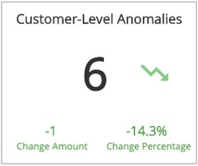

## Host-Level Anomalies

This section provides the total count  of host-level anomalies for the selected day, the difference compared to the previous day, and the total change with the percentage change between the two days.

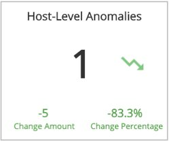

## User-Level Anomalies

This section provides the total count  of user-level anomalies for the selected day, the difference  compared to the previous day, and the total change with the percentage change between the two days.

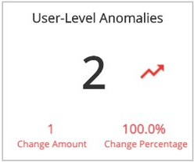

## Administrator Activities

This section provides the total count  of administrator activities anomalies for the selected day, the difference  compared to the previous day, and the total change with the percentage change between the two days.

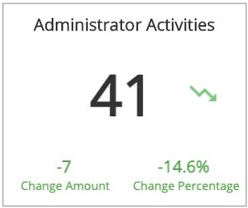

## Top Customer Anomaly Types

This section provides the counts and a bar graph with the percentages of the top customer anomaly types for the previous day and the selected day, and the total change with the percentage change between the two days.

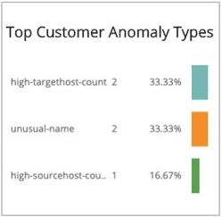

## Top Host Anomaly Types

This section provides the counts and a bar graph with the percentages of the top host anomaly types for the previous day and the selected day, and the total change with the percentage change between the two days.

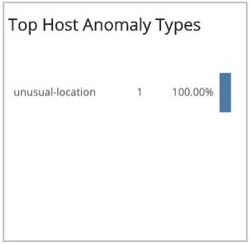

## Top User Anomaly Types

This section provides the counts and a bar graph with the percentages of the top anomaly types for the previous day and the selected day, and the total change with the percentage change between the two days.

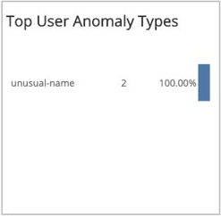

## Top Admin Message Types

This section provides the counts and a bar graph with the percentages of the top administration message anomaly types for the previous day and the selected day, and the total change with the percentage change between the two days.

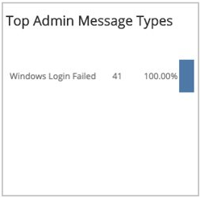

## Customer-Level Anomalies section

This section provides customer-level anomalies detected for the selected date. The list provides anomalies regarding a high overall count for the log message of the customer. The high message count is compared against your normal baseline, and can indicate scans, brute-force attacks, or denial-of-service attacks. The list is organized by customer account, log message type, anomaly, anomalous value, hosts, users, start time, end time, and log sources.

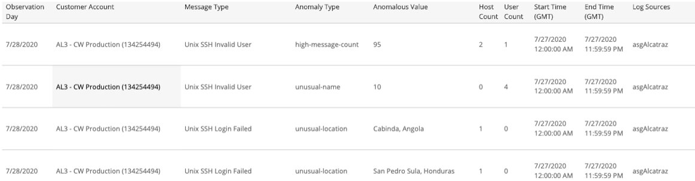

## Host-Level Anomalies section

This section provides host-level anomalies detected for the selected date. The list provides the following detected anomalies and what they can indicate:

| Anomaly | Indicative of  |
|---|---|
| High count  for certain log message types   for a host when compared with the baseline count for that host | Scans or brute-force attacks directed at the host |
| Unusual location of a host for certain log message types | Brute force attack by that host and the corresponding users |
| High number of unique users for certain log messages types | Scan or brute force attack by those users on the host |

The list is organized by customer account, log message type, anomaly, anomalous value, host, users, event types, start time, end time, and log sources.

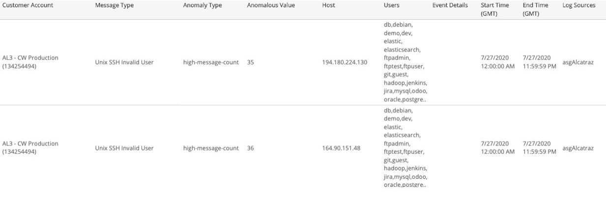

## User-Level Anomalies section

This section provides user-level anomalies detected for the selected date. The list provides anomalies regarding a high overall count for log message for a host when compared with the baseline count for that user, which can indicate scans or brute-force attacks by that user.

The list is organized by customer account, log message type, anomaly, anomalous value, hosts, user, event types, start time, end time, and log sources.

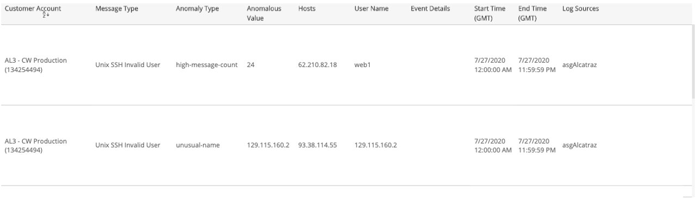

## Administrator Activities section

This section provides administrator activities detected for the selected date. The list provides the following detected activities:

* High log message count for ‘Windows Login Failed’ type for an admin-like user within an hour time period with the default threshold of 1.
* High  log message count for ‘Windows Account Changed’ type  for an admin-like user within an hour minute time period with the default threshold of 5.
* Total log message count for ‘Windows Account Changed’ type for an admin-like user with the default threshold of 1.

The list is organized by customer account, log message type, summary of findings, detections, users, hosts, event types, start time, end time, and log sources.

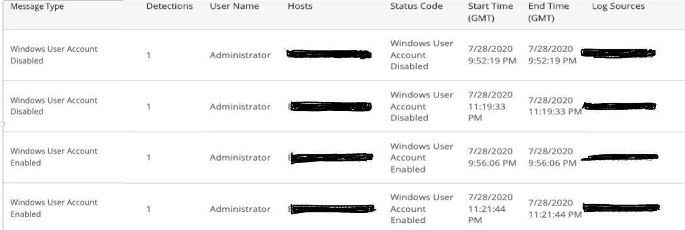

## Log Review Incidents

This section provides details and analysts notes for escalated and closed Log Review incidents generated in the selected date. The list is organized by incident summary, incident ID, date created, status, and the notes from the Alert Logic analysts.

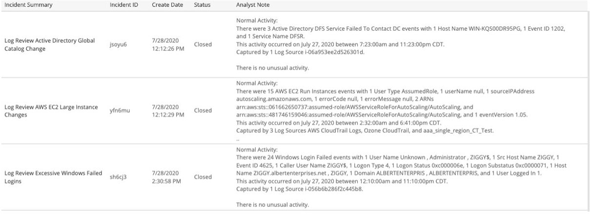
