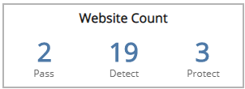
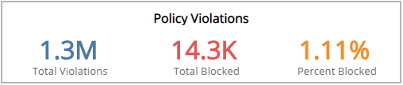
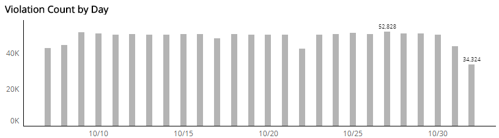

# WAF Violation Explorer Report

The WAF Violation Explorer report provides visibility into blocked Alert Logic Managed Web Application Firewall (WAF) requests and attempted web application attacks, including total and blocked WAF policy violations counts, violations by day, operating mode, risk level, attack class, and type.

Use this report to validate your WAF policies and focus efforts on tuning your configurations.

To access the WAF Violation Explorer report:

1. In the Alert Logic console, click the menu icon (), and then click **Validate**.
2. Click **Reports**, and then click **Threats**.
3. Under **Web Application Analysis**, click **VIEW**.
4. Click **WAF Violation Explorer**.

## Filter the report

To refine your findings, filter your report by  **Date Range** and **Customer Account**.

### Filter the report using drop-down menus

By default, Alert Logic includes **(All)** filter values in the report.

**To add or remove filter values: **

1. Click the drop-down menu in the filter, and then select or clear values.
2. Click **Apply**.

## Website Count Headline section

This section provides the total count of the websites configured in pass, detect, or protect mode in the selected period.

## Policy Violations Headline section

This section provides the total number of WAF policy violations, total number of policy violations resulting in a blocked request, and the percentage of the total number of policy violations that were detected and blocked in the selected filters.

## Violation Count by Day section

The bar graph presents the daily violation count in the selected filters.

## Violations by Operating Mode section

This section displays WAF policy violations by operating mode in a color-coded pie chart in the selected filters. The graph presents the following operating modes:

* Pass: Requests are not blocked, and logging is not performed. This mode is primarily used during the onboarding phase and troubleshooting.
* Detect: Default operating mode during the tuning phase. Violations to configured policy rules are only logged.
* Block: Violations to configured policy rules will be blocked and logged.

##  Violations by Risk Level section

This section displays the violations by risk level presented in a color-coded pie chart in the selected filters. The risk levels are the following:

* Critical: Could represent a successful attack or breach
* High: Requires immediate attention
* Medium: Recommended observation and monitoring
* Low: Common violations and events
* None:           No risk detected

## Violations by Attack Class section

The list displays the violations by attack class during the selected period. The list is organized by attack class, the total number of violations in each attack class, and the percentage of violations in each attack class, along with a color-coded bar that represents the size of violations in each attack class. Hover over the color-coded bar for more information about that attack class.

## Violations by Violation Type section

The list displays the violations by violation type during the selected period. The list is organized violation type, the total number of that violation type, and the percentage of each violation type, along with a color-coded bar that represents the size of that violation type. Hover over the color-coded bar for more information about that violation type.

