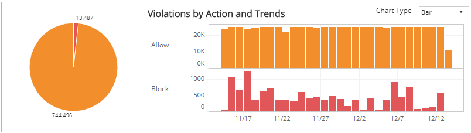
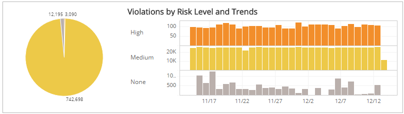
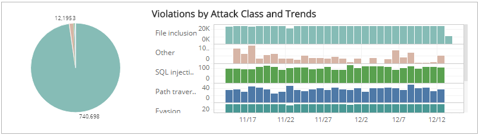
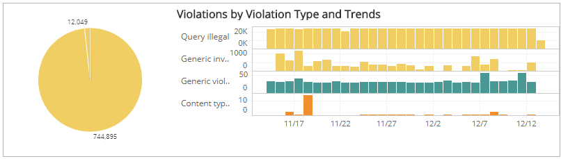
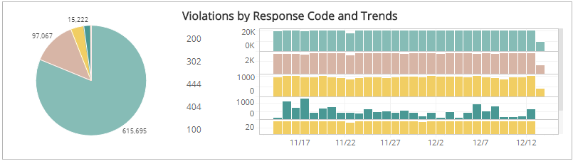
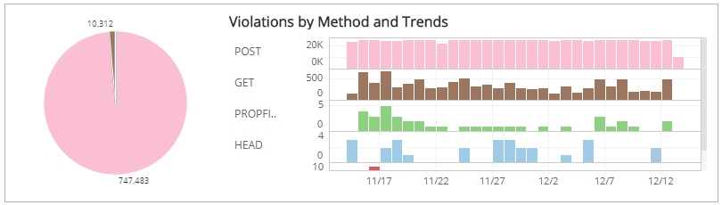
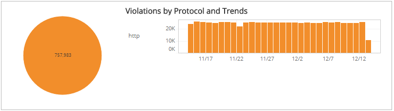

# WAF Violation Trends

The WAF Violation Trends report provides insights into patterns in your Alert Logic Managed Web Application Firewall (WAF) violations, including violation distribution and trends categorized by action, risk level, attack class, violation type, response code, method, and protocol.

**To access the WAF Violation Trends report**:

1. In the Alert Logic console, click the menu icon (), and then click **Validate**.
2. Click **Reports**, and then click **Threats**.
3. Under **Web Application Analysis**, click **VIEW**.
4. Click **WAFViolation Trends**.

## Filter the report

To refine your findings, you can filter your report by  **Date Range** and **Customer Account**.

### Filter the report using drop-down menus

By default, Alert Logic includes **(All)** filter values in the report.

**To add or remove filter values: **

1. Click the drop-down menu in the filter, and then select or clear values.
2. Click **Apply**.

## Violations by Action and Trends section

This section shows the distribution of action categories from your WAF deny logs and trends over the selected time period in the selected filters. The action categories are the following:

* Allow: The request was allowed because of the current operating mode or WAF configuration.
* Block: The request was blocked by Alert Logic.

The color-coded pie chart represents the total violation count in each action category, along with a chart that presents the daily trend over the selected time period of those violations.

You can display the trend data as a line or bar chart. Click the drop-down on the top right of this section, and then select the chart type you want to see. This selection changes all the charts.

## Violations by Risk Level and Trends section

This section shows the distribution of risk levels and trend of those violations over the selected time period in the selected filters. The risk levels are the following:

* Critical: May represent a successful attack or breach
* High: Requires immediate attention
* Medium: Observation and monitoring
* Low: Common violations and events
* None: No risk detected

The color-coded pie chart presents the total violation count in each risk level, along with a chart that presents the daily trend over the selected time period of those violations.

You can view the trend data as a line or bar chart. Click the drop-down on the top right of the **Violations by Action and Trends** section at the top of the page, and then select the chart type you want to see.  This selection changes all the charts.

## Violations by Attack Class and Trends section

This section shows the distribution of attack classification and trend of those violations over the selected time period in the selected filters. Some of the most common attack classes include the following:

* Malformed request
* File inclusion
* SQL injection
* Cross site scripting
* Buffer overflow
* XPath injection
* DOS attempt
* Evasion
* OS commanding
* Path traversal

The color-coded pie chart presents the total violation count in each attack class, along with a chart that presents the daily trend over the selected time period of those violations.

You can view the trend data as a line or bar chart. Click the drop-down on the top right of the **Violations by Action and Trends** section at the top of the page, and then select the chart type you want to see.  This selection changes all the charts.

## Violations by Violation Type and Trends section

This section shows the distribution of violation types and trend of those violations over the selected time period in the selected filters. Some of the most common violation types include the following:

* Query illegal
* Generic invalid hostname
* Generic violation
* Content type ne
* Malformed XML
* Authorization failed
* Path unknown
* File upload attempt

The color-coded pie chart presents the total violation count in each violation type, along with a chart that presents the daily trend over the selected time period of those violations.

You can view the trend data as a line or bar chart. Click the drop-down on the top right of the **Violations by Action and Trends** section at the top of the page, and then select the chart type you want to see.  This selection changes all the charts.

## Violations by Response Code and Trends section

This section shows the response codes and trend of those violations over the selected time period  in the selected filters. The response codes are the following:

* 1xx: Information responses
* 2xx: Successful responses
* 3xx: Redirection messages
* 4xx: Client error responses
* 5xx: Service error responses

The color-coded pie chart presents the total violation count in each response code, along with a chart that presents the daily trend over the selected time period of those violations.

You can view the trend data as a line or bar chart. Click the drop-down on the top right of the **Violations by Action and Trends** section at the top of the page, and then select the chart type you want to see.  This selection changes all the charts.

## Violations by Method and Trends section

This section shows the distribution of method categories and trending of those violations over the selected time period within the selected filters. The method categories are the following:

* GET
* POST
* PUT
* HEAD
* PATCH
* OPTIONS
* DELETE
* PROPFIND

The color-coded pie chart presents the total violation count for each method category, along with a chart that presents the daily trend over the selected time period of those violations.

You can view the trend data as a line or bar chart. Click the drop-down on the top right of the **Violations by Action and Trends** section at the top of the page, and then select the chart type you want to see.  This selection changes all the charts.

## Violation by Protocol and Trends

This section shows the distribution of protocol categories and trending of those violations over the selected time period within the selected filters. The protocol categories are the following:

* HTTP
* HTTPS

The color-coded pie chart presents the total violation count for each protocol category, along with a chart that presents the daily trend over the selected time period of those violations.

You can view the trend data as a line or bar chart. Click the drop-down on the top right of the **Violations by Action and Trends** section at the top of the page, and then select the chart type you want to see.  This selection changes all the charts.

