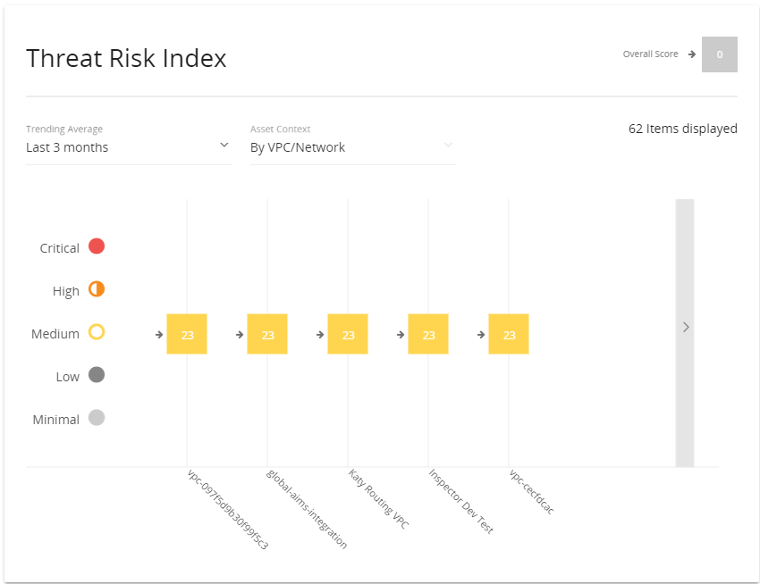
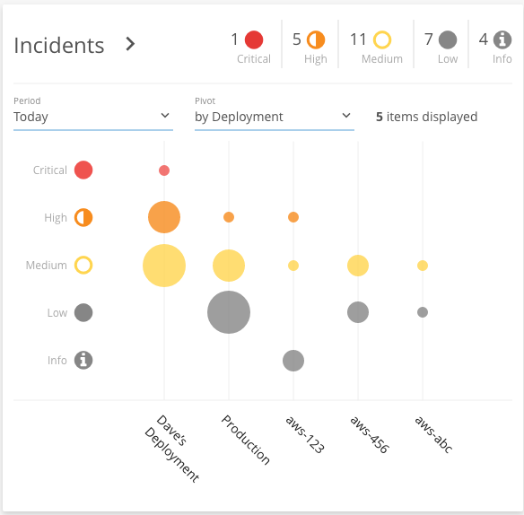
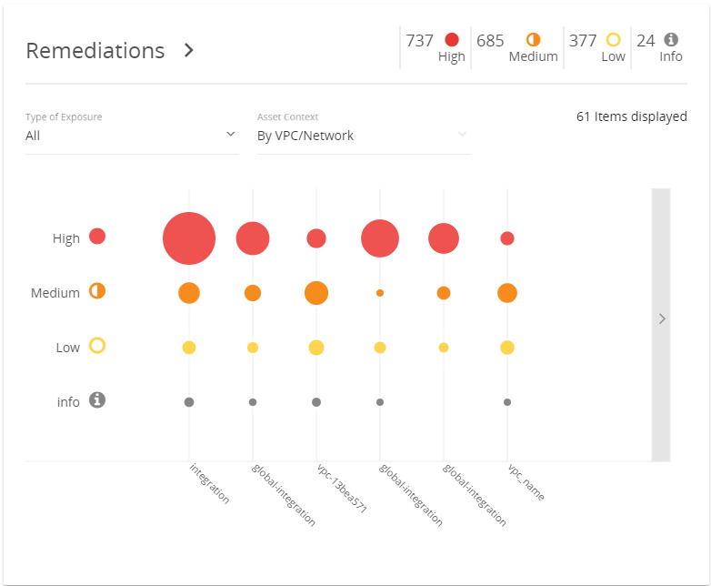

# Security Posture Dashboard

In early 2020, the Security Posture dashboard was deprecated. The information is still available on the [Threat Risk Index Summary](dashboard/tri-summary.md).

Alert Logic provides an overview of the current state of your environments when you log into the Alert Logic console. The Security Posture page, under the **Overview** tab in the Alert Logic console, displays interactive dashboard summaries of your environment for Threat Risk Index (TRI), Remediations, and if you have an Alert Logic Professional or Alert Logic Enterprise subscription, for Incidents. Use the dashboards to analyze and address issues in your environment.

## Threat Risk Index

The Threat Risk Index (TRI) graph displays the current TRI score, a numbered system that calculates the risk  of your deployments, VPCs, or networks. The color-coded icons illustrate the score levels:

* Critical
*  High
*  Medium
*  Low
*  Minimal

The Overall Score is the weighted average of all TRI scores of your selected deployments. The trend arrow is based on whether the TRI score for the asset is better, worse, or the same over the selected trending average period.

For more about how Alert Logic calculates TRI scores, see [Threat Risk Index Score Factors](TRI-score-factors.md).

The graph allows you to select the Trending Average, set the asset context by deployment, or VPCs and networks, and displays the number of items in the graph. The color-coded boxes contain the TRI scores, which are higher or lower depending on their  scores, and organized from worst to best (left to right). If some items do not fit in the graph view, you can click the arrow on the right of the graph to scroll and view more items.

To see more details about a TRI score, hover over a TRI box. To see more details about an asset, hover over a deployment, or VPC and network.

## Incidents

If you have a  Professional or Enterprise subscription, you can have access to the incidents dashboard. The Incidents graph summarizes the threat level and incident classifications of detected incidents in your deployments. The size and color of the circle illustrates the count and threat level of those incidents. Alert Logic uses color-coded icons in the graphs to illustrate the threat levels with the following:

* Critical
*  High
*  Medium
*  Low
*  Information

The graph displays the number of incidents in your environment for the time period you specify, and allows you to specify whether you view the graph by incidents classification or deployment. The color-coded circles are higher or lower depending on the threat level of the incidents within that classification type or deployment, and  organized from worst to best (left to right). If some items do not fit in the graph view, you can click the arrow on the right of the graph to scroll and view over more items.

To see more details about an incident, hover over an incident circle. To see more details about an incident classification or deployment, hover over a classification type or deployment.

Click the incident circle to open the Incident List, filtered by the specified incident classification and deployment. Click a classification type or deployment on the graph to open the Incident List, filtered by incidents of that classification type or deployment.

## Remediations

The Remediations graph is a summary of  remediation priorities for the security and configuration exposures discovered in your deployments, VPCs, or networks. The size and color of the circle illustrate the count and priority of those exposures. Alert Logic uses color-coded icons in the graphs to illustrate the exposure levels with the following:

* High
*  Medium
* Low
*  Information

The graph allows you to display exposures by configuration or security type and by deployment, or VPCs and networks. The color-coded circles are higher or lower depending on the exposure severity level of the remediations within that deployment, VPC, or network, and  organized from worst to best (left to right). If some items do not fit in the graph view, you can click the arrow on the right of the graph to scroll and view over more items.

To see more details about a remediation, hover over a remediation circle. To see more details about an asset, hover over a deployment, or VPC and network.

Click the remediation circle to open the Remediations List, filtered by that exposure level and the specified deployment, VPC, or network. Click a deployment, or VPC and network on the graph to open the Remediation List, filtered by remediations in that deployment, VPC, or network.
