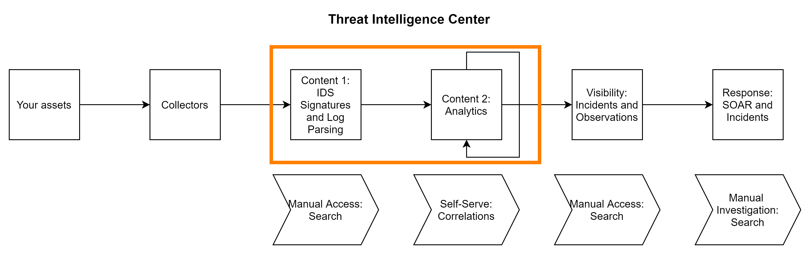

# Threat Intelligence Center (Beta)

    This document is intended for early-access customers, and it is updated as Threat Intelligence Center features are enhanced.     
The Threat Intelligence Center provides insight into Alert Logic threat coverage by displaying  security content details in an interactive, tabular list. You can use the Threat Intelligence Center to learn technical details about how Alert Logic analyzes data to produce security outcomes, using different types of security content. The Threat Intelligence Center displays all customer agnostic security content and coverage details provided by Alert Logic and you can use it to help determine if your environment is configured to maximize security value.

    Information in the Threat Intelligence Center is not specific to your environment. For real-time threat response in your environment, see [Incidents](incidents.md). For automating response actions for real-time threats in your environment, see [Automated Response (Beta)](../respond/automated-response-new.md).    
To access the Threat Intelligence Center, click the menu icon (), click **Investigate**, and then click **Threat Intel Center**.

## About security content

Security value starts with the data that Alert Logic can collect in your environment. For more information on configuring data collection for you environment, see [Get Started with Alert Logic Deployments](../get-started/deployments.md). For more information on collection, see [Collectors-overview].

Security content is the rule-based, anomaly detection, and machine-learning processing that Alert Logic performs on the activity and logs collected from your environment. The first stage of the security analytics pipeline is either  parsing (for log telemetry) or IDS signature matching (for network traffic telemetry). For more information on the first stage of processing for each telemetry type, see [Log telemetry security content: log parsers](#Log) or [Network IDS telemetry security content: IDS signatures](#Telemet).

After the activity is formatted, contextualized, and enriched by Alert Logic in the first stage of processing, it is sent to the second stage of security content processing: analytics. Analytics evaluate the enriched telemetry data to determine if it represents a legitimate threat. For legitimate threats, analytics generate an incident. If the activity needs further analysis, analytics send the data to another analytic or a live analyst.  If the activity does not represent an active threat  but may be of interest in the future, analytics generate an observation. For more information on the second stage of processing, see [Analysis of security content: analytics](#Analysis).

### Log telemetry security content: log parsers

Logs are messages that function as a ledger for activity generated by applications in a system. Limited format standards exist for log messages, which means that they must be parsed to identify and format activity of interest for each specific application. Alert Logic makes Log Parser content coverage visible in the Threat Intelligence Center so that you can easily track relationships among vendors, their applications and appliances, and whether Alert Logic parses logs generated by those applications and appliances. After log messages are parsed, analytics can evaluate the formatted, enriched log messages  to generate incidents and observations.

    Not every log source that Alert Logic parses is also supported with Alert Logic created or curated security analytics. You can create self-service analytics using [Improved Correlations and Search](search/search-correlation.md).    
The Threat Intelligence Center provides a tabular list for the properties of each log parser available from Alert Logic. To view the tabular list of log parsers, click the **Log Parsers** tab.

#### Log parser details page

Click a row in the tabular list to view the full details for all properties of the selected log parser.  For more information about property definitions, use cases, and examples, see  [About Log Parsers in the Threat Intelligence Center](threat-intel-center/about-log-parser-content.md).

### Network IDS telemetry security content: IDS signatures

Network traffic is the machine-to-machine  activity to and from your environment, and it is monitored by the Network IDS appliance. Network activity, unlike log messages, is governed by internet standards, including TCP/IP, HTTP, HTTPS, DNS, and many others. Therefore, suspicious activity can be identified by looking for patterns in the traffic, commonly known as "signature" network patterns. IDS signatures recognize a specific type of activity to generate events. Analytics can evaluate these events to generate incidents and observations.

The Threat Intelligence Center provides a tabular list for the properties of each IDS signature available from Alert Logic. To view the tabular list of IDS signatures, click the **IDS Signatures** tab.

#### IDS Signatures Details Page

Click  a row in the tabular list to view the full details for all properties of the selected IDS signature.  For more information about property definitions, use cases, and examples, see [About IDS Signatures in the Threat Intelligence Center](threat-intel-center/about-IDS-signature-content.md).

### Analysis of security content: analytics

An Alert Logic analytic refers to content  that uses telemetry data derived from parsed logs or IDS signatures to evaluate activity to generate incidents or observations. An analytic can help detect one or more specific threats, and threats can require one or more analytics to detect.

The Threat Intelligence Center provides a tabular list for the properties of each analytic available from Alert Logic. To view the tabular list of analytics, click the **Analytics** tab.

#### Analytics Details Page

Click a row in the tabular list to view the full details for all properties of the selected analytic. For more information about property definitions, use cases, and examples, see [About Analytics in the Threat Intelligence Center](threat-intel-center/about-analytics-content.md).

## General Use Cases for the Threat Intelligence Center

The Threat Intelligence Center is content and context rich. You can use it to accomplish a variety of goals. Some common use cases that require using multiple views within the Threat Intelligence Center are:

1. Validate threat coverage
2. Validate security content updates
3. Investigate content configuration requirements
4. Determine

Other use cases can be found on their specific pages:

### Validate threat coverage

### Validate security content updates

###  Investigate content configuration requirements

You can  use the Threat Intelligence Center to verify that you have configured the collection sources required to detect specific threats in your deployments. You can find an analytic designed to evaluate a specific type of activity in the Threat Intelligence Center and check the telemetry property to see what data is required by the analytic.

For example, you may find an analytic that uses Log telemetry to evaluate threat activity, which indicates that you need to have the collection configured for specific log sources on your assets for the analytic to evaluate the activity as an incident or observation. For more information on configuring specific log sources, see [Log Sources](../deploy/log-sources.md) and [Application Registry](../configure/application-registry.md).## Customize the view in the Threat Intelligence Center

You can use filters and search to display specific content. Use the content tabular list and preview panel to learn about each piece of content. Click a row to view full details for a piece of content.

### View by content type

Click the **Analytics**, **Log Parsers**, or **IDS Signatures** tab to view each type of security content.

### Search

You can use the search bar to filter the list to include only items that contain specific strings.

The search function uses a non-case-sensitive, full text match with any property of the content, not just the columns selected as viewable. For example, a search of a string "inspection of the server" will result in a match for the analytic named "WsmAbnormComp", which includes the sentence "Inspection of the server responses have matched known compromise traffic." in the description property on the [Analytics Details Page](#AnalyticsDetailsPage). A search string of "Alert WAF" will not return analytics with the phrase "Alert Logic WAF" because the text match much be in exact order. ### Content  list style and view Options

You can choose which columns are shown, sort by property, and change the column order and width. Columns shown, order, and width preferences are preserved in the session and across sessions in the same browser.

To choose columns shown:

Click the **Choose Columns** drop-down menu, and then select the check boxes for the content properties that you would like to show as columns.

You can reset to default columns by clicking the refresh arrow () next to the **Choose Columns** drop-down menu.

**To change column order**:

By default, columns are displayed in the order that you chose them. To reorder columns, click the column header and drag it to a new position in the table.

**To change column width**:

To change column width, click between two columns and then drag the columns to the desired width. To change default column width, click , and drag to the desired width.

**To sort by a property**:

Click the arrow next to the column  heading text to sort the table in ascending or descending order by a property.

### Side panel hide and show options

By default, the filter panel and preview panel are shown. To hide a panel, click the hide panel button (). To show the panel, click the show panel button ().

### Filter the content list

By default, no filters are selected. You can apply filters to narrow the content shown in the  table. Use the left panel  to choose the filters. You can only choose one property value for each filter. Click the selected property value again to remove the filter.

### **Preview content details**

Hover over a piece of content in the  list to view details about select properties in the preview panel.

### Export the content table

You can export selected rows and columns by selecting individual rows in the tabular list. Click the box next to the item(s) you would like to download as a CSV, and then click **EXPORT**.
