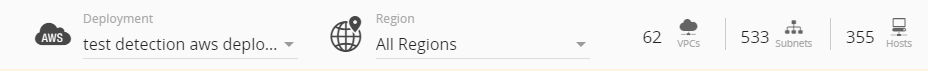
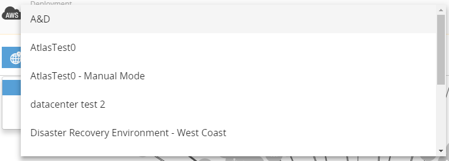
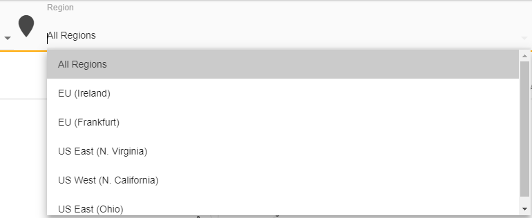

# Topology

The Topology page, under the **Investigate** menu item, displays an interactive diagram that uses color-coded icons to show the distribution of exposures and threats across your network assets.

Topology allows you to select regions or assets to see details about the item, exposures, and remediations for those exposures.

## Topology page 

The Topology page header allows you to specify a deployment and a region, and displays the number of VPCs, VNETs or networks, subnets, and hosts in that selected deployment.

The Topology menu bar allows you to group the assets displayed in the diagram, customize how and what assets are displayed, view details on the status of those assets, and search for specific assets.

###  Specify a deployment

Use the **Deployment** drop-down menu to switch the displayed topology diagram to another deployment.

### Specify a region

By default, the displayed topology diagram includes all regions in the selected deployment. If your deployment includes multiple regions, you can click the **All Regions** drop-down menu to specify a single region for a more focused view of deployment assets.

## Customize the diagram display

The Alert Logic console allows you to customize your view of the topology diagram.

 Scope — Click **Scope** icon to only include assets within the deployment scope in the topology diagram.

 Remediations — Click **Remediations** icon to display the topology diagram with asset icons that appear in colors that identify their exposure levels. Color codes for remediation states are:

* Red: Critical
* Orange: High
* Yellow: Medium
* Gray: Low

 Scan map — Click **Scan map** to display the topology diagram with asset icons that appear in colors that identify their scan states. Color codes for scan states are:

* Blue : Scanned
*  Dark gray with a blue halo: Currently being scanned
* Dark gray: Not scanned
* Light gray: Not in scope

 Credentials map — Click **Credentials map** to display the topology diagram as a credentials map in which assets with assigned credentials are highlighted in green.

 Agents map — Click **Agents map** to display the topology diagram with host icons that appear in colors to identify the agent health status. Color codes for agent status are:

*  Green: Ok; Healthy
* Red: Error
* Yellow: Warning
* Gray: Offline
* Dark Gray: Not installed

### Add assets to view

You can add the following assets to the topology diagram:

 Load balancers

 Security groups

 AMIs

 Containers

 Stopped instances

## Asset details

Click a region, or asset to view its information, manage or add credentials, view incidents and recommended remediations for the asset, or add the asset to the Watch List, or scan now.

### Add or manage asset credentials

Alert Logic uses credentials to gather information about the assets in your environment. Click a region, VPCs, VNETs or networks, subnets, and hosts, and then click **credentials** to manage the asset credentials.

### Take action on incidents and remediations 

Click a region or asset, and then click **action** to see the incidents and recommended remediations for that asset, or to add the selected asset to the Watch List. Use the watch list to monitor selected assets for changes in threat levels.

### Scan Now

If you need to run a scan immediately, you can use the Scan Now feature on the Topology page. This feature scans the selected host right away or as soon as possible, outside the normal schedule.

    For hosts with [Agent-Based Scanning](manage-scans-and-results/agent-based-scan.md), Scan Now triggers an agent-based scan at the same time as the network scan. The results of both scan devices are merged once the l network scan completes.    
To see which scans are in progress, click the scan icon () to see the scan statuses of your assets. For more information about scan status, see [Customize the diagram display](#customize-display).

**To use the Scan Now feature:**

1. On the Topology page, specify a deployment or region in the respective drop-down menus.
2. Click the host you want to scan immediately, if a scan is not in progress.
3. In the slideout panel, click **Actions**, and then click **SCAN NOW**.
If the host is excluded from scanning in the deployment scope of protection, a message prompts you to confirm whether to continue with the scan. If ports are excluded, a message prompts you to choose whether to honor or override the exclusions. If you choose to honor exclusions, the scanner does not scan the excluded ports.
4. Click **OK** to run the scan.

Scan Now may delay the scan for 5-25 minutes, depending on technological factors such as the current load on the scanner and the availability of a scan appliance. Alert Logic will always scan the host as soon as possible.
