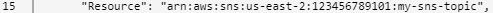
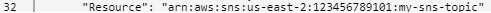
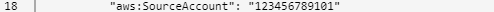
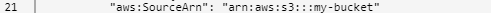

# Configure AWS Network Firewall Log Collector

The Alert Logic Amazon Web Services (AWS) Network Firewall log collector is  designed to collect AWS Network Firewall alerts delivered to an Amazon Simple Storage Service (S3) bucket. You can find AWS Network Firewall alerts collected with keyword search in the Alert Logic console [Search: Log Messages](../../analyze/log-message-search.md) page. The message type is "AWS Network Firewall Alert." You can create correlations to generate incidents from these alerts. For more information, see [Correlations and Notifications](../notifications/log-correlation.md). Alert Logic also generates security incidents from AWS Network Firewall alerts in the [Incidents](../../analyze/incidents.md) page. For more information about firewall application security content, see [Firewall Incidents and Log Configuration](../../analyze/firewall-incidents.md).

You must complete the following to successfully configure your AWS Network Firewall log collector:

1. [Set up an SNS topic and IAM role in your AWS account](#SetupanSNStopicandIAMroleinyourAWSaccount)
2. [Set up S3 notifications in your AWS account](#SetupS3notificationsinyourAWSaccount)
3. [Configure collection in the Alert Logic console](#ConfigurecollectionintheAlertLogicconsole)
4. [Add Alert Logic firewall rules to your AWS Network Firewall policy](#AddAlertLogicfirewallrulestoyourAWSNetworkFirewallpolicy)

You can use the same setup in AWS for configuring the AWS Network Firewall log collector and the [Amazon S3 log collector](amazon-s3.md).  If you have already completed the setup in AWS and want to reuse it, you can skip to [Configure collection in the Alert Logic console](#ConfigurecollectionintheAlertLogicconsole).

You can use the same setup in AWS for configuring integration with these services available in the Application Registry when you click the AWS tile:

* Amazon EC2
* Elastic Load Balancing
* AWS Network Firewall
* Amazon Redshift
* Amazon S3 Audit
* Amazon VPC Flow Logs

If you have already completed the setup in AWS and want to reuse it, you can skip to [Configure collection in the Alert Logic console](#ConfigurecollectionintheAlertLogicconsole).

## Set up an SNS topic and IAM role in your AWS account

In the AWS account that hosts your S3 buckets, you must set up an Amazon Simple Notification Service (SNS) topic where AWS publishes S3 notifications. You must also set up an IAM role to grant Alert Logic access to your S3 buckets.

Use an AWS CloudFormation template that Alert Logic provides to set up the SNS topic and IAM role, or you can set them up manually.

### Set up an SNS topic and IAM role with a CloudFormation template

Alert Logic recommends that you deploy the Alert Logic CloudFormation template to set up the SNS topic and IAM role.

**To set up an SNS topic and IAM role with a CloudFormation template:**

1. Click the following link, and ensure you select the same region as your S3 bucket. Note this region identifier (for example, **us-east-2** for Ohio), which you need when you configure the collector in the Alert Logic console.
[https://console.aws.amazon.com/cloudformation/home?region=us-east-1#/stacks/create/review?stackName=alertlogic-s3-collection&amp;templateURL=https://alertlogic-collectors-us-east-1.s3.amazonaws.com/cfn/s3-collector-support.template](https://console.aws.amazon.com/cloudformation/home?region=us-east-1#/stacks/create/review?stackName=alertlogic-s3-collection&amp;templateURL=https://alertlogic-collectors-us-east-1.s3.amazonaws.com/cfn/s3-collector-support.template)
2. Under **Parameters**, in the **External ID** field, enter your Alert Logic Account ID.
3. In the **Stack Name** and **AlertLogicAWSAccountId** fields, leave the default values.
4. Select the **I acknowledge that AWS CloudFormation might create IAM resources with custom names** check box.
5. Click **Create stack** to deploy the stack.
6. View the stack output to retrieve the IAM Role ARN, SNS Topic ARN, and External ID, which you need when you configure the collector in the Alert Logic console.

### Set up an SNS topic and IAM Role manually

If you are unable to use CloudFormation in your AWS account, you can use the following procedures instead to set up the SNS topic and IAM role manually.

#### Set up an SNS topic for S3 notifications manually

In the AWS account that Alert Logic protects, you must create an Amazon SNS topic  to which Amazon S3 can publish notifications. The SNS topic must be in the same region as your S3 bucket.

You must also configure the SNS topic access policy to allow S3 to publish notifications to the topic and grant Alert Logic permission  to receive and process S3 notifications, specifically object created events.

**To set up an SNS topic for S3 notifications manually:**

1. Sign in to the Amazon SNS console.
2. In the left navigation pane, choose **Topics**.
3. Choose to create a **Standard** topic.
4. In the **Details** section, enter a descriptive **Name** for the topic (for example,  my-sns-topic).
5. Click this link to download the [S3 SNS access policy document (JSON file)](../../pdf-files/s3-sns-access-policy.json). Keep the link open so you can edit the  example as described next.
6. In the **Access policy** section, use the downloaded example to configure the SNS topic access policy to allow S3 to publish notifications to the topic and grant Alert Logic permission  to subscribe to updates. 
The example allows the publishing of S3 notifications from S3 bucket "my-bucket" in AWS account 123456789101 to an SNS topic with ARN arn:aws:sns:us-east-2: 123456789101:my-sns-topic. It also grants Alert Logic permission to subscribe to the SNS topic. Edit the example as follows:
   1. Replace values  for the SNS topic ARN in lines 15 and 32.
   
   
   2. Replace the AWS account in line 18.
   
   3. Replace the S3 bucket name in line 21.
   
   4. Add the statements to your SNS access policy.
8. Scroll to the end of the form and choose **Create topic**.

#### Set up an IAM role in AWS for your S3 buckets manually

Alert Logic uses AWS IAM role-based authentication to enable access to your S3 buckets. Before you configure your S3 collector in the Alert Logic console, you must first create an IAM role with the necessary permissions that Alert Logic can use to retrieve objects from S3.

**To create an IAM role for your S3 buckets manually:**

1. In the AWS console, navigate to the IAM service.
2. Under **Roles**, click **Create Role**.
3. Select **Another AWS Account**.
4. In the **Account ID** field, enter **230378978437**.
5. Under **Options**, select **Require external ID**, and enter an external ID of your choosing. Make note of it. You will need the value when you configure the collection in the Alert Logic console.
6. Click this link to download the [S3 IAM policy document (JSON file)](../../pdf-files/s3-iam-policy.json). Keep the link open so you can copy and paste the information in the next step.
7. Under **Permissions**, click **Create policy**, and then paste the JSON policy.
      To limit the buckets this role can access, enter their names in the JSON policy **Resource** field.      11. In the **Review Policy** section, type a descriptive **Policy name** (for example, AlertLogicS3AccessPolicy).
12. Return to your Role creation page, and then click the policy you created.
13. Type a **Role name**, and then click **Create Role**.
14. Note the Role ARN value, which you will need when you configure the collection in the Alert Logic console.

## Set up S3 notifications in your AWS account

The next step is to send Amazon S3 notifications to the Amazon SNS topic you set up.

**To set up  S3 notifications:**

1. Log in to AWS and navigate to the Amazon S3 service console.
2. Select the S3 bucket that collects the logs you want Alert Logic to process.
3. In the **Properties** tab, under **Advanced settings**, click the **Events** tile.
4. Click **Add notification**.
5. In the **Name** field, type a descriptive name for this event.
6. Select the **All object create events** check box.
7. (Optional) To limit the objects that Alert Logic receives notifications about, add the prefix in the **Prefix** field. Use this option if, for example, you store your logs in a particular folder.
8. Leave the **Suffix** field blank.
9. Click the **Send to** drop-down box, and then select **SNS topic**.
10. Select the SNS topic created in the previous procedure, and then click **Save**.

A message notifies you whether the event was created successfully, and if not, provides troubleshooting tips.

## Configure collection in the Alert Logic console

After you set up the SNS topic, IAM role for your S3 buckets, and S3 event notifications  in AWS, you must complete the next step of the collection configuration process in the Alert Logic console. This configuration is an account-level integration, which means you can configure more than one instance of AWS Network Firewall log collection. This capability is useful when  more than one instance of the application exists.

To access the Application Registry page, click the menu icon () from the Dashboards page. Click **Configure**, and then click **Application Registry**.

**To add a new application collection**:

1. In the Application Registry, click the **AWS** tile, and then click **AWS Network Firewall**.
2. In the **Application Name** field, enter a name for this AWS Network Firewall collection instance.
3. Under  **Collection Method and Policy**, in the **Role ARN** field, enter the ARN for the IAM role granting access to your S3 bucket that you noted earlier.
4. In the **External ID** field, enter the value in the **External ID** field that you noted earlier.
5. In the **S3 Bucket Name** field, enter the name of the S3 bucket from which to collect alerts.
6. (Optional) If you want Alert Logic to collect logs from a particular folder in your S3 bucket, in the **S3 Object Key Prefix** field enter the prefix that identifies the folder, followed by a slash (for example, "logs/"). Leave this field blank if you want Alert Logic to collect all objects in the bucket.
7. In the **SNS Topic ARN** field, enter the ARN of the SNS topic created earlier that receives S3 notifications (for example, arn:aws:sns:us-east-2: 123456789101:my-sns-topic).
8. In the **SNS Topic Region** field, select the AWS region where S3 sends notifications when data is stored in S3.
9. Under **Firewall Rules**, click **DOWNLOAD THE RULES**. You need these Alert Logic IPS rules to finish the integration in the next procedure.
10. Click **ADD**.Wait a few minutes for the application to create and appear in your application list. Do not click **ADD** again.

In the Applications List tab, if you configured your application correctly, within approximately 10 minutes you will see Configured next to the application. In the Configured Applications tab, if you configured your application correctly, within approximately 10 minutes you will see the application listed. For more information about how to add instances or manage existing collecting applications, see [Manage your configured applications](../application-registry.md#Configur).

The Health console also indicates whether the application collector  is healthy or unhealthy. For more information, see [Health](../../analyze/health.md).

## Add Alert Logic firewall rules to your AWS Network Firewall policy

Alert Logic provides stateful firewall rules compatible with Suricata and Snort open source IPS rule specifications. For full integration with Alert Logic, you must download the Alert Logic firewall rules  (see [Configure collection in the Alert Logic console](#ConfigurecollectionintheAlertLogicconsole)), create a firewall rule group in AWS with the Alert Logic rules, and then add the rule group to your firewall policy.

The following procedure explains how to complete the process in the AWS console, but you can use AWS APIs instead.

If you load the rules into your network firewall policy and an event occurs that matches a rule, AWS produces a message that Alert Logic collects, and Alert Logic generates a medium threat level incident based on the event. Alert Logic also collects events that you configure with other rules, but those rules do not generate incidents in Alert Logic.

**To add **Alert Logic** firewall rules to your firewall policy:**

1. In the AWS console, browse to the VPC page.
2. In the navigation pane on the left, click **Firewalls**.
3. Follow instructions on the page to create the firewall to which you want to add Alert Logic IPS rules or select an existing firewall.
4. In the **Stateful rule groups** section, click **Add rule groups**, and then select **Create and add new stateful rule group**.
5. Enter details about the stateful rule group, and under **Choose how you want to configure the stateful rules**, select **Suricata compatible IPS rules**.
6. Under **Suricata compatible IPS rules**, select **Enter Suricata compatible IPS rules**, and then paste the contents of the file you downloaded in the previous procedure in the  field provided.
7. Under **Action**, select **Alert**.
8. Follow AWS instructions to associate the Alert Logic rule group you created with the firewall policy.

## Security content for Incidents

Alert Logic builds collectors to capture data from AWS Network Firewall and various other applications to create security content that is used to generate incidents for key security use cases. The following security incidents are available for AWS Network Firewall:

* Administrative Actions?
* User Login AD?
* User Behavior AD?

For more information about authentication application security content, see [Authentication Application Security Incidents](../../analyze/security-incidents.md).
