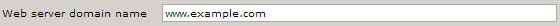
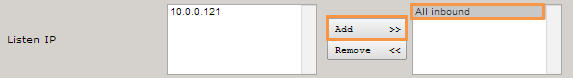
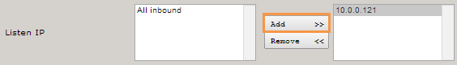
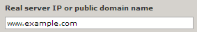
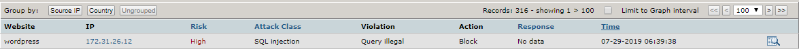
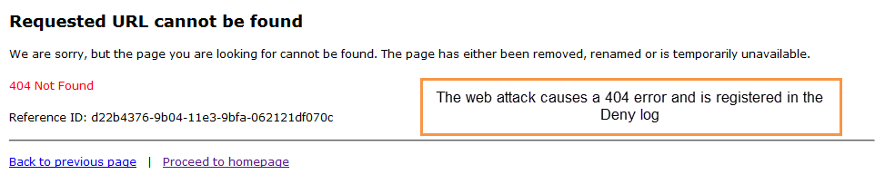
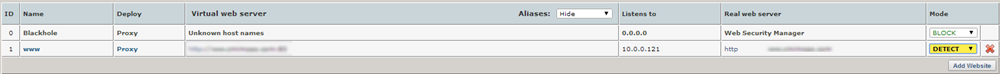

# Configure Alert Logic Managed Web Application Firewall (WAF)

When you access the Alert Logic Managed Web Application Firewall (WAF) interface the first time, you must add your websites and test the website proxy. After you configure and test your websites, the test attack registers in  the deny log.

## Add a website

### Open the Add Website page

1. In the Alert Logic console, click the **Configure** menu item, click WAF, and then click the **Appliances** tab.
2. In the item row of your appliance, click **Manage Appliance**.
3. On the Manage Appliance page, in the left navigation pane, under Services, click **Websites**.
4. On the Websites page, click **Add Website**.

### Modify the virtual web server

By default, WAF deploys as a reverse proxy. Reverse proxy deployments require an IP address to be configured on the appliance. The routing proxy deployment routes traffic to the backend server but intercepts traffic for the configured ports; it then processes traffic and proxies it to the backend. Both deployments terminate client requests and proxy the requests to the backend server.

1. On the Add Website page, in the **Deployment** list, select either **Reverse proxy** or **Routing proxy**. For routing proxy deployments, make sure that IP forwarding is enabled. Under Services, click **Network**, and then under **Network routing,** select **Enable IP forwarding**.
2. On the Add Website page, in the **Web Server Protocol** list, select one of the following:
   * **HTTP**: Creates a website proxy that responds to HTTP requests.
   * **HTTPS**: Creates a website proxy that responds to HTTPS requests. This will generate a temporary SSL certificate.
   * **Both**: Creates a website proxy that responds to HTTP and HTTPS requests. This will generate a temporary SSL certificate.  Click [Manage Your SSL Certificates](manage-certificates.md) to learn how to upload your own certificate.
4. In **Web server domain name**, type the address of the website you want to protect. This address should be identical to the address users use to view your website in a browser. 
5. In the **Listen IP** section, perform one of the following actions to add IP addresses to the Active Listen list:
   * If the left column lists multiple IP addresses, you can select **All Inbound**, and then click **Add** to listen to all IP addresses. 
   * Select one or more IPs, and then click **Add**. 
   
8. **HTTP(S) listen port** field, type the port for  the website you want listen to. The default ports are as follows:
   * HTTP: 80
   * HTTPS: 443
10. For your first or primary site, select **Default Host for listen IP**.

When enabled, the virtual host responds to all requests for virtual hosts that are not otherwise configured for this IP address. The procedure in [Test your website proxy](#testProxy) assumes you selected this option. This configuration is convenient for testing, because it  sends any request that is not a policy violation to the backend web server.

### Modify the real web servers                 

1. In the **Real web server protocol** list, select the protocol you want WAF to use to connect to the backend web server. If you want traffic to the backend web server(s) to be encrypted, change the protocol to either **http** or **both** (for dual protocol configuration).

1. Select **Validate real servers**.

WAF sends an HTTP request to the backend web server on the port configured to verify that the server is live and responding to HTTP requests. If the server is not yet running, clear the check box.

1. In **Real server IP or public domain name**, type the private IP address or DNS name the web server is listening to.                

1. In the **Port** field, type the port the web server is listening to. The default ports are as follows:
   * **HTTP**: 80
   * **HTTPS**: 443
3. In the **Role** list, select one of the following:
   * **Active**Forwards requests to the backend web server
   * **Backup**:  Forwards  requests to the backend web server if no other servers are active
   * **Down**: Does not forward requests to the backend web server

### Modify the initial configuration section and save changes                

1. Under **Initial configuration**, select one of the following configurations to apply to the website proxy:
   * **WAF Default**
   * **Load Balancer**
   * **Custom**
   * **Template**

1. Click **Save Configuration**, and then click **Apply changes**.

## Test your website proxy

After you add a website, test whether WAF can connect to the backend web server. You can also test WAF in Detect mode and Protect mode.

The following walkthrough assumes you have configured your website to be used as the default virtual host for the listen IP. You should also make sure that your website proxy is in Detect mode. You can change these settings after testing.

To set your website proxy to Detect mode, on the **Websites** page, in the Mode column for the website you want to test, select **Detect**.

### Test Connectivity

In your web browser address bar, type your public IP. The browser should open the default website for your backend  web server.

This test will not affect production traffic.

### Test Detect mode

**To test Detect mode:**

1. On the **Websites** page, for the website you want to test, in the Mode column, select **DETECT**.
2. In the browser address bar, type your public IP followed bby <kbd>/?x=a%00</kbd> and press **Enter** (e.g. <kbd>204.110.218.96/?x=a%00</kbd>).

The browser should open the default website for your backend web server, however, this attack should be registered on the **Deny log** as a DOS attempt.

### View the Deny log                

The Deny log lists the attacks on your website proxy. To view the Deny log, in the left navigation pane, click **Deny Log**.

To view details of any Deny log entry, click the Details icon ().

### Test Protect mode

After you test the connectivity and Detect mode for your website, test the Protect mode.

**To test Protect mode:**

1. On the **Websites** page, for the website you want to test, in the Mode column, select **PROTECT**.
2. In the browser address bar, type your public (Elastic) IP followed by <kbd>/?x=a%00</kbd> and press **Enter** (e.g. <kbd>204.110.218.96/?x=a%00</kbd>).

The browser should show a 404 error message. This attack should also be registered on the Deny log as a DOS attempt.

## About Learning

When a website is first created, the default security policy is signature based. As the Learner maps the website, the policy shifts toward a positive security model for specific applications. The Learner analyzes incoming static requests, web applications, and input parameters to build a complete profile of the website.

To avoid learning from worms, attacks, and other unauthorized access, the Learner employs a combination of heuristic attack classification, statistics, and server responses.

When learning is enabled for the website, the Learner works in asynchronous mode to process a queue of traffic samples between 10,000 and 200,000 requests each. For each sample processed, the Learner builds a trial policy, compares it to the former trial policy, and records the number of changes. Once the continuous processed samples result in no change between trials, the learned policy is stable enough to commit to the WAF.

If you plan to enable learning for a website, Alert Logic recommends a learning period before you run WAF in Protect mode. You can run WAF in Protect mode while learning, and doing so provides immediate protection. However, you run the risk of blocking friendly traffic if you start WAF in Protect mode without a learning period.

## About the Websites page

The Websites page contains a list of all websites configured on your WAF appliance.

**To open the Websites page:**

1. In the Alert Logic console, click the **Configure** menu item, click WAF, and then click the **Appliances** tab.
2. In the item row of your appliance, click **Manage Appliance**.
3. On the Manage Appliance page, in the left navigation pane, under Services, click **Websites**.

### The Websites list

Each website in the list is a proxy service that listens for incoming traffic for specific virtual host names (e.g. www.example.com). It then proxies it to the backend Real web server, which would typically be one or more web servers running in your VPC.

### Blackhole

Blackhole is the first entry in the Websites list.  WAF uses it to respond to requests for domain names that your other websites are not configured to listen to. WAF blocks and logs these requests in the **Blackhole** deny log of the website. This way of blocking requests for unknown host names automatically stops most attack probes from automated agents that traverse an entire IP range looking for vulnerable hosts.

Website proxies other than the Blackhole proxy can be configured to be the default website proxy for unknown host names. Doing so allows you to override the blocking from the Blackhole website proxy.

### Websites list details

| Name | Description |
|---|---|
| ID | The ID for the website, also indicates the sequence number of added websites. |
| Name | The internal name you give your website proxy. |
| Deploy | The proxy deployment mode. For Amazon Web Services, only Reverse proxies are allowed. |
| Virtual web server | The domain name and port number combination for the website you want protected. |
| Listens to | The IP address bound to the virtual host. |
| Real web server | The domain name for your backend web server. |
| Mode | Blocking mode. You can select either Detect, Protect, or Pass mode. |

### Selecting a Block mode

On the Websites list, you can select a Block mode for your website. Doing so determines how WAF monitors your website traffic.

### Protect mode                        

Protect mode blocks and logs all violations according to the access policy.

### Detect mode                        

In the default Detect mode preset, only logging occurs, and no blocking protection is activated. Blocking protection that would occur in Protect mode is logged and available for review in the deny log. Operating in the default detect preset is comparable to an intrusion detection system (IDS)—it detects and logs activities but does not protect or prevent policy violations.

When the WAF is first deployed in front of a production website, Alert Logic recommends the Detect mode while the initial tuning takes place. This is the default mode when you select the **WAF configuration**  when you create the website.

### Pass mode

In Pass mode, all requests are passed through the website proxy. No requests are blocked and no logging is performed. This mode is not configurable because no filters are active in this mode.
