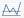

# Dashboards

After you set up Alert Logic Managed Web Application Firewall (WAF), you can access WAF management interface  from the Alert Logic console. To learn how to set up WAF, see [Get Started with Alert Logic Managed Web Application Firewall (WAF)](ch_getting_started.md#ch_getting_started.md).

If you have more than one appliance configured and you want to see and access all of your appliances, websites, and certificates, see [Connect to WAF from the Alert Logic console](ch_getting_started.md#Connect-to-wsm-AL-console.md).

Dashboards is a section located on the left panel in the WAF management interface.

Dashboards includes the following features. Click on the link to go to the corresponding section to learn more:

<!--<MadCap:menuProxy mc-linked-toc="$topicHeadings" xmlns:MadCap="http://www.madcapsoftware.com/Schemas/MadCap.xsd" />-->
To save configuration changes or edits you make to any features and options, you must click **Save** on the lower-right of the section or page where you are making changes. Click **apply changes** on the upper-left corner of the page, and then click **OK**. Your changes will not be stored if you do not properly save your changes.

To go to the previous section, click [Get Started with Alert Logic Managed Web Application Firewall (WAF)](ch_getting_started.md). To go to the next section, click [Services](ch_services.md).

## Deny Log 

In WAF, websites have separate security policies and deny logs. This allows for fine grain tuning of policies and makes it easy to provide detailed reporting to management and application/web site owners. For the security administrator, it is necessary to have the ability monitor the deny log for all websites. The deny summary window provides such functionality by summarizing log data for all configured websites. The window consists of two sections:

* An interactive graph with a drill down of the functionality which summarizes all deny log events in a column graph.
* A more detailed interactive list with drill down functionality which shows deny log events for all websites above a configured risk level (default medium).

Both elements allows you to narrow in on events in the specific websites deny log.

### Interactive graph

The interactive column allows you to zoom in on log events through three levels. For all three levels, the date selector allows you to scroll through historic log events and if you hover over a column, it displays the exact number of requests for that category.

1. **By date and risk**: For each date in the selected period, deny log events are shown divided into the five risk categories `critical` through `none`.                  Click one of the columns to zoom in on that date which takes you to level two.
2. By website and risk: For each website/application deny log events are shown divided into the five risk categories `critical` through `none`.                Click one of the columns to zoom in on log events for that website for the specific date selected.
3. **Single website by attack class**: The lowest level of the interactive graph shows log events for a specific website by attack class, sql injection, XSS, etc. By default, the log entries are only shown for one day. To extend the interval or view a different interval, choose an option from the **Show** drop-down.                  Click on an attack class column to filter the deny log of the website, which also shows only log entriesfrom that filter in the interactive graph.

### Interactive list 

The interactive list shows log entries above a configurable risk level for all websites. The blue column headings indicate that the result can be sorted by that column. Click the same column to toggle sort direction (asc/desc).

The top level of the list shows attacks summarized by either source IP or country. Click on a row to display a list showing the number of attacks showed in the attacks column. When the list is summarized by IP, the list shows log records from all websites from that specific source IP. When the list is summarized by country, the list displays log records from all websites summarized by source IP. Click on a row to show details from that specific IP.

When showing IP details, click the details icon in the rightmost column of the list to display details from that log event.

The description of the columns below apply to all detail levels of the list. Some columns are specific for a level and will not be visible in other.

By default, the list shows all records for a maximum of 90 days. Select **Limit to Graph interval** to only display records for the interval specified in the list and graph above.

<table>
  <colgroup>
    <col />
    <col />
  </colgroup>
  <tbody>
    <tr>
      <td>
        <b>Website <!-- need information here --></b>
      </td>
      <td> </td>
    </tr>
    <tr>
      <td>
        <b>                IP              </b>
      </td>
      <td>
        
IP the requests originated from.

      </td>
    </tr>
    <tr>
      <td>
        <b>                Risk              </b>
      </td>
      <td>
        
Risk classification of the log entry. Options are:

        <ul>
          <li>Critical</li>
          <li>High</li>
          <li>Medium</li>
          <li>Low</li>
          <li>None</li>
        </ul>
      </td>
    </tr>
    <tr>
      <td>
        <b>                Attack Class              </b>
      </td>
      <td>
        
Attack classification of the log entry. Options are:

        <ul>
          <li>SQL injection</li>
          <li>XPath injection                                    </li>
          <li>SSI injection</li>
          <li>OS commanding</li>
          <li>XSS (Cross Site Scripting)</li>
          <li>Path traversal</li>
          <li>Enumeration</li>
          <li>Format string</li>
          <li>Buffer overflow</li>
          <li>DoS attempt</li>
          <li>Worm probe</li>
          <li>Access violation</li>
          <li>Malformed request</li>
          <li>Session invalid</li>
          <li>CSRF</li>
          <li>Session expired</li>
          <li>Broken robot</li>
          <li>Broken int. link</li>
          <li>Broken ext. link</li>
          <li>Other</li>
          <li>None</li>
          <li>False positive</li>
          <li>Friendly</li>
        </ul>
      </td>
    </tr>
    <tr>
      <td>
        <b>                Violation              </b>
      </td>
      <td>
        
Shows the general violation description as defined by WAF. Options are:

        <ul>
          <li>Generic violation</li>
          <li>Header unknown</li>
          <li>Header illegal</li>
          <li>Path unknown</li>
          <li>Query unknown - no policy rules match the name of the parameter.</li>
          <li>Query illegal - a policy rule is matching name of the parameter but the parameter value does not match the corresponding regular expression for validating the input value.                                 </li>
          <li>Header length</li>
          <li>Missing hostname</li>
          <li>Invalid hostname</li>
          <li>Header failed</li>
          <li>Path denied</li>
          <li>Upload attempt</li>
          <li>Payload length</li>
          <li>Session validation failed</li>
          <li>Form validation failed</li>
          <li>Session expired</li>
          <li>Malformed XML</li>
          <li>Content type not enabled - Content type is supported but not enabled.</li>
          <li>Negative match</li>
        </ul>
      </td>
    </tr>
    <tr>
      <td>
        <b>                Action              </b>
        
Showed only in IP details view.

      </td>
      <td>
        
Block action taken on the request. Options are:

        <dl>
          <dt>                Allow              </dt>
          <dd>
            
The request was allowed, either because the current mode and whitelist configuration or because the requests was allowed according to policy. If the request was allowed by policy the reason for the request being logged in the deny log is typically that the backend server responded with an error. Expand the request to see details.                                 

          </dd>
          <dt>                Block              </dt>
          <dd>
            
The request was blocked by WAF.

          </dd>
          <dt>                Block-IP              </dt>
          <dd>
            
The request was blocked by WAF and the source IP was blacklisted resulting in further requests from that source being blocked at the network level.                                 

          </dd>
          <dt>                Strip              </dt>
          <dd>
            
The offending part of the request was stripped before allowing the request. Used for instance to remove session cookies for expired sessions.                                 

          </dd>
        </dl>
      </td>
    </tr>
    <tr>
      <td>
        <b>Action</b>
      </td>
      <!-- need information for Action and Response section -->
      <td> </td>
    </tr>
    <tr>
      <td>
        <b>Response</b>
      </td>
      <td> </td>
    </tr>
    <tr>
      <td>
        <b>                Time              </b>
      </td>
      <td>
        
Date and time the request was logged.

      </td>
    </tr>
    <tr>
      <td>
        <b>                Country              </b>
      </td>
      <td>
        <!-- I do not see this columns or following columns to the end of this table in my instance of WSM. Do these columns still exists? -->
        
Country the requests originated from.

      </td>
    </tr>
    <tr>
      <td>
        <b>                Attacks              </b>
      </td>
      <td>
        
Total number of attacks recorded from country/IP.

        
Click row to zoom in on attacks.

      </td>
    </tr>
    <tr>
      <td>
        <b>                Last seen              </b>
      </td>
      <td>
        
Date and time the last request from IP/Country was logged.

        
By default results are sorted by date.

      </td>
    </tr>
    <tr>
      <td>
        <b>                Method              </b>
        
Detail - click details icon to view.

      </td>
      <td>
        
Offending method (if any)

      </td>
    </tr>
    <tr>
      <td>
        <b>                Resp. status              </b>
        
Detail - click details icon to view.

      </td>
      <td>
        
If applicable shows the response status from the backend server like <code>404 not found</code> or <code>200 (OK)</code>.                         

      </td>
    </tr>
    <tr>
      <td>
        <b>                Resp. time              </b>
        
Detail - click details icon to view.

      </td>
      <td>
        
The time from WAF received the request and forwarded it to the backend server until the response is sent to the client from WAF.                        

      </td>
    </tr>
    <tr>
      <td>
        <b>                Referer              </b>
        
Detail - click details icon to view.

      </td>
      <td>
        
The referring source, internal or external, from which the request originated.

      </td>
    </tr>
    <tr>
      <td>
        <b>                Header              </b>
        
Detail - click details icon to view.

      </td>
      <td>
        
Offending header fields and values (if any).

      </td>
    </tr>
    <tr>
      <td>
        <b>                Query              </b>
        
Detail - click details icon to view.

      </td>
      <td>
        
Offending parameter names and values (if any).

      </td>
    </tr>
    <tr>
      <td>
        <b>                Raw              </b>
        
Detail - click details icon to view.

      </td>
      <td>
        
Shows the original request as send by the client. To view it, click on the <b>View RAW request</b> button.                        

      </td>
    </tr>
  </tbody>
</table>## Learning 

Key learning indicators for each website are displayed in the overview table below:

<table>
  <colgroup>
    <col />
    <col />
  </colgroup>
  <tbody>
    <tr>
      <td>
        <b>                Website              </b>
      </td>
      <td>
        
Website name as configured in WAF. 

      </td>
    </tr>
    <tr>
      <td>
        <b>                Samples              </b>
      </td>
      <td>
        
The total number of requests processed during the learning process. 

      </td>
    </tr>
    <tr>
      <td>
        <b>                URL paths              </b>
      </td>
      <td>
        
Total number of unique URL paths identified. 

      </td>
    </tr>
    <tr>
      <td>
        <b>                Parameters              </b>
      </td>
      <td>
        
Total number of unique parameter names identified. Uniqueness is determined by URL path. Two parameters with the same name but mapped as belonging to different URL paths are therefore identified as two unique parameters. When the policy is built WAF identifies parameters with similar names and input data as as global in scope and builds global patterns matching such parameters.                         

      </td>
    </tr>
    <tr>
      <td>
        <b>                Sampling progress              </b>
      </td>
      <td>
        
An indicator bar showing the progress of the sampling process.

        
Sampling is the process of collecting information about the website in terms of what paths/applications are used, what parameters do they take as input, what extensions are used for static content, etc.                        

      </td>
    </tr>
    <tr>
      <td>
        <b>                Verification Progress              </b>
      </td>
      <td>
        
An indicator bar showing the progress of the verification process.

        
The verification process:

        <ul>
          <li> Validates the data samples using statistical methods like analyzing spread in IP sources and time, number of requests, etc.</li>
          <li>Verifies that the resulting policy covers the requests sampled.                        </li>
        </ul>
        
As the WAF Learner extracts characteristics like extensions, specific directories in paths and global parameters (parameter names a number of applications take as input - like print=1) and even patterns used in global parameters the verification process may start before the Data sampling progress has reached 100%.                        

        
Verification is calculated as the number of sample runs in a row with no policy changes relative to the required number configured in learner settings.                        

        
When Verification has reached 100% WAF will either build and commit a new policy or notify the administrator by email that verification has reached 100% and a new policy can be built and committed.                        

      </td>
    </tr>
  </tbody>
</table>## System

The Status Monitor page displays system monitoring information.

The monitor page can be viewed as a separate read-only page without the menu system. The information is also available in XML-format. See below for more information.

### Interfaces

This table displays various interface information parameters.

<colgroup></colgroup>| **                Interface              ** | Interface description/name. |
| **                Status              ** | Physical interface status. |
| **                System IP              ** | Current system IP address for the interface. |
| **                In data              ** | Incoming data. |
| **                Out data              ** | Outgoing data. |
| **                In pkts.              ** | Incoming packets in packets per second. |
| **                Out pkts.              ** | Outgoing packets in packets per second. |

### System 

This table displays the current system usage statistics, and is constantly updated.

<colgroup></colgroup>| **                CPU               ** | CPU load. |
| **                Memory (physical)              ** | Free and total system memory in megabytes. |
| **                Memory (swap)              ** | Maximum and used swap memory in megabytes/kilobytes. |
| **                Files/Sockets              ** | Open files and sockets. |

### Disk

The disk section shows disk usage information per partition.

<colgroup></colgroup>| **Cache** | Content cache partition. |
| **Log** | Log partition. |
| **WSM** | Applications partition. |
| **System** | Access policy partition. |

### Modules

Displays status and memory usage for important system components. In the graphical user interface, general daemons can have the values **OK** (in XML output 1) or **ERROR** (in XML output -1). The Sync Daemon and Proxy core have some extra status codes that are explained below.

<colgroup></colgroup>| **                Proxy core              ** | Proxy core components. Status code can be STOPPED indicating that no physical interfaces are bound to the proxy core (XML output 2) or that Proxy core is stopped by the system since no proxies are defined (XML output 0). |
| **Application server** | The administrative layer. |
| Cluster synchronization | The subsystem which handles cluster synchronization. Status code can be INACTIVE indicating that synchronization is not enabled and the Sync daemon therefore is not running. |
| **Deny log** | The subsystem handling logging. |
| **External alerts** | The subsystem issuing attack alerts via syslog and email. |
| **Health checking** | Daemon checking backend servers. |
| **                Learner              ** | The automated learner. |
| **Traffic statistics** | The subsystem recording proxy statistics. |

### Disk I/O

The Disk I/O section shows disk activity information.

<colgroup></colgroup>| **                Read              ** | Data read from disk per second. |
| **                Write              ** | Data written to disk per second. |
| **                I/O ops              ** | I/O operations per second. |

### Read-only monitor access 

To view the monitor page directly or using an XML client, follow the instructions below.

#### As HTML

Click the **Monitor** in the lower button bar. This will open a new window.

#### XML format

Access the address https://address_of_management_interface:4849/monitor.html?xml using an XML client. An XML data structure with the values above will be returned. Note however that the units can be different from the HTML output. The XML keys therefore the unit the value is returned in.

## Traffic 

The monitor window provides an overview of configured proxies. The overview includes real time traffic information.

### Core traffic 

### Network traffic

<!-- Need information on Core traffic and Network traffic sections -->
### Interfaces

Displays various interface information parameters.

<colgroup></colgroup>| **                Interface              ** | Interface description/name. |
| **                Status              ** | Physical interface status. |
| **                System IP              ** | Current system IP address for the interface. |
| **                In data              ** | Incoming data. |
| **                Out data              ** | Outgoing data. |
| **                In pkts.              ** | Incoming packets in packets per second. |
| **                Out pkts.              ** | Outgoing packets in packets per second. |

### Traffic by website

<colgroup></colgroup>| **                Website              ** | Total number of requests. |
| **                Services              ** | Number of services configured. |
| **Requests** | Total number of HTTP requests received. |
| **Responses** | Total number of HTTP responses sent. |
| **                40x              ** | Total number of responses af type 40x (404 - Not Found, 403 - Forbidden, etc). Unless denied requests are redirected 40x include denied requests. |
| **                50x              ** | Total number of responses af type 50x (502 - Bad gateway, 500 - Internal Server Error, etc). These responses typically indicates that real servers are not responding withion the real server time out or that they are in error state. |
| **                Received              ** | Total data received. |
| **                Sent              ** | Total data sent. |
| **                Compression              ** | Total compression ratio for the proxy. Eg. 60% means that the total original data was compressed to the 60% of it's original size. |
| **Cache hits** |  |
| **                Backend              ** | Backend status `OK` or `ERROR`. When status is in parentheses the backend status is not being managed by the health checking daemon. |
| **                24hr Health %              ** | Even when health checking is not enabled, WSM keeps track of backend availability and latency by querying the configured backend servers at 1-minute intervals and displays a calculated health score based on the last 24 hours of health monitoring. The score is calculated ratio of responses with a response code lower than 400. To display the result of the actual health health monitoring checks, click the magnifying glass symbol. |
| **                Mode              ** | The mode the proxy is running in. |
| **                  Details icon                **  | Click to manage proxy settings. |
| **                Graph icon              **  | Click to display traffic information graphs. |
