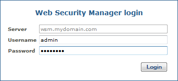
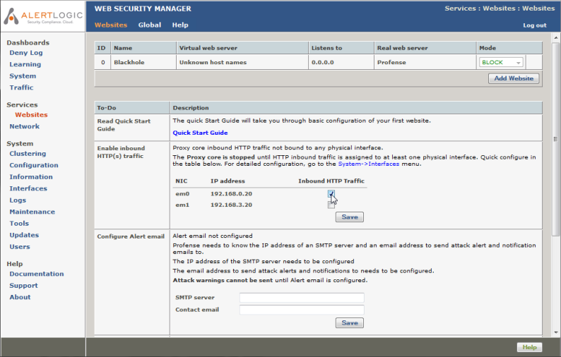
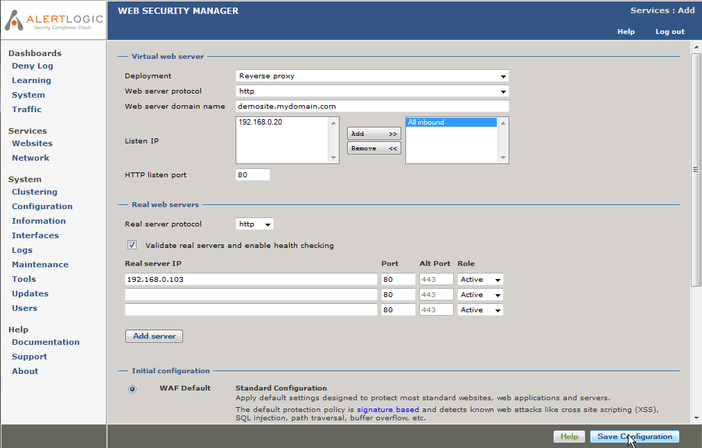
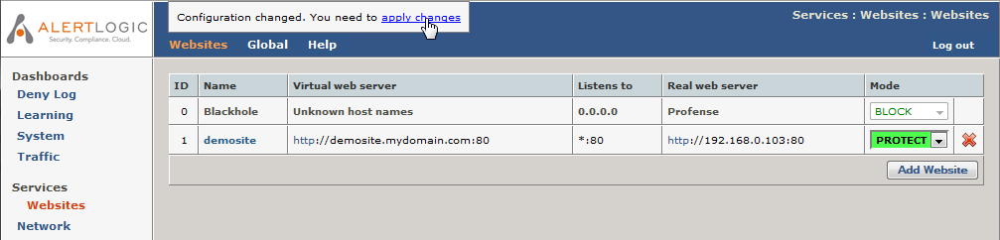
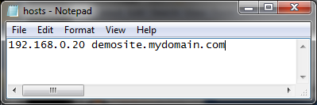
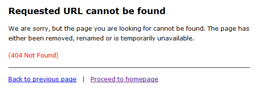
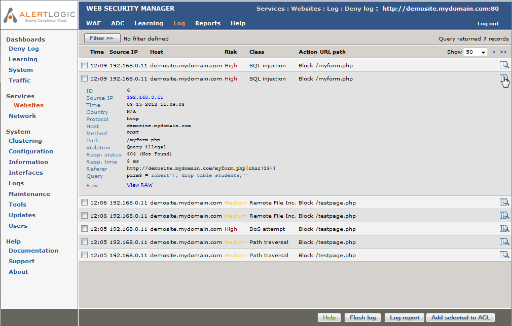
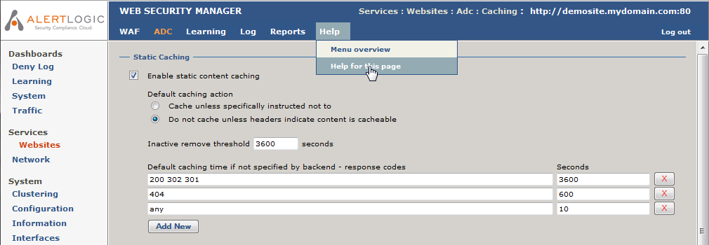

# Get Started with Alert Logic Managed Web Application Firewall (WAF)

This document includes the following sections. Click on the link to go to the corresponding section to learn more:

<!--<MadCap:menuProxy mc-linked-toc="$topicHeadings" xmlns:MadCap="http://www.madcapsoftware.com/Schemas/MadCap.xsd" />-->
To save configuration changes or edits you make to any features and options, you must click **Save** on the lower-right of the section or page where you are making changes. Click **apply changes** on the upper-left corner of the page, and then click **OK**. Your changes will not be stored if you do not properly save your changes.

To go to the previous section, click [About Alert Logic Managed Web Application Firewall (WAF)](about_profense_waf.md). To go to the next section, click [Dashboards](ch_dashboards.md).

## Connect to the WAF management interface

To access the WAF management interface, open a web browser and enter URL https://websecuritymanager_ip_address:4849 (note HTTPS). The management address in the example installation is https://192.168.3.20:4849.

If you are accessing the management interface for the first time, you must enter a license key.

Enter the license key provided in your license key and support contract information letter (PDF), and then click **Activate**. After you enter the license key, you must read and agree to the WAF license agreement. You will be redirected to the WAF management login screen.

Log in using username “admin” and password (last nine characters of license key in reverse order). Change the password after the initial login. For instructions on how to change your password, see [Get Started with Alert Logic Managed Web Application Firewall (WAF)](#gs_change_administrator_password.md).

## Connect to WAF from the Alert Logic console

If you need to connect more than one appliance, you must repeat the steps to connect to WAF for each appliance and access them individually in your browser to manage their corresponding websites and settings.

If you have more than one appliance already configured, you can log in through the Alert Logic console to see a lists all of your appliances, websites, and certificates which you can directly access.

**To access WAF through the **Alert Logic console:

1. In the Alert Logic Managed Web Application Firewall (WAF) management login screen, click **Log in at **Alert Logic** portal**.
2. In the Alert Logic console, enter your  credentials.
3. Click **CONFIGURATION**, and then click **WAF**.
4. Click **Manage Website**. You can filter by appliance, or use the search bar to look for a website. To learn more about website configuration, see [Services](ch_services.md).
5. If you want to access a websites by appliance, click **Appliance**on the left panel, and then click **Manage Appliance**. You can also use the filter to narrow your results, or use the search bar to look for a specific appliance or customer. To learn more about appliance configuration, see [Services](ch_services.md).
6. If you want to access websites based on certificates, click **CERTIFICATES**on the left panel, and then click **Manage Certificate**. You can also use the filter to narrow your results, or use the search bar to look for a specific appliance or customer. To learn more about certificate configuration, see [Configuration](ref_system_configuration.md).

### Navigating WAF management interface

After successful login, you will be presented with the management interface website overview page. The management interface is divided into four main sections:

* **Dashboards**: A quick overview of denied requests, traffic, system status and learning progression.
* **Services**: Configuration and management tool for all website proxies, including policy, caching, acceleration, load balancing, HTTP request throttling and DoS mitigation settings. To add a website or to select a website for management, click **Services**, and then click **Websites**. For more information, see [Website configuration](#gs_adding_a_proxy.md).
* **System**: Configuration of system parameters like network interfaces, IP addresses, fail-over, network settings (DNS, NTP, SMTP), viewing of system logs and status information, including administration of updates, backup and configuration restore.Main (vertical) menu system is on the left side of the screen. Content assigned to the menu item is displayed on the right side of the screen. An additional horizontal menu system appears where applicable.
* **Help**: Access to help and support related information including documentation, version information and support links. On any page, click **Help** at the top menu to display the manual reference section specific for that page.

## Basic system configuration

The table below has a list of system configuration tasks that must be completed. When you complete an item, it will be removed from the list in the WAF management interface. After you add your first website, the "read Quick Start Guide" item in the WAF management interface willalso be removed.

<colgroup></colgroup>| **                Enable inbound HTTP(s) traffic              ** | Select which network interfaces you want to respond to inbound HTTP/HTTPS requests from clients. |
| **                Configure Alert email              ** | WAF needs to know an SMTP server and an email address to send log warnings, update notifications, and other alerts. **SMTP server**: Enter the address of an SMTP server that is reachable and accepts SMTP requests from WAF. **Contact email**: Enter the email address to send notifications to. This item can be skipped, but it is recommended. |
| **                Configure DNS              ** | IP address of one or more DNS servers.<dl><dt>                Valid input              </dt><dd>IP addresses                                        </dd><dd>Use space to separate multiple hosts (only one required).                                    </dd><dt> </dt><dt>                Input example              </dt><dd>`192.168.0.1`</dd></dl> |
| **                Configure time synchronization              ** | IP address or host name of an NTP server. Remember to set up at least one DNS server if you enter a host name here.<dl><dt>                Valid input              </dt><dd>IP address or fully qualified domain name.</dd><dd>Use space to separate multiple hosts (only one required).                                    </dd><dt> </dt><dt>                Input example              </dt><dd>`time.nist.gov`</dd></dl> |

## Website configuration

**To configure a website**:

1. In the left panel,             under  **Services**, click **Websites**.
2. In the Websites page,            click **Add Website**.
3. In the Services Add page, on the Virtual web server section,  you must complete the following steps to configure the part of the website proxy clients use for connecting:
   * In Deployment field, select either **Reverse proxy** or **Routing proxy**.For routing proxy deployments, make sure that IP forwarding is enabled in **Services**>**Network**>**Network routing**.Both deployments terminate client requests and proxies requests to the backend real server. While the reverse proxy requires an IP address to be configured on the WAF node, the routing proxy deployment routes traffic to the backend server, but intercepts traffic for the configured ports, processes it and proxies it to the backend.
   * In Web server protocol field, select **HTTP**, **HTTPS**, or **Both**. The Both option creates a website proxy that responds to both HTTP and HTTPS requests.When selecting **HTTPS** or **Both** as the protocol, a temporary certificate will be generated. When the new proxy is created, the certificate can be replaced by importing the real certificate in **Services**>**Websites**>**ADC**>**Virtual host**. Click **Help** in that section to get instructions.
   * In Web server domain name field, enter the address of the web server you want to protect. The address is you enter in the browser to go to the website.
   * In Listen IP, select the IP address(es) you want the web server to respond to, and then click **Add**. For HTTP websites, all inbound/DHCP can be selected. This will configure the website proxy to respond to all IP addresses that are configured to accept inbound requests. For HTTPS proxies, you must select a specific IP address.
   * In HTTP(s) listen port field, select the port(s) you want the website to listen to. For HTTP proxies, the default is 80, and for HTTPS proxies, the default is 443. When creating a website proxy that serves both HTTP and HTTPS, two input fields will appear.
   * Select the **Default host for listen IP** check box, if
5. In the Real web servers section, you must complete the following steps to configure how the website proxy communicates with the backend web servers:

   1. In **Real server protocol** drop-down option, select the protocol you want WAF to use when connecting to the backend web servers. If you want the traffic to the backend web servers to be encrypted, select **HTTPS**. Otherwise leave the default **HTTP** selected.
   2. Under Real server IP or public domain name, enter the address of the web server to which WAF will redirect the allowed client requests. This is the address of the web server you want to protect. In the example, 192.168.0.103 is entered. Only select HTTPS if it is necessary. HTTPS puts an extra burden on the backend web servers.
   3. Select **Validate real servers** to enable WAF to connect to the backend servers automatically, and find a suitable target page to use for health checking. If **Validate real servers** is disabled, WAF will not monitor the backend server status.
   4. For each backend web server that is serving the website (demosite.mydomain.com in this example), enter the IP address and port in the real servers list.
      * **Real server IP or public domain name**: The IP address the web server is listening on.
      * **Port**: The port the web server is listening on. Typically Address:80 for HTTP servers and Address:443 for HTTPS servers.
      * **Alt Port**:
      * **Role**: Select **Active**, **Backup** or **Down**.
         * Active means that requests is forwarded to the server.
         * Backup means the server is only used if no active servers are in operation.
         * Down means that the server should not be used, for instance if it is down for maintenance.
7. In the Initial configuration section, select the **WAF Default**to apply to the website proxy.
8. In the lower right corner of the page, click the **Save Configuration**. This will save your configurations and take you back to the Websites Overview page.
9. Click the  **apply changes** that appears in the upper right corner of the page to apply changes to your configuration of WAF.

## Test your website

You can now test your newly configured website.

### Change the DNS for the website

For testing purposes, make sure the website domain name resolves to the WAF IP address. You can do this by adding the IP address and domain name to the hosts file on your PC.

### Test connectivity

In a new page or tab, enter the address of the website you configured. You should see the home page of the website, and it should be served by WAF. To check that WAF is serving the content, enter an URL that will match an attack signature.  For instance, to match the path traversal signature append the parameter print=../../../etc/somefile to a page like the example below.

**http://demosite.mydomain.com/testpage.php?print=../../../etc/somefile**

If the page is served through WAF and in Protect Mode, you see the message below with a unique reference ID:

If the proxy is in Detect Mode, there will be no block page, but you will be able to view the allowed test request and other deny logs in the Alert Logic console.

If the above is not displayed, restart your browser and/or flush your DNS cache by running cmd.exe on your PC, and then enter <kbd>ipconfig /flushdns</kbd>. Try the request again.

## View the website deny log

In the WAF management interface, on the left panel, under **Dashboards**,  click **Deny Log**. The websites overview page will be displayed. Select the website for which you want to view the deny log.

When you select a website, landing page is the Deny Log. To view details of a log entry, click the details icon () in the right column of the list.

## Getting help 

Click **Help**  in the relevant section you want more information on, and then click **Help for this page** to open in a new window.

