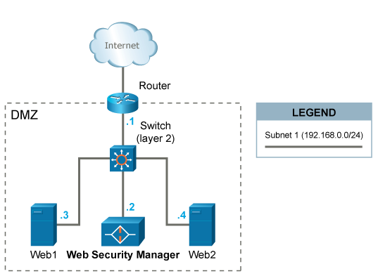
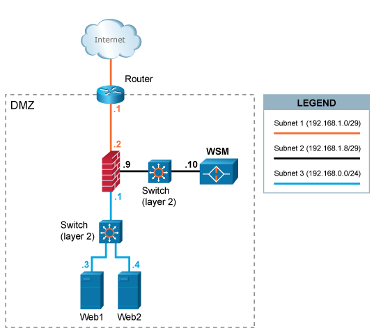
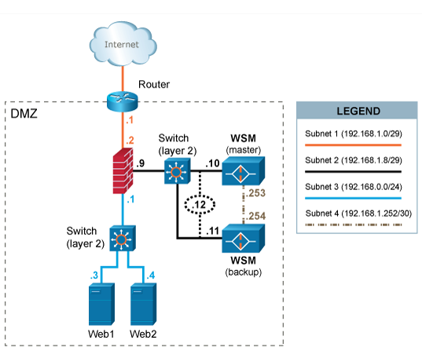
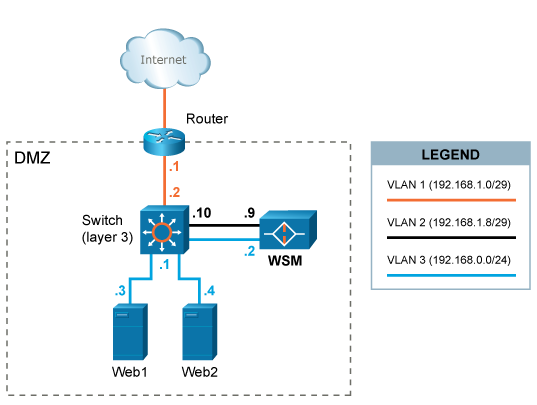

# Network Deployment

Network deployment includes the following features. Click on the link to go to the corresponding section to learn more:

<!--<MadCap:menuProxy mc-linked-toc="$topicHeadings" xmlns:MadCap="http://www.madcapsoftware.com/Schemas/MadCap.xsd" />-->
To save configuration changes or edits you make to any features and options, you must click **Save** on the lower-right of the section or page where you are making changes. Click **apply changes** on the upper-left corner of the page, and then click **OK**. Your changes will not be stored if you do not properly save your changes.

To go to the previous section, click [System](ch_system.md). To go to the next section, click [Frequently Asked Questions](ch_faq.md).

## Simple single-homed Alert Logic Managed Web Application Firewall (WAF) implementation

This scenario is the easiest to implement, since WAF can be introduced in the already established network without any major reconfigurations. A caveat with this setup is that all WAF traffic (both inbound from clients and outbound to the web systems) is using a single ethernet interface.

WAF is placed on the same network (DMZ) with the web systems web1 and web2 it is protecting.

HTTP/HTTPS traffic designated to the web systems (`192.168.0.3` and `192.168.0.4`) is redirected (either by forwarding IP packets via the router or by altering web systems' DNS settings) to the IP address `192.168.0.2` of WAF.

The default gateway of the web systems  is unaltered and is still the router with IP address `192.168.0.1`.

## Firewalled single-homed WAF implementation

This scenario requires an extra interface in the firewall since WAF is deployed in a DMZ-segment separated from the segment in which the web servers are placed. A caveat with this setup is that all WAF traffic (both inbound from clients and outbound to web systems) is using a single ethernet interface.

A separate network segment (`subnet 2`) is configured between WAF and the firewall.

HTTP/HTTPS traffic designated to the web systems (`192.168.0.3` and `192.168.0.4`) is redirected (either by forwarding IP packets via the router or by altering the DNS settings of the web systems) to the  IP address `192.168.1.10` of WAF.

Outbound traffic from WAF to web systems is again inspected by the firewall and sent to the web systems on            `subnet 3`.

The default gateway of the web systems is the firewall with IP address `192.168.0.1`.

## Firewalled WAF implementation with a fail-over/backup WAF

In this scenario WAF is deployed in a high availability configuration with an extra WAF (backup) used for fail-over. A dedicated network or crossover cable is used to connect the WAF cluster and a separate interface is used for synchronization of various information between the active and the backup WAF. Inbound and outbound traffic share the same interface.

The two WAF systems share a virtual (VIP) IP address `192.168.1.12`.

HTTP/HTTPS traffic designated to the web systems (`192.168.0.3` and `192.168.0.4`) is redirected (either by forwarding IP packets via the router or by altering the DNS settings of web systems' ) the VIP address `192.168.1.12`of WAF.

In case the active WAF system fails or looses the connectivity, the backup will take over the VIP and start handling the requests from clients.

The default gateway of the web systems is the firewall with IP address `192.168.0.1`.

## Dual-homed performance optimized WAF implementation

In this scenario, WAF is configured in a dual-homed setup with separation of inbound and outbound web traffic. Two ethernet interfaces are used. Client requests are terminated in VLAN2 and responses from web systems are terminated in VLAN3. This setup (or similar) potentially provides greater performance (since 2 interfaces are used) and security.

A separate network segment (VLAN2) is configured between WAF and the layer 3 switch.

HTTP/HTTPS traffic designated to the web systems (`192.168.0.3` and `192.168.0.4`) is redirected (either by forwarding IP packets via the router or by altering web systems' DNS settings) to Web Security Manager's IP address `192.168.1.9`.

Outbound traffic (downstream) from WAF is sent to web systems via `VLAN3`.

The layer three switch is configured only to allow traffic on the necessary ports (typically `80/tcp` for HTTP and `443/tcp` for HTTPS to pass from Web Security Manager to the web systems.

The default gateway of the web systems is the layer 3 switch with IP address `192.168.0.1`.
