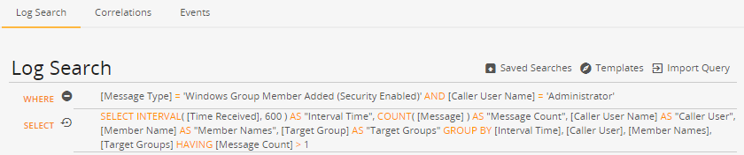
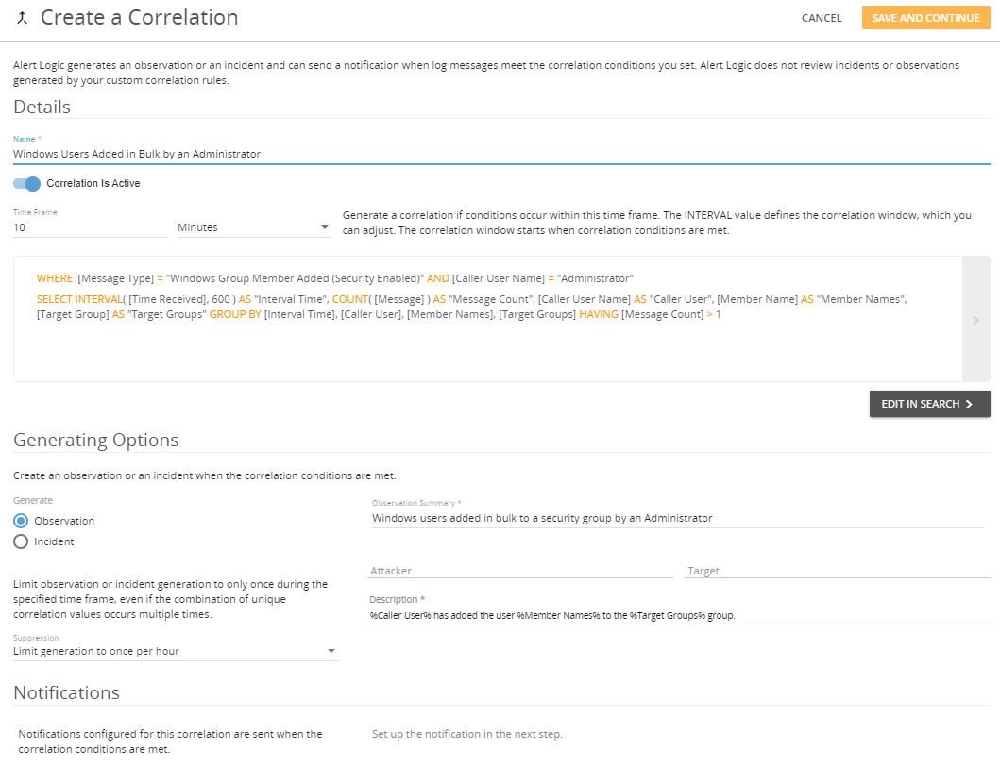

#  Examples of Correlation Queries and Setup

The following examples illustrate common log correlation queries. You can copy the search and projection statements into the **WHERE** and **SELECT** fields in the Log Search page as shown below, and then substitute log message objects with your own to create correlation queries relevant to your organization and its security goals. For more information about working in the Log Search page, see [Search: Log Messages](../../analyze/log-message-search.md).

Following each query is an example for setting up the correlation in the Create a Correlation page as shown below. For more information about creating correlations and subscribing notification recipients, see [Correlations and Notifications](log-correlation.md).

## Discover Windows users added  in bulk by an Administrator

The following query returns a list of log messages that reveals when the Administrator user adds more than one member to a security-enabled group in 10 minutes. Search results are grouped by the interval (time of the log message in Unix time), user name added, and name of the affected group.

### Correlation query

**WHERE:**

| [Message Type] = 'Windows Group Member Added (Security Enabled)' AND [Caller User Name] = 'Administrator' |

**SELECT:**

| SELECT INTERVAL( [Time Received], 600 ) AS "Interval Time", COUNT( [Message] ) AS "Message Count", [Caller User Name] AS "Caller User", [Member Name] AS "Member Names", [Target Group] AS "Target Groups" GROUP BY [Interval Time], [Caller User], [Member Names], [Target Groups] HAVING [Message Count] > 1 |

### Correlation setup

**Name:** Windows Users Added in Bulk by an Administrator

**Generate:** Observation

**Observation Summary:** Windows users added in bulk to a security group by an Administrator

**Description:** %Caller User% has added the user %Member Names% to the %Target Groups% group.

## Search for brute force attempt: more than five failed logins in 10 minutes

The following query searches for more than five failed login attempts in 10 minutes, which can indicate an attempted brute force attack. Search results are grouped by the interval (time of the failed attempt in Unix time), host name of the target, and remote host name of the attacker, if it can be determined.

### Correlation query

**WHERE:**

| [Message Type] = 'Windows Login Failed' AND EXISTS [Caller User Name] |

**SELECT:**

| SELECT INTERVAL( [Time Received], 600 ) AS "Interval Time", COUNT( [Message] ) AS "Message Count", [Host Name] AS "Host Name", [Remote Host Name] AS "Remote Host Name" GROUP BY "Interval Time", "Host Name", "Remote Host Name" HAVING "Message Count" > 5 |

### Correlation setup

**Name:** Brute Force Attempt

**Generate:** Incident

**Incident Threat Level:** High

**Incident Summary:** Brute Force Attempt: Consecutive failed logins

**Attacker:** Remote Host Name

**Target:** Host Name

**Investigation Report:** Brute Force Attempt: At least %Message Count% failed login attempts to %Host Name% from %Remote Host Name% occurred.

**Recommendations:** Confirm whether the activity is expected. Lock out the remote IP address with multiple failed login attempts.

## Generate an incident from an AWS Network Firewall alert

If you configure an integration between Alert Logic and Amazon Web Services (AWS) Network Firewall (see [Configure AWS Network Firewall Log Collector](../collectors/aws_network_firewall.md)), you can search for alerts generated from AWS Network Firewall traffic. The following query searches for AWS Network Firewall alerts generated from the Alert Logic IPS firewall rules  with a threat signature of AL USWEST_TEST_IP_ARRAY Network Attack Request.

### Correlation query

**WHERE:**

`
[Message Type] = "AWS Network Firewall Alert" AND [Signature] = "AL USWEST_TEST_IP_ARRAY Network Attack Request"`

**SELECT:**

| SELECT [Time Received], [source_ip], [destination_ip], [Message] ORDER BY "Time Received" DESC |

### Correlation setup

**Name:** AWS Network Firewall Correlation

**Generate:** Incident

**Incident Threat Level:** Medium

**Incident Classification:** Suspicious Activity

**Incident Summary:** AWS Network Firewall Incident

**Attacker:** source_ip

**Target:** destination_ip

**Investigation Report:** This is an incident generated for a web attack.
