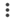

# Amazon Web Services (AWS) Deployment Configuration—Manual Mode

Alert Logic allows for an optional, manual deployment mode for AWS deployments. Alert Logic recommends Manual Mode for AWS deployment creation only if you want  to deploy and maintain new VPC subnets used for scanning instances.

Deployment creation requires that you be logged into your [Alert Logic account](http://console.overview.alertlogic.com/) and the [AWS account](http://aws.amazon.com/) you want this deployment to monitor and protect.

    If you manage more than one Alert Logic account, be sure you are logged into the correct account.    
To start creating your AWS deployment:

1. In the Alert Logic console, click the **Configure** menu item, and then click **Deployments**.
2. Click the  add icon (), and then select Amazon Web Services (AWS).
3. Type a name for your deployment, and then click **SAVE AND CONTINUE**.
4. Select Manual Mode, and then click **SAVE &amp; CONTINUE**.

## IAM policy and role creation 

To protect your AWS deployment, you must set up an AWS IAM policy and role to allow Alert Logic access to your AWS account. Alert Logic provides an AWS CloudFormation template to automate creation of the correct policy and role for the deployment. You can also choose to manually set up the IAM policy and role.

Cross-account roles allow Alert Logic to access your AWS account. AWS role creation requires that you provide an AWS policy, a document that specifies the permissions assigned to the AWS role you create for Alert Logic to access to your AWS account.

The IAM policy document used for a Manual Deployment provides minimal permissions for third-party access and requires that you manually perform the following additional configuration steps in the AWS console:

* Set up a CloudTrail log source
* Create or configure S3 bucket
* Create or configure an existing SNS topic
* Create or configure an existing SQS queue

You can choose to create an IAM policy with minimal permissions. For more information, see [Configure  AWS Minimal Permission Deployment in Manual Mode](../../prepare/aws-minimal-permission-deployment.md).

### IAM policy and role setup using AWS CloudFormation 

Alert Logic recommends you use the Alert Logic CloudFormation template for quick, convenient IAM policy and role creation. The CloudFormation template creates the appropriate IAM role that allows your deployment access to your AWS assets.

Click **CLOUDFORMATION SETUP**, and then follow the instructions in the Alert Logic console and the AWS console.

### IAM policy and role setup using manual IAM setup

Select manual IAM set up if your AWS account permissions allow you to create an IAM policy, but does not have the permissions to run CloudFormation.

Click **MANUAL IAM SETUP**, and then follow the instructions on the screen.

## Enter your Role ARN

In the Alert Logic console, enter the ARN you copied from the AWS console after you created the IAM role.

If you want to configure cross-account access for centralized CloudTrail log collection, click the **I want to configure centralized CloudTrail log collection for this deployment** slide bar, and enter a second Role ARN you created for this purpose. For more information about centralized log collection, see [Should you centralize CloudTrail log collection?](../../prepare/aws-cross-account-role-setup.md#ShouldyoucentralizeCloudTraillogcollection).

## Asset Discovery 

Allow Alert Logic a moment to discover your assets. When discovery is complete, click **CONTINUE**. Alert Logic displays the assets discovered in your account in topology diagrams. To learn more about topology, click [Topology](../../analyze/topology.md).

### Add external assets

You can add external assets by domain name or IP address. Alert Logic will scan these external assets that you define.

    External assets are also used for non-PCI external scans.     
**To add external assets:**

1. Click the Add icon () and choose the DNS name or IP address.
   * If you chose the DNS name, enter your fully-qualified domain name in the field.
   * If you chose IP address, name your external IP address, and then enter the IP address in the field.
3. Click **SAVE**.

## Scope of protection

Alert Logic discovers and organizes deployments into a visual topology where you can select the desired levels of protection for your assets.

You can define the scope of your protection per region or network  or subnet. Each network and subnet appears within its protected region. Click a region or individual network or subnet to set the service level  or leave it unprotected, and then click **SAVE**. You can also use tags  in the internal scanning tab of **EXCLUSIONS** to exclude assets from scanning, including subnets. You must choose one of the following levels of coverage:

* Unprotected
* Alert Logic Essentials coverage
* Alert Logic Professional coverage
* Alert Logic Enterprise coverage

The choices available for scope of protection correspond directly with your entitlement. Although a Professional subscription includes all the features of Essentials, a Professional customer cannot set the protection scope to Essentials unless the account has a separate Essentials subscription. Likewise, an Enterprise customer cannot set the protection scope to Essentials or Professional unless the account has separate subscriptions for those.

You can [change the protection level](../change-protection.md) later as needed.

### Exclusions

You can exclude assets or ports from external and internal scanning and Network IDS.

#### External scanning

1. Click **EXCLUSIONS**.
2. Click the **External Scanning** tab.
3. To exclude assets, click **ASSETS** to search for available assets to exclude, and then click **EXCLUDE** for the asset you want to exclude.               You can remove an asset from the exclusion list at any time to include the asset in scanning. To remove an asset from the exclusion list, click **CANCEL**.
4. To exclude ports, click **PORTS**, and then do the following:
   1. Search for the host, subnet, or network that has the ports you want to exclude from external scanning.
   2. In the **Protocol** field, select the port protocol: **UDP** or **TCP**.
   3. Enter one or more ports that you want to exclude. Use a dash or colon to indicate a range  (for example, 1-10001). Separate multiple ports or port ranges with a comma (for example, 11234, 11311, 12000-12010).
   4. Click **EXCLUDE AND ADD ANOTHER**.
      You can remove ports from the exclusion list at any time to include the ports in scanning. To remove ports from the exclusion list, click **REMOVE**.      9. After you apply your exclusions, close the **Exclusions** window.
10. On the **Scope of Protection** page, click **SAVE**.

    If you exclude assets or ports that are selected in the Scope or Ports tab in an active scan schedule, the assets or ports remain selected   but are not included in future scans.    #### Internal scanning

To exclude assets or ports from internal scanning:

1. Click **EXCLUSIONS**.
2. Click the **Internal Scanning** tab.
3. To exclude assets, click **ASSETS** to search for available assets to exclude, and then click **EXCLUDE** for the asset you want to exclude.                 You can remove an asset from the exclusion list at any time to include the asset in scanning. To remove an asset from the exclusion list, click **CANCEL**.
4. To exclude ports, click **PORTS**, and then do the following:
   1. Search for the host, subnet, or network that has the ports you want to exclude from internal scanning.
   2. In the **Protocol** field, select the port protocol: **UDP** or **TCP**.
   3. Enter one or more ports that you want to exclude. Use a dash or colon to indicate a range  (for example, 1-10001). Separate multiple ports or port ranges with a comma (for example, 11234, 11311, 12000-12010).
   4. Click **EXCLUDE AND ADD ANOTHER**.
      You can remove ports from the exclusion list at any time to include the ports in scanning. To remove ports from the exclusion list, click **REMOVE**.      9. After you apply your exclusions, close the **Exclusions** window.
10. On the **Scope of Protection** page, click **SAVE**.

    If you exclude assets or ports that are selected  in an active scan schedule in the Scope or Ports tab, the items remain selected   but are not included in future scans.    #### Network IDS

**To whitelist assets from Network IDS:**

1. Click **EXCLUSIONS**.
2. Select the **Network IDS Whitelist** tab to exclude CIDRs.
3. In the **Network(s)** field, click the drop-down menu to select a network or leave **All networks** selected.
4. In the **Protocol(s)** field, click the drop-down menu to select a protocol.  Select **TCP**, **UDP**, or **ICMP**, or  select ***** to select all IP protocols.
5. Enter the network CIDR network address you want to exclude. You must enter a range of network addresses using CIDR format.
Enter 10.0.0.0/24 to exclude IP addresses in the range 10.0.0.0-10.0.0.255.
6. Click the drop-down menu to select the port. You can enter a single port, a port range, or ***** to select all ports.             
Enter 443 for a single port. Enter 1:1024 for a port range.
7. Click **EXCLUDE AND ADD ANOTHER**. Repeat the steps to add more CIDRs.               You can remove an asset from the exclusion list at any time  to include the asset in scanning. To remove an asset from the exclusion list, click **REMOVE**.
8. After you apply all the necessary exclusions, close  the **Exclusions** window.
9. On the **Scope of Protection** page, click **SAVE**.

## Scheduling 

Alert Logic automatically performs certain scans. You can schedule how often and when you want Alert Logic  to scan for vulnerabilities from the **Internal Scanning** and **External Scanning** tabs.

### Internal scans and External scans

To schedule how often you want  to scan for vulnerabilities, choose one of the following scan frequency options:

* **Scan as often as necessary**—Select this option if you want  to scan known assets for vulnerabilities once a day or, if significant changes  to an asset are detected, twice a day.—Select this option if you want  to scan assets for vulnerabilities up to twice  a day or when significant changes  to an asset are detected, such as the addition of a network. This option automatically scans all the assets you selected on the Scope tab at least once in a 24-hour period. The option attempts a second scan depending on resources and changes to your environment. Scans on networks or hosts added that day, for example, occur immediately and take priority over second scans. Assets that were not scanned twice take priority the next day.
* Scan once a day
* Scan once a week
* Scan once a month
* **Scan once**—Select this option if you want to scan assets selected on the Scope tab once, starting at a specific time. For example, to verify a patch or remediation action, you could use this option to schedule a scan of several assets to start within the next five minutes  instead of waiting for the next regularly scheduled scan.

To schedule when you want  to scan for vulnerabilities, choose one of the following options:

* **Scan whenever necessary**—Select this option if you do not want to limit  scans to particular days or times.
* **Scan only during certain times on certain days**
* **Scan only on a certain day** (AWS and Azure deployments only)

To schedule when you want  to scan for vulnerabilities, choose one of the following scan window options:

* **Scan any time**—Select this option if you do not want to limit  scans to certain days or times.
* **Scan only during certain times**—Select this option to choose the specific days and hours for this scan. You can define multiple scan windows if you chose **Scan as often as necessary**, **Scan once a week**, or **Scan once a month** as the frequency.
* **Scan only during certain times on certain days** (available if you choose **Scan once a month** as the scan frequency)

If you chose **Scan once** as the frequency, specify the time zone, start day and time, and an option for the end day and time for the scan:

* **Scan until done**
* **Specify end date and time**

Click **SAVE**, and then click **NEXT**.

## Configure Cross-Network Protection

You have the option to set up Cross-Network Protection to create connections across networks, in the same or different deployment, but within the same account. Cross-Network Protection allows other networks to use resources from a protecting network with an assigned network appliance. The common places for  Cross-Network Protection use are Amazon Web Services (AWS) VPC Peering, AWS Transit Gateway, and Microsoft Azure VNet Peering.

A protecting network hosts the appliance. The network protected by the  protecting network is the protected network. For more information on Cross-Network Protection, see [Cross-Network Protection](../cross-network-protection.md).

Only manual mode deployments have the Cross-Network Protection option.

**To configure Cross-Network Protection:**

1. On the side navigation, click **Options** under **Protection**.
2. On the Cross-Network Protection tab, click the network or region you want to protect in the topology diagram, or in the **Search Assets** field, search for the network or region you want to protect.
3. Click the search field to search or type the name of a protecting network, and then select one.
4. Click **SAVE**.

The protecting network and protected network are now visible in the topology diagram with distinguishing icons. The Cross-Network Protection** Breakdown**, on the top left of the topology graph, provides an overview of your Cross-Network Protection connections.

#### View protected networks 

**To view protected networks**:

1. Click the protecting network icon () to see the number of protected networks currently connected.
2. Click the details icon () to see a slideout panel that contains  protected network names.

#### View protecting networks 

To view protecting networks, click the protected network icon ().

## Configuration Topology

This topology diagram provides an overview of your scope of protection. You can see which assets are unprotected, or being scanned at the Essentials, Professional, or Enterprise levels. Click a VPC in the diagram to view its subnets, instances, and hosts.

The protection breakdown displays  how many assets are unprotected, excluded, and protected, along with the number of protected assets in each level.

You can search for specific assets. The protection breakdown updates as it finds specific assets.

## Manual AWS configuration 

Manual Mode deployments require you to log into the AWS console and configure the following AWS services:

* Set up a CloudTrail log source.
   * Create a CloudTrail and SNS topic, or
   * Use an existing CloudTrail and SNS topic
* Configure Amazon S3 bucket policy
* Deploy an IDS appliance
* Deploy a scanning appliance

### Set up AWS CloudTrail

The process to set up AWS CloudTrail depends on whether you need to create a SNS topic, or edit an existing SNS topic for CloudTrail.

#### **Create a CloudTrail and SNS topic**

If AWS CloudTrail is not yet enabled for your account, you must create a new trail, with an S3 bucket and SNS topic, and configure it for use with Alert Logic.

To set up CloudTrail with a new SNS topic:

1. Log into the AWS protected account.
2. Click **CloudTrail** >**Trails**.
3. Click **Create trail**.
4. In **Trail name**, type a name for your trail.
5. For **Apply trail to all regions**, click **Yes**.
6. For **Create a new S3 bucket**, select **Yes** .
7. In **S3 bucket**, type the name of the S3 bucket in which to store your CloudTrail logs in your account.
8. Click **Advanced**.
9. For **Send SNS notification for every log file delivery**, select **Yes**.
10. For **Create a new SNS topic**, select **Yes**.
11. Click **Save**.
12. Click **Create**.

#### **Use an existing CloudTrail and SNS topic**

If you already enabled AWS CloudTrail for your account, Alert Logic uses the existing trail with the "multi-region" flag enabled. If you set up more than one trail with this flag enabled, Alert Logic selects the trail that appears first in alphabetical order. The existing trail you use must be configured with SNS delivery enabled, as described in the steps below.

To configure an existing SNS Topic:

1. From the AWS CloudTrail console, click **Trails** and then select your existing trail.
2. Ensure that **Apply trail to all regions** is set to **Yes**; if not, click the pencil icon (), and then change the value to **Yes**.
3. In the **S3** section, ensure that **Publish to SNS** is set to **Yes**, and that a valid SNS topic is set. If your current configuration is not set up to publish to SNS, then click the pencil icon () to change the settings and create a new SNS topic to receive notifications. Note the ARN of the SNS topic; you will need it when defining the IAM policy.

### Configure Amazon S3 bucket policies for log collection

For Alert Logic to collect CloudTrail and other logs from your S3 buckets, you must allow permission for the IAM role you created above to access the ListObjects and GetObject APIs for the bucket and prefix where you store the logs.

The process to configure the S3 bucket policy depends on your current configuration. Use one of the following procedures to either create an Amazon S3 bucket policy or edit an existing Amazon S3 bucket policy.

#### Create an Amazon S3 bucket policy

You must create an S3 bucket policy if your CloudTrail does not have that policy set up.

To create an Amazon S3 bucket policy:

1. From the IAM Console click **Roles**, select the role you created above, and then note the IAM **Role ARN** value to ensure that the correct policy is applied to your bucket.
2. From the Amazon S3 console, find the bucket that stores the logs to be collected.
If the logs are stored under one or more prefixes (which appear as folders in the console), note the prefix but stop at the top-level bucket, because bucket policies can only be edited from this level.
3. Click **Properties**, and then expand the Permissions section and click **Add Bucket Policy**.
4. Define the policy as follows:
   1. Download and open [this policy document](../../pdf-files/bucket_policy_new.txt) and paste the contents into the bucket policy window.
   2. Where indicated, replace <kbd>BUCKET_NAME/PREFIX</kbd> with the name of your bucket.
   3. Where indicated, replace <kbd>YOUR_IAM_ROLE_ARN</kbd> with the IAM role you created above.
6. Click **Save**.

#### Edit an existing Amazon S3 bucket policy

If the Amazon S3 bucket where you store logs has an existing bucket policy, you must make the following changes to your policy to allow the IAM role created forAlert Logic to collect logs.

To update an existing Amazon S3 bucket policy:

1. From the Amazon S3 console, find the bucket that stores collected logs.
If the logs are stored under one or more prefixes (which appear as folders in the console), note the prefix but stop at the top-level bucket, because bucket policies can only be edited from this level.
2. Click **Properties**, expand the **Permissions** section, and then click **Edit Bucket Policy**.
3. Make the following changes to your policy:
   1. [Download the bucket policy block (.txt)](../../pdf-files/bucket_policy_update.txt) and copy the contents.
   2. After the last permissions statement in the bucket policy window, paste the bucket policy block contents.
5. Where indicated, replace <kbd>BUCKET_NAME/PREFIX</kbd> with the name of your bucket.
6. Where indicated, replace <kbd>YOUR_IAM_ROLE_ARN</kbd> with the account number of the protected account.
7. Click **Save**.

### Deploy IDS appliances and scanning appliances

Manual deployments require that you deploy IDS and scanning appliances into each VPC you want to protect.

Alert Logic provides CloudFormation templates to help you easily deploy IDS appliances and scanning appliances. The templates require your Alert Logic Customer ID and the ID for the deployment you are creating, as well as information about the AWS VPC you want to protect.

**To find and copy your Alert Logic Customer ID: **

1. In the Alert Logic console, click the Settings icon (), and then click **Support Information**.
2. Copy your Customer ID.

To find and copy the Alert Logic Deployment ID:

1. In the Alert Logic console, click the Settings icon (), and then click **Support Information**.
2. From the Support Information page, click **VIEW DEPLOYMENTS**.
3. From the list of deployments, find the current deployment.
4. Copy the 36-digit Deployment ID for the current deployment.

To find your AWS VPC and subnet information, log into the AWS console, and access the [VPC Management Console](https://console.aws.amazon.com/vpc/). From the VPC console, you can find information about the VPCs and subnets in your account, which you need for the CloudFormation template. For more information, see the AWS documentation, [VPCs and Subnets](https://docs.aws.amazon.com/vpc/latest/userguide/VPC_Subnets.html).

#### Deploy IDS appliances

Manual deployments require that you deploy an IDS appliance into each VPC you specified as protected by the Professional level of service in your scope of protection. Alert Logic provides two AWS CloudFormation templates to help you deploy the IDS appliance to the AWS deployment.

* Click to download this [CloudFormation template to deploy the IDS appliance to an existing subnet](http://route105-manual-mode.repository.s3.amazonaws.com/cf_templates_latest/al_security_ids_reduced.template).
* Click to download this [CloudFormation template to create a new subnet to deploy the IDS appliance](http://cd.prod.manual-mode.repository.s3.amazonaws.com/cf_templates_latest/al_security_ids_full.template).

**Perform the following steps to use the CloudFormation template to deploy an IDS appliance:**

1. Log into the AWS console.
2. Access the CloudFormation service.
3. On the Create Stack page, click **Create new stack**.
4. Select **Upload a template to Amazon S3**, and then click **Choose File**.
5. Browse for, and select, the appropriate CloudFormation template to use.
6. Click **Next**.
7. Provide the requested information.
8. Click **Next**.
9. On the Configure Stack Options page, click **Next**.

    The parameters on the Configure Stack Options page are optional, and you do not need to set them.     1. Review the deployment options, make any necessary changes, and then click **Create stack**.
2. From the CloudFormation stacks page, ensure that this stack appears with the status CREATE_COMPLETE.

Repeat this procedure for each VPC where you need to deploy an IDS appliance.

#### Deploy scanning appliances

You must deploy a scanning appliance into each VPC you specified as protected by Professional level of service in your scope of protection. Alert Logic provides a [CloudFormation template](http://cd.prod.manual-mode.repository.s3.amazonaws.com/cf_templates_latest/al_security_infrastructure.template) to help you deploy a scanning appliance to the AWS deployment. You can use this CloudFormation template whether you deploy into an existing subnet, or want to create a new subnet.

**Perform the following steps to use the CloudFormation template to deploy scanning appliances:**

1. Log into the AWS console.
2. Access the CloudFormation service.
3. On the Create Stack page, click **Create new stack**.
4. Select **Upload a template to Amazon S3**, and then click **Choose File**.
5. Browse for, and select, the appropriate CloudFormation template to use.
6. Click **Next**.
7. Provide the requested information.
8. Click **Next**.
9. On the Configure Stack Options page, click **Next**.

    The parameters on the Configure Stack Options page are optional, and you do not need to set them.     1. Review the deployment options, make any necessary changes, and then click **Create stack**.
2. From the CloudFormation stacks page, ensure that this stack appears with the status CREATE_COMPLETE.

Repeat this procedure for each VPC where you need to deploy a scanning appliance.

## Install Alert Logic agent

Alert Logic provides a single agent that collects data used for analysis, such as log messages and network traffic, metadata, and host identification information. Click the links below for more information and to download the appropriate agent:

* [Install the Alert Logic Agent for Linux](../../prepare/alert-logic-agent-linux.md)
* [Install the Alert Logic Agent for Windows](../../prepare/alert-logic-agent-windows.md)

## Configure log sources

If you have a Professional subscription, you can set up log collection. To add log sources for data you want to collect, see [Log Sources](../log-sources.md#top).

## Verify the health of your deployment

After you create your deployment, access the Health console in the Alert Logic console to determine the health of your networks, appliances, and agents, and then make any necessary changes.
