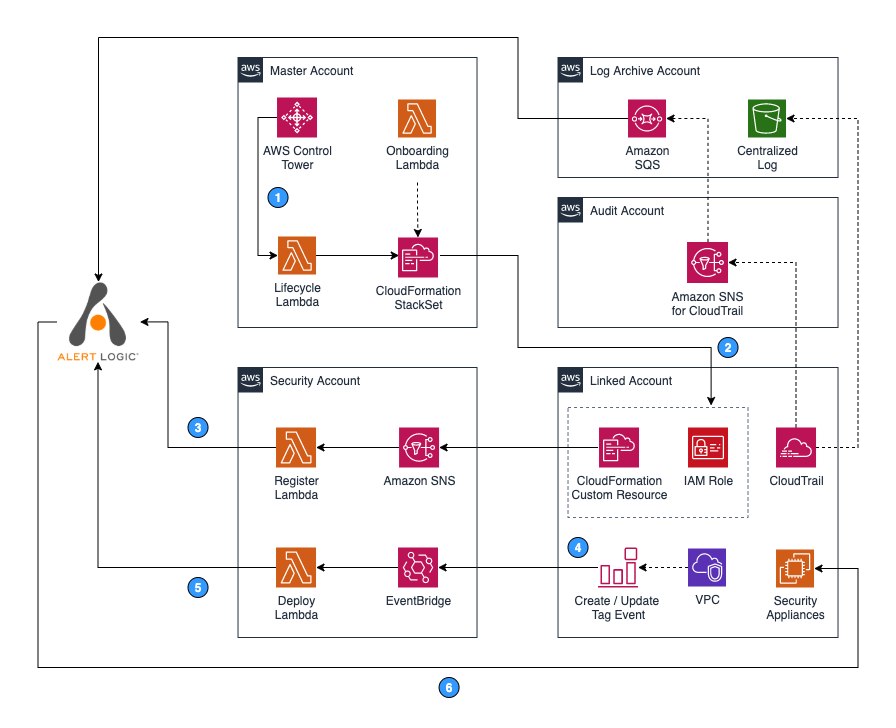

# Deployment with AWS Control Tower

Customers who use AWS Control Tower and Alert Logic can get automatic protection of existing and newly enrolled accounts through a series of automations.

## Architecture

The Alert Logic Control Tower Automation uses the following AWS Services to enable automatic protection of newly added AWS Accounts:

* Amazon EventBridge
* AWS CloudFormation
* AWS Lambda
* Cross-account IAM Roles
* AWS Secrets Manager
* Amazon SNS
* Amazon SQS

Accounts shown in the architecture diagram:

* Control Tower Account—Master account on which AWS Control Tower was enabled
* Log Archive Account—Account for centralized repository of logs, including CloudTrail logs
* Audit Account—Restricted account with read/write access to all accounts. A centralized CloudTrail SNS Topic for security and CloudTrail notification islocated here.
* Security Account—An account where Alert Logic Control Tower Automation Orchestration is deployed
* Linked Account—One or more AWS accounts protected by Alert Logic. Alert Logic deploys appliances and agents into this account.

The following steps are associated with the numbers indicated in the architecture diagram.

1. When a new Linked account is enrolled into AWS Control Tower, the <kbd>LifeCycle</kbd> lambda function receives a notification from AWS Control Tower and deploys an <kbd>AlertLogic-CT</kbd> StackSet Instance to the new Linked account.
2. In the new Linked account, <kbd>AlertLogic-CT</kbd> StackSet Instance creates an IAM Role to enable Alert Logic Asset Discovery. Upon completion, the StackSet Instance  sends an SNS event via Custom Resource to the Security account to notify that a new deployment must be registered with Alert Logic.
3. In the Security account, a lambda function named <kbd>Register</kbd> is subscribed to the <kbd>ALHubTopic</kbd> SNS topic to receive new deployment registration requests from the new Linked account. Once the function receives a notification request, it registers a new linked account deployment with Alert Logic.
4. When a user in the new Linked account tags or untags any VPCs with the "al," "alertlogic," "tm," or "threatmanager" keys, an event is published to Amazon EventBridge.
5. A lambda function named <kbd>Deploy</kbd> receives the event and updates deployment protection scope in the Alert Logic console accordingly.
6. If you specified Automatic mode during the initial setup, Alert Logic creates a security subnet in a newly protected VPC and deploys Alert Logic appliances. If you chose Manual mode, you must deploy the appliances to protect newly added VPCs. To learn more about deployment modes, see [About  Deployment Types](../get-started/about-deployment-types.md).

Deployment begins with a CloudFormation stack deployed in the AWS Control Tower Master account. The stack creates two AWS Lambda Functions, two AWS CloudFormation StackSets, and an AWS CloudWatch Event Rule for AWS Control Tower Lifecycle. <kbd>Onboarding</kbd> Lambdas are used during initial deployment to orchestrate an <kbd>AlertLogic-CT</kbd> StackSet Instance, create an SQS in the Log archive account, and SQS to SNS subscription in the Audit account. <kbd>Onboarding</kbd> Lambda also orchestrates <kbd>AlertLogic-CT-Central-IAM-Role</kbd> stackset (not shown in the diagram) to create a StackSet Instance  in the Log Archive account for CloudTrail ingestion. The CloudWatch Event Rule triggers the <kbd>Lifecycle</kbd> Lambda   during new AWS account setup. This Lambda deploys <kbd>AlertLogic-CT</kbd> StackSets to the new AWS account.

The <kbd>AlertLogic-CT</kbd> StackSet launches stackset instances in all AWS accounts included in the scope of deployment. In each account, this stackset creates an IAM role for Alert Logic and a CloudWatch Event rule for detecting tag changes on VPC.  The <kbd>AlertLogic-CT</kbd> stackset create additional resources in the Security Account, including an Amazon SNS Topic,  two AWS Lambda Functions, and an Amazon EventBridge Event bus.

## Prerequisites

You do not need to enable any additional resources other than the ones enabled by AWS Control Tower.

You do not need to increase any limits, but note that the automation solution creates an EventBridge in a security account to capture tag updates in linked accounts.

Before you implement this solution, Alert Logic recommends that you become familiar with AWS CloudFormation, AWS Lambda, AWS CloudTrail, and Amazon EventBridge services:

* If you are new to AWS, see [Getting Started with AWS](https://aws.amazon.com/getting-started/).
* For additional information on AWSMarketplace, see [this documentation on AWS Marketplace](https://aws.amazon.com/marketplace/help/about-us?ref_=footer_nav_about_aws_marketplace).
* To get started with Control Tower, see the [AWS documentation on Control Tower](https://docs.aws.amazon.com/controltower/latest/userguide/getting-started-with-control-tower.html).

## Deployment and Configuration

### Subscribe to Alert Logic Managed Detection and Response on the AWS Marketplace

1. Locate Alert Logic Managed Detection and Response in the AWS Marketplace
   * [Alert Logic Managed Detection and Response (US)](https://aws.amazon.com/marketplace/pp/B07K2J16QH?ref_=beagle)
   * [Alert Logic Managed Detection and Response (UK)](https://aws.amazon.com/marketplace/pp/B07KJMQN6X?ref_=beagle)
   * [Alert Logic Managed Detection and Response Professional - SaaS Contract (US)](https://aws.amazon.com/marketplace/pp/B07S64BX2Q?ref_=beagle)
   * [Alert Logic Managed Detection and Response Professional - SaaS Contract (UK)](https://aws.amazon.com/marketplace/pp/B07SB6P6N7?ref_=beagle)).
3. Click **Continue to Subscribe**.
4. Next, configure your contract. You can set the **Contract Duration** and **Renewal Settings**.
5. Select the **Contract Options** to be activated with your contract.
6. When you configure your contract, click **Create contract**.
7. You will be prompted to confirm the contract. If you agree to the pricing, click **Pay Now**.
8. Check your email for the validation email from Alert Logic. After you confirm receipt, Alert Logic sends another email to enable password reset and grant you access to the Alert Logic console.
9. Log into the [Alert Logic console](https://console.account.alertlogic.com/#/login).

### Log into the Partner UI				

1. Create  an access key and a secret key in the Alert Logic console. For more information about how to create an access key and secret key, see [Create and Manage Alert Logic Access Keys](https://docs.alertlogic.com/prepare/access-key-management.htm).
2. Download the code from <kbd>&amp;lt;partner-github-repository&amp;gt;</kbd>.
3. Log into the <kbd>&amp;lt;MASTER|LOG|XXX&amp;gt;</kbd> account in AWS Control Tower as <kbd>&amp;lt;Permissions&amp;gt;</kbd>.
4. To deploy the solution, create a new CloudFormation Stack using [this template](https://s3.amazonaws.com/alertlogic-public-repo.us-east-1/templates/ct-al-master-onboarding.yaml).
5. Provide the following information to deploy the CloudFormation Stack:
   * Alert Logic API Access Key and Alert Logic API Secret Key
   * Alert Logic Customer ID –  On the Support page in the Alert Logic console
   * Control Tower Audit Account ID – Control Tower AWS audit account
   * LogArchiveAccount  Control Tower  account
   * SecurityAccount – Designated AWS security account
   * TargetRegion – List of regions to enable Alert Logic Managed Detection and Response deployment into

### Verify linked accounts

After you complete the CloudFormation deployment, you can see your linked accounts listed as deployments in the Alert Logic console.

### Validate that the solution is properly deployed

The Alert Logic appliance deploys automatically within 15 minutes to the linked accounts.

Next, you must install  Alert Logic Managed Detection and Response Agents on the protected hosts. Follow these instructions to deploy Alert Logic Managed Detection and Response Agents for [Linux](../prepare/alert-logic-agent-linux.md) or [Windows](../prepare/alert-logic-agent-windows.md).

     If you have Amazon Web Services (AWS) Systems Manager managed instances, you can use [AWS Systems Manager Distributor](https://docs.aws.amazon.com/systems-manager/latest/userguide/distributor.html)     to install the  Alert Logic agent on the instances instead of installing the agent on each host manually. For more information, see [Automate Alert Logic Agent Installation with AWS Systems Manager Distributor](../prepare/agent-install-automated-aws.md).    
Alert Logic automatically claims the agents and assigns them to the appliances.
