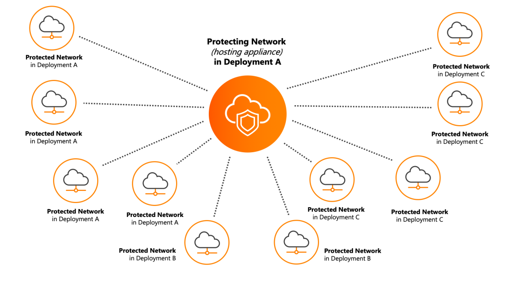

# Cross-Network Protection

Alert Logic allows you to set up Cross-Network Protection from a manual deployment in the Alert Logic console. Cross-Network Protection creates connections across networks, in the same or different deployment,  that  use resources from a protecting network to protect other networks within the same account.

Cross-Network Protection allows an assigned network appliance, for Network IDS or scanning, to reside outside the protected network. This centralizes the appliances that provide protection to an account, which allows your organization to reduce infrastructure costs. Cross-Network Protection is also convenient for organizations that cannot add more appliances due to lack of address space, or due to policy concerns that prevent in-network deployment.

The following figure is an example of a network with an appliance in "Deployment A" that is protecting networks in its deployments, and other deployments in the same account:

## Protecting networks and protected networks

A protecting network hosts the appliance. The network protected by the  protecting network is the protected network.

Protecting networks and protected networks can be VPCs (AWS deployments), VNETs (Azure deployments), or networks (Data Center deployments), depending on your deployment type. The corresponding network type appears as such in your deployments in the Alert Logic console. For more information about deployment types, see [About  Deployment Types](../get-started/about-deployment-types.md).

Protecting networks and protected networks are only in manual deployments. The Cross-Network Protection option is visible in manual deployments, and you can only configure a network that can be protected to connect to a protecting network.

## Requirements for Cross-Network Protection 

Before you set up Cross-Network Protection, you must configure the agents and appliances within your environment to connect with other networks. Otherwise, your appliances and protecting networks cannot communicate with other networks.

For Data Center networks  that have no agents installed and are configured to SPAN or another port mirroring feature, Cross-Network Protection will not function. The SPAN configured network will  continued to protect Data Center networks configured to the port mirroring feature.

Hosts in the protected network must have valid routes to the private IP address of appliances in the protecting network, using VPC peering, a VPN, or a similar network connectivity option. Appliances in the protecting network must have valid routes to the private IP addresses of protected hosts in the protected network, using VPC peering, a VPN, or a similar network connectivity option.

For information about configuring your AWS environment for AWS VPC peering, see [AWS Peering Configurations](https://docs.aws.amazon.com/vpc/latest/peering/peering-configurations.html).  To learn how to configure your Azure environment for Azure VNET connections, see [Azure VNET Connection tutorial](https://docs.microsoft.com/en-us/azure/virtual-network/tutorial-connect-virtual-networks-portal). For an example of how you can configure your Data Center environment, see [VPN between Two IOS Routers](https://www.cisco.com/c/en/us/support/docs/cloud-systems-management/configuration-professional/113337-ccp-vpn-routerA-routerB-config-00.html).

### Network IDS protection requirements 

For Network IDS protection, hosts in the protected network must be able to connect to appliances in the protecting network.

#### AWS Network IDS protection requirements

For AWS environments, ensure the following are allowed:

| Network control | Assets | Direction | Type | Protocol | Port Range | Source/Destination | Notes |
|---|---|---|---|---|---|---|---|
| Security Group | Agented EC2 | Outbound | Custom TCP | TCP | 7777 | Alert Logic IDS appliance IPs (can also use Alert Logic appliance subnet CIDR) | Agent to appliance data transport |
| NACL (Network Access Control List) | Agented EC2 Subnet | Outbound | Custom TCP | TCP | 7777 | Alert Logic IDS appliance IPs (can also use Alert Logic appliance subnet CIDR) | Agent to appliance data transport |
| NACL | Agented EC2 Subnet | Inbound | Custom TCP | TCP | 32768-6100 | Alert Logic IDS appliance IPs (can also use Alert Logic appliance subnet CIDR) | Agent to appliance return data transport |
| NACL | Alert Logic IDS Appliance Subnet | Inbound | Custom TCP | TCP | 7777 | Agented EC2 subnet CIDRs | Agent to appliance data transport |
| NACL | Alert Logic IDS Appliance Subnet | Outbound | Custom TCP | TCP | 32768-6100 | Agented EC2 subnet CIDRs | Agent to appliance return data transport |
| Security Group | Alert Logic IDS Appliance | Inbound | Custom TCP | TCP | 7777 | Agented EC2 subnet CIDRs | Agent to appliance data transport |

| Network control | Asset | Destination | Target |
|---|---|---|---|
| Route Table | Agented EC2 VPC | AL IDS VPC CIDR | Peering Connection |
| Route Table | AL IDS Appliance VPC | Agented EC2 VPC CIDR | Peering Connection |

#### Azure Network IDS protection requirements

For Azure environments, ensure the following are allowed:

| Network control | Assets | Direction | Port | Protocol | Source | Destination | Action | Notes |
|---|---|---|---|---|---|---|---|---|
| Security Group | Agented Azure VM | Outbound | 7777 | TCP | Agented Azure VM | Alert Logic IDS appliance IPs (can also use Alert Logic appliance subnet CIDR) | Allow | Agent to appliance data transport |
| Security Group | Alert Logic IDS Appliance | Inbound | 7777 | TCP | Agented Azure VM subnet CIDRs | Alert Logic IDS appliance(s) | Allow | Agent to appliance data transport |

### Scanning requirements

For scanning, appliances in the protected network must be able to connect to protected hosts in the protected network to perform vulnerability assessment.

When you create an AWS manual mode deployment with the Alert Logic CloudFormation template, the deployment procedure creates a restrictive security group which may not allow vulnerability scans to work properly. The default outbound rules only allow the appliance from the protecting network to reach ports 53, 80, and 443 of the protected network. You must configure the security group of the appliance after you create the deployment to allow all outbound traffic from the protecting network to the protected network. For more information about AWS manual mode scanning appliances, see [Amazon Web Services (AWS) Deployment Configuration—Manual Mode (Essentials Subscription)](aws-manual-essentials.md) or [Amazon Web Services (AWS) Deployment Configuration—Manual Mode  (Professional Subscription)](aws-manual-pro-ent.md).

#### AWS scanning requirements

For AWS environments, ensure the following are allowed:

| Network control | Assets | Direction | Type | Protocol | Port Range | Source/Destination | Notes |
|---|---|---|---|---|---|---|---|
| Security Group | Agented EC2 | Inbound | All traffic | All | 0 - 65535 | Alert Logic IDS Appliance IPs (can also use Alert Logic appliance subnet CIDR) | Vulnerability scanning |
| NACL (Network Access Control List) | Agented EC2 Subnet | Inbound | All traffic | All | 0 - 65535 | Alert Logic IDS Appliance IPs (can also use Alert Logic appliance subnet CIDR) | Vulnerability scanning |
| NACL | Agented EC2 Subnet | Outbound | Custom TCP | TCP | 32768 - 61000 | Alert Logic IDS Appliance IPs (can also use Alert Logic appliance subnet CIDR) | Vulnerability scanning (Return traffic) |
| NACL | Alert Logic IDS Appliance Subnet | Outbound | All traffic | All | 0 - 65535 | Agented EC2 subnet CIDRs | Vulnerability scanning |
| NACL | Alert Logic IDS Appliance Subnet | Inbound | Custom TCP | TCP | 32768 - 61000 | Agented EC2 subnet CIDRs | Vulnerability scanning (Return traffic) |
| Security Group | Alert Logic IDS Appliance | Outbound | All traffic | All | 0 - 65535 | Alert Logic IDS Appliance IPs (can also use Alert Logic appliance subnet CIDR) | Vulnerability scanning |

#### Azure scanning requirements

For Azure environments, ensure the following are allowed:

| Network control | Assets | Direction | Port | Protocol | Source | Destination | Action | Notes |
|---|---|---|---|---|---|---|---|---|
| Security Group | Agented Azure VM | Inbound | 7777 | TCP | Agented Azure VM | Alert Logic IDS appliance IPs (can also use Alert Logic appliance subnet CIDR) | Allow | Vulnerability scanning |
| Security Group | Alert Logic IDS Appliance | Out | 7777 | TCP | Agented Azure VM subnet CIDRs | Alert Logic IDS appliance IPs (can also use Alert Logic appliance subnet CIDR) | Allow | Vulnerability scanning |

## Configure Cross-Network Protection

**To configure** Cross-Network Protection:

1. In the Alert Logic console, open the deployment for which you want to configure Cross-Network Protection.

Only manual mode deployments have the Cross-Network Protection option.3. On the side navigation, click **Protection**, and then click **Options**.
4. Click the network or region you want to protect in the topology diagram, or in the **Search Assets** field, search for the network or region you want to protect.
5. Click the search field to search or type the name of a protecting network, and then select one.
6. Click **SAVE**.

The protecting network and protected network are now visible in the topology diagram with distinguishing icons. The Cross-Network Protection** Breakdown**, on the top left of the topology graph, provides an overview of your Cross-Network Protection connections.

### View protected networks 

**To view protected networks**:

1. Click the protecting network icon () to see the number of protected networks currently connected.
2. Click the details icon () to see a slideout panel that contains  protected network names.

### View protecting networks 

To view protecting networks, click the protected network icon ().

### Remove a Cross-Network Protection 

**To remove a **Cross-Network Protection** connection**:

1. Click the protected network icon (), and then click the remove icon ().
2. Click **DELETE**.

If there are any issues after you setup Cross-Network Protection, Alert Logic will create a configuration remediation in the Remediations page. To learn more about Remediations, see [Remediations](../analyze/remediations.md).
