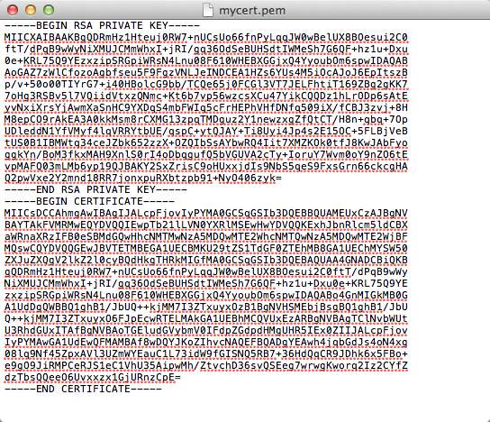

# Deployment Assets

introduction here

## Networks

A  network is a range of IP addresses, expressed in CIDR notation, that you want to monitor within your network. A  network cannot monitor a range of IP addresses larger than a /8 CIDR.

To monitor a  network, you must apply the network to a monitoring policy. You may apply multiple networks to a monitoring policy. For more information about monitoring policies, see .

### Create and protect networks

The  networks feature allows you to create and protect networks.

To create and protect a network:

1. At the top of the Alert Logic console, from the drop-down menu, click **Threat Manager**.
2. In the left navigation area, under **Detection**, click **Networks**.
3. In the table of networks, in the **Actions** column, click the gear icon (), and then select **Protect Networks**.
4. In the **Name** box, type a name for the network.
5. In the **CIDR** box, type the network CIDR information.
6. To assign tags to your network, in the **Tags** box, type one or more tags.
7. To monitor the network immediately, select the appliance that you want to monitor the network.
8. Click **Save**.

If you do not select an appliance, the configuration status of your network appears as "unprotected." To protect this network at a later time, you must assign it to a monitoring policy, and then assign the monitoring policy to an appliance. For more information about monitoring policies, see .

### Edit networks

The  edit feature allows you to perform edits on one or more networks.

**To edit networks**

1. At the top of the Alert Logic console, from the drop-down menu, click **Threat Manager**.
2. In the left navigation area, under **Detection**, click **Networks**.
3. In the table of networks, in the **Actions** column, hover on the network that you want to edit and click the pencil icon ().
4. Make necessary edits to the following fields:
   * **Name**
   * **CIDR**
   * **Collection Alerts**
   * **Tags**
6. Click **Update**.

### Additional options

You can mass edit networks, export a list of networks, or force a statistics update. To access these options, click the gear icon in the top right corner.

To mass edit networks:

1. From the **Networks** page, click the gear icon, and then click **Mass Edit**.
2. Make the following changes, if applicable:
   1. Specify whether you want changes applied to the following:
      * **All Networks**
      * **Only Filtered Networks**
      * **Only Selected Networks**
   3. Select an appliance to protect the specified networks.
   4. Select one of the following tag settings:
      * Do not change tag settings
      * Append additional tags to these networks
      Type tags you want added to the networks.
      * Replace existing tags on these networks
      Type tags you want to replace those associated with the networks.
      * Remove specific tags from these networks
      Type the tags you no longer want associated with the networks.
      * Remove all tags from these networks
   6. Specify whether you want to delete the selected networks.
4. Click **Apply**.

### Export networks

You can export your list of networks to a file.

To export networks:

1. From the **Networks** page, click the gear icon, and then select **Export Networks**.
2. Choose whether you want to export a list of all networks or only filtered networks.
3. Select a format for the exported file:
   * Comma separated values (.csv)
   * Tab delimited values (.txt)
   * Microsoft Excel 1997–2003 (.xls)
   * Microsoft Excel 2007 (.xlsx)
5. Click **Export**.

### Force statistics update

The Alert Logic console automatically updates network details and statistics every 30 minutes. You can manually force a statistics update to refresh the network screen display.

To force a statistics update:

From the **Networks** page, click the gear icon, and then click **Force Statistics Update**.

## Networks and Protected hosts

### Create a protected host for a threat host

Protected hosts are uniquely identifiable devices registered externally from the Alert Logic console. To create a protected host for a threat host, the threat host must be online. If you do not see an option to create a protected host, the threat host is offline. To sort the list of threat hosts by online status, in the **Status** column, click **Status**.

To create a protected host source for a threat host:

1. At the top of the Alert Logic console, from the drop-down menu, click Threat Manager.
2. In the left navigation area, under **Detection**, click **Hosts**.
3. In the threat hosts table, in the **Actions** column, click the plus icon ().
4. See the table below for field definitions and fill in the form.
5. Click **Save**.

**Create a protected host form**

| Field/Option | Description | Sample Value | Visible |
|---|---|---|---|
| Source Name | Name of this source. It will show on the display list and other areas of this product. | Server-tmdocs | Always |
| Use an existing Assignment Policy | Select this option to choose a policy from the existing Assignment Policy list. | Not applicable | Always |
| Create a new Assignment Policy | Select this option to open the Create a new Assignment Policy section. | Not applicable | Always |
| Existing Assignment Policy list | Select a policy from this list to assign it to the protected host. | cali-ngtm-01 Assignment | Visible when **Use an existing Assignment Policy** is selected. |
| **Create new Assignment Policy mini-form** Visible when you select **Create new Assignment Policy** |  |  |  |
| Field/Option | Description | Sample Value | Visible |
| Appliance Assignment Policy Name | Policy name. This name will be added to the Existing Assignment Policy list. | cali-ngtm-01 Assignment | Visible when **Create a new Assignment Policy** is selected. |
| Appliances/
Secondary Appliances | An appliance on your network. | i-27273bcb | Visible when **Create a new Assignment Policy** is selected. |
| Restrict Network | Select this option if you want to include a netmask. | Not applicable | Visible when **Create a new Assignment Policy** is selected. |
| Netmask | One CIDR address. | 10.0.0.0/16; partial address specifications are not acceptable. | Visible when **Create a new Assignment Policy** is selected. |
| Use existing Whitelist Policies | Select this option to choose a policy from the Existing Whitelist Policy list. | Not applicable | Visible when **Create a new Assignment Policy** is selected. |
| Create a new Whitelist Policy | Select this option to open the Create a new Whitelist Policy section. | Not applicable | Visible when **Create a new Assignment Policy** is selected. |
| Existing Whitelist Policy list | Select a policy from this list to assign it to the protected host. | SF01183529 Pentest | Visible when **Create a new Assignment Policy** and **Use existing Whitelist Policies** is selected. |
| **Create new Whitelist Policy mini-form** Visible when you select **Create new Assignment Policy** and **Create a new Whitelist Policy** |  |  |  |
| Field/Option | Description | Sample Value | Visible |
| Name | Policy name. This name will be added to the Existing Whitelist Policy list. | SF01183529 Pentest | Visible when you select **Create new Assignment Policy** and **Create a new Whitelist Policy**. |
| Enabled | Select this option to activate the policy. | Not applicable | Visible when you select **Create new Assignment Policy** and **Create a new Whitelist Policy**. |
| Rules | Click   to add rules to the Whitelist Policy. This includes Protocol, CIDR, and Port. | Not applicable | Visible when you select **Create new Assignment Policy** and **Create a new Whitelist Policy**. |
| Protocol | Select the internet protocol for the current rule. | tcp | Visible when you select **Create new Assignment Policy** and **Create a new Whitelist Policy**. |
| CIDR | Type the Classless Inter-Domain Routing address for the current rule. | 10.0.0.0/16 | Visible when you select **Create new Assignment Policy** and **Create a new Whitelist Policy**. |
| Port | Type the port for the current rule. | 22 | Visible when you select **Create new Assignment Policy** and **Create a new Whitelist Policy**. |
| Field/Option | Description | Sample Value | Visible |
| Use existing Host Policies | Select this option to choose a policy from the Existing Host Policy list. | Not applicable | Always |
| Create new Host Policy | Select this option to open the Create a new Host Policy section. | Not applicable | Always |
| Existing Host Policy list | Select a policy from this list to assign it to the protected host. | Default-test | Visible when **Use existing Host Policies** is selected. |
| **Create new Host Policy mini-form** Visible when you select **Create new Host Policy** |  |  |  |
| Field/Option | Description | Sample Value | Visible |
| Name | Policy name. This name will be added to the Existing Host Policy list. | Default-test | Visible when you select **Create new Host Policy**. |
| Encrypt | Select this option to encrypt traffic from the agent to the appliance. | Not applicable | Visible when you select **Create new Host Policy**. |
| Tags | A tag is a customer defined identifier that can be assigned to one or more sources. A customer can use tags to organize or search for specific types of sources. | High usage | Always |

### Update a protected host

Threat Manager allows you to update your protected hosts.

To update a protected host:

1. At the top of the Alert Logic console, from the drop-down menu, click **Threat Manager**.
2. In the left navigation area, under **Detection**, click **Protected Hosts**.
3. In the table of protected hosts, select the protected host you want to update, and then click the pencil icon (  ).
4. Fill in the form and click Update. See the table below for field definitions.

**Update a protected host form**

| Field/Option | Description | Sample Value | Visible |
|---|---|---|---|
| Source Name | Name of this source. It will show on the display list and other areas of this product. | Server-tmdocs | Always |
| Use an existing Assignment Policy | Select this option to choose a policy from the existing Assignment Policy list. | Not applicable | Always |
| Create a new Assignment Policy | Select this option to open the Create a new Assignment Policy section. | Not applicable | Always |
| Existing Assignment Policy list | Select a policy from this list to assign it to the protected host. | cali-ngtm-01 Assignment | Visible when **Use an existing Assignment Policy** is selected. |
| **Create new Assignment Policy mini-form** Visible when you select **Create new Assignment Policy** |  |  |  |
| Field/Option | Description | Sample Value | Visible |
| Appliance Assignment Policy Name | Policy name. This name will be added to the Existing Assignment Policy list. | cali-ngtm-01 Assignment | Visible when **Create a new Assignment Policy** is selected. |
| Appliances/
Secondary Appliances | An appliance on your network. | i-27273bcb | Visible when **Create a new Assignment Policy** is selected. |
| Restrict Network | Select this option if you want to include a netmask. | Not applicable | Visible when **Create a new Assignment Policy** is selected. |
| Netmask | One CIDR address. | 10.0.0.0/16; partial address specifications are not acceptable. | Visible when **Create a new Assignment Policy** is selected. |
| Use existing Whitelist Policies | Select this option to choose a policy from the Existing Whitelist Policy list. | Not applicable | Visible when **Create a new Assignment Policy** is selected. |
| Create a new Whitelist Policy | Select this option to open the Create a new Whitelist Policy section. | Not applicable | Visible when **Create a new Assignment Policy** is selected. |
| Existing Whitelist Policy list | Select a policy from this list to assign it to the protected host. | SF01183529 Pentest | Visible when **Create a new Assignment Policy** and **Use existing Whitelist Policies** is selected. |
| **Create new Whitelist Policy mini-form** Visible when you select **Create new Assignment Policy** and **Create a new Whitelist Policy** |  |  |  |
| Field/Option | Description | Sample Value | Visible |
| Name | Policy name. This name will be added to the Existing Whitelist Policy list. | SF01183529 Pentest | Visible when you select **Create new Assignment Policy** and **Create a new Whitelist Policy**. |
| Enabled | Select this option to activate the policy. | Not applicable | Visible when you select **Create new Assignment Policy** and **Create a new Whitelist Policy**. |
| Rules | Click   to add rules to the Whitelist Policy. This includes Protocol, CIDR, and Port. | Not applicable | Visible when you select **Create new Assignment Policy** and **Create a new Whitelist Policy**. |
| Protocol | Select the internet protocol for the current rule. | tcp | Visible when you select **Create new Assignment Policy** and **Create a new Whitelist Policy**. |
| CIDR | Type the Classless Inter-Domain Routing address for the current rule. | 10.0.0.0/16 | Visible when you select **Create new Assignment Policy** and **Create a new Whitelist Policy**. |
| Port | Type the port for the current rule. | 22 | Visible when you select **Create new Assignment Policy** and **Create a new Whitelist Policy**. |
| Field/Option | Description | Sample Value | Visible |
| Use existing Host Policies | Select this option to choose a policy from the Existing Host Policy list. | Not applicable | Always |
| Create new Host Policy | Select this option to open the Create a new Host Policy section. | Not applicable | Always |
| Existing Host Policy list | Select a policy from this list to assign it to the protected host. | Default-test | Visible when **Use existing Host Policies** is selected. |
| **Create new Host Policy mini-form** Visible when you select **Create new Host Policy** |  |  |  |
| Field/Option | Description | Sample Value | Visible |
| Name | Policy name. This name will be added to the Existing Host Policy list. | Default-test | Visible when you select **Create new Host Policy**. |
| Encrypt | Select this option to encrypt traffic from the agent to the appliance. | Not applicable | Visible when you select **Create new Host Policy**. |
| Tags | A tag is a customer defined identifier that can be assigned to one or more sources. A customer can use tags to organize or search for specific types of sources. | High usage | Always |

### Mass edit protected hosts

The Threat Manager mass edit feature allows you to simultaneously perform the same edits on one or more protected hosts.

To mass edit protected hosts:

1. At the top of the Alert Logic console, from the drop-down menu, click **Threat Manager**.
2. In the left navigation area, under **Detection**, click **Protected Hosts**.
3. In the table of protected hosts, in the **Actions** column, click the gear icon ().
4. Select **Mass Edit**. A configuration area expands on your screen.
5. Make the following changes if applicable:
   1. Specify one of the following tag settings:
      * **Do not change tag settings**
      * **Append additional tags to these networks**—Type tags you want added to the networks.
      * **Replace existing tags on these networks**—Type tags you want to replace those associated with the networks.
      * **Remove specific tags from these networks**—Type the tags you no longer want associated with the networks.
      * **Remove all tags from these networks**
   1. Select which, if any, host policy setting to change.
   1. Specify an appliance assignment policy.
   1. Specify the hosts to which you want to apply changes:
      * **All hosts**
      * **Only filtered hosts**
      * **Only selected hosts**
10. Select whether to delete the selected hosts.

You cannot undo this action.

1. Click **Apply**.

### Export protected hosts

Threat Manager allows you to export your list of protected hosts to a file. You can choose one of the following formats for the exported file:

* Comma separated values (.csv)
* Tab delimited values (.txt)
* Microsoft Excel 1997–2003 (.xls)
* Microsoft Excel 2007 (.xlsx)

To export protected hosts:

1. At the top of the Alert Logic console, from the drop-down menu, click **Threat Manager**.
2. In the left navigation area, under **Detection**, click **Protected Hosts**.
3. In the table of protected hosts, in the **Actions** column, click the gear icon (), and then  select **Export Protected Hosts**.
4. Select a file format for the exported file.
5. Click **Download**.

### Archive and restore protected threat hosts

To safeguard against permanent loss of data, Threat Manager provides the archive and restore features. To archive a threat host, you must delete all protected hosts data streams associated with the threat host.

If the archive feature issues an **Internal Server Error**, edit the threat host to make the object valid, and then in the left navigation area, under **Detection**, click **Protected Hosts**. Next, you must delete any protected hosts associated with the threat host.

If the restore feature is unavailable, edit the threat host to make the object valid.

### Delete a protected host

Threat Manager allows you to remove existing protected hosts.

To delete a protected host:

1. At the top of the Alert Logic console, from the drop-down menu, click **Threat Manager**.
2. In the left navigation area, under **Detection**, click **Protected Hosts**.
3. In the table of protected hosts, select the protected host you want to delete, and then click the trash icon (  ).
4. Click **Delete**.

## IDS Appliances

### Update an appliance

Threat Manager allows you to edit and update existing appliance configurations.

To update an appliance:

1. At the top of the Alert Logic console, from the drop-down menu, click **Threat Manager**.
2. In the left navigation area, under **Detection**, click **Appliances**.
3. In the table of appliances, within the corresponding row, click the pencil icon (  ).
4. In the **Appliance Name** box, enter an appliance name.

You can perform the following edits to the appliance configuration:

**Use an existing whitelist policy**

1. Select **Use existing Whitelist Policies**.
2. From the existing Whitelist Policy drop-down menu, select a whitelist policy.

If you do not want to assign a whitelist policy to this appliance, select **No Whitelist Policy**.

**Create a new whitelist policy**

1. Select **Create a new Whitelist Policy**.
2. In the **Name** box, enter a descriptive name.
3. Create one or more rules by entering information for the following fields:
   * **Protocol**
   * **CIDR**
   * **Port**

**Enable vulnerability scanning **

* Select **Enable Scans**.

Enabling scans affects performance. Enabling scanning on devices with fewer than four cores may result in degraded performance of the Threat Manager device.

**Assign tags**

* Enter tag(s) in the **Tags** box.

1. Click **Update**.

Updating detection or policy configurations affects all interconnected configurations.

### Mass edit appliances

Threat Manager allows you to simultaneously apply edits to multiple existing appliances.

To mass edit appliances:

1. At the top of the Alert Logic console, from the drop-down menu, click **Threat Manager**.
2. In the left navigation area, under **Detection**, click **Appliances**.
3. In the table of appliances, in the **Actions** column, click the gear icon ().
4. Select **Mass Edit** to display a configuration area.
5. Select the appliances to apply changes.

To apply changes to only selected appliances, then select those appliances.

1. Select which, if any, appliance tag settings to change.
2. To assign tags, enter tags in the **Tags** box.
3. Select whether to delete the selected appliances.

You cannot undo this action.

1. Click **Apply**.

### Export appliances

Threat Manager allows you to export existing appliances to a variety of file formats. You can choose one of the following formats for the exported file:

* Comma separated values (.csv)
* Tab delimited values (.txt)
* Microsoft Excel 1997–2003 (.xls)
* Microsoft Excel 2007 (.xlsx)

To export appliances:

1. At the top of the Alert Logic console, from the drop-down menu, click **Threat Manager**.
2. In the left navigation area, under **Detection**, click **Appliances**.
3. In the table of appliances, in the **Actions** column, click the gear icon ().
4. Select **Export Appliances** to display a configuration area.
5. Select a file format.
6. Click **Download**.

### Enable scans

Threat Manager allows you to run internal vulnerability scans from the Alert Logic appliance in your environment. This feature allows you to enable and disable internal scanning from the appliance interface.

For more information about scans, see .

    AWS and Azure treat penetration testing and scanning the same, requiring scan clients to fill out and submit penetration testing request forms. This authorization allows AWS and Azure to differentiate between testing and a real attack on their respective systems.    
To enable scans:

1. At the top of the Alert Logic console, from the drop-down menu, click **Threat Manager**.
2. In the left navigation area, under **Detection**, click **Appliances**.
3. In the table of appliances, within the corresponding appliance row, click the pencil icon (  ).
4. Select **Enable Scans**.
5. Click **Update**.

**Effects on performance**

Enabling scans can affect the performance of your appliance, depending on the number of cores in your environment. The following table illustrates the effect on performance.

| Number of cores | Performance impact |
|---|---|
| 4* | 50% |
| 8 | 17% |
| 16 | 7% |
| * Minimum required number of cores. |  |

## Certificates, keys, and SSL decryptor

If you enable Secure Sockets Layer (SSL) entitlement for your Alert Logic account, you can create certificates, which Threat Manager automatically assigns to your appliances.

To use this feature, you must enable SSL entitlement for your account, and you must have permission to manage certificates and keys.

To access Certificates and Keys:

1. At the top of the Alert Logic console, from the drop-down menu, click **Threat Manager**.
2. In the left navigation area, under **Detection**, click **Certificates &amp; Keys**.

If you do not see the **Certificates &amp; Keys** section in the user interface, you do not have access to this feature. 

To use this feature, contact Alert Logic by e-mail at support@alertlogic.com or by phone (US: (877) 484-8383, UK: +44 (0) 203 011 5533).

**SSL certificates and keys**

SSL is the standard mechanism used to secure communication on the web, and SSL helps secure information, such as credit card numbers, personal information, and private data.  At the most basic level, an SSL-enabled web server uses certificates and private keys to establish a secure and encrypted connection with web browsers.

The private key is the necessary component to decrypt the entire SSL connection. Guard the private key as carefully as a password. Alert Logic uses an industry-standard key encryption mechanism to store private keys.

A certificate matches a key, and the certificate provides authenticated identity information to web browsers and other client software. Certificates present authentication information during the establishment of a secure SSL connection, so certificates are considered public information.

Threat Manager allows you to upload your SSL certificate and corresponding key. This action allows  the SSL decryptor to decrypt traffic for further analysis.

Alert Logic** SSL Decryptor**

The Alert Logic SSL Decryptor extends the advanced intrusion detection capabilities of Threat Manager. The decryptor allows the appliance to inspect the encrypted SSL traffic.

Alert Logic* SSL Decryptor Setup Requirements and Process*

The SSL Decryptor setup process requires the following:

* A copy of the SSL certificate for the protected site exported to .PEM format without a passphrase.

When you upload certificates and private keys to the Alert Logic console, you provide a secure and encrypted communication between your web browser and Alert Logic servers. In addition, Alert Logic stores private keys through an industry-standard key encryption mechanism. Because Alert Logic software handles the key automatically and securely, you need not upload the private key with a passphrase. If you previously saved your unencrypted private key to a file, Alert Logic strongly recommends you destroy the key immediately after you upload the key.

* The TCP/IP address and port on your system that you want to monitor, and that you associated with your SSL certificate.  For example, 10.10.10.17 is your IP address on port 443.

*Maintenance of the SSL decryption on the *Threat Manager* appliance*

The Alert Logic SSL Decryptor requires the SSL certificate information to detect possible intrusions in encrypted channels.  SSL certificates expire. A renewed SSL certificate requires an update to the certificate information in the Alert Logic console.

Alert Logic does not support any cipher that uses Diffie-Hellman key exchange protocols. This includes the use of Perfect Forward Secrecy (PFS).

If you change the certificate for a protected device, but do not change the certificate SSL Decryptor, the Decryptor cannot examine SSL traffic for that site.

### Add a certificate

To inspect SSL-encrypted traffic, you must upload a certificate through the Alert Logic console. After you add a certificate, it will automatically be assigned to all appliances.

Alert Logic does not support any cipher that uses Diffie-Hellman key exchange protocols. This includes the use of Perfect Forward Secrecy (PFS).

To add a certificate:

1. At the top of the Alert Logic console, from the drop-down menu, click **Threat Manager**.
2. In the left navigation area, under **Detection**, click **Certificates &amp; Keys**.
3. In the table of certificates, in the **Actions** column, click the gear icon ().
4. Select **Add Certificate**.
5. Complete the fields with the appropriate information:
   * **Name**—A descriptive name to identify the certificate.
   * **Certificate Content**—The PEM-encoded certificate. 
   This field must  include the header and footer notes.
   * **Private Key Content**—The PEM-encoded private key. 
   This field must include the header and footer notes.
   The PEM-encoded private key must be in RSA format, or you must convert the key to RSA format.

**Correct format for the Add Certificate page**

* Include "----BEGIN RSA PRIVATE KEY----" and "----END RSA PRIVATE KEY----" in Private Key Content.
* Include "----BEGIN CERTIFICATE----" and "----END CERTIFICATE----" in Certificate Content.

The following shows an example of valid certificate format:

You can upload a PEM file instead of completing the empty fields. To upload a PEM file, click **Browse** in the **PEM File Upload** field and then search for and select the desired PEM file.
Your PEM file must have both certificate information and private key information.

1. Click **Save**.

Allow about 15 minutes for your system to update with these changes.

### View certificate information

Threat Manager allows you to view information for public certificates. Alert Logic protects confidential private keys, so you cannot retrieve or view private keys.

To view information about a certificate:

1. At the top of the Alert Logic console, from the drop-down menu, click **Threat Manager**.
2. In the left navigation area, under **Detection**, click **Certificates &amp; Keys**.
3. In the table of certificates, within the corresponding  row, place your cursor in the **Actions** column.
4. Click **View**.

Information, which includes the name of the certificate, the host IP address, the host port, and the certificate key, appears on the right side of the screen.

### Delete a certificate

Threat Manager allows you to delete uploaded certificates.

When you delete a certificate, you delete the corresponding key, which means Alert Logic can no longer decrypt the SSL-encrypted traffic associated with the deleted certificate and private key.

To delete a certificate:

1. At the top of the Alert Logic console, from the drop-down menu, click **Threat Manager**.
2. In the left navigation area, under **Detection**, click **Certificates &amp; Keys**.
3. In the table of certificates, within the corresponding row, place your cursor under the **Actions** column and click the trash icon ().
4. Click **Delete**.

Allow about 15 minutes for your system to update with these changes.
