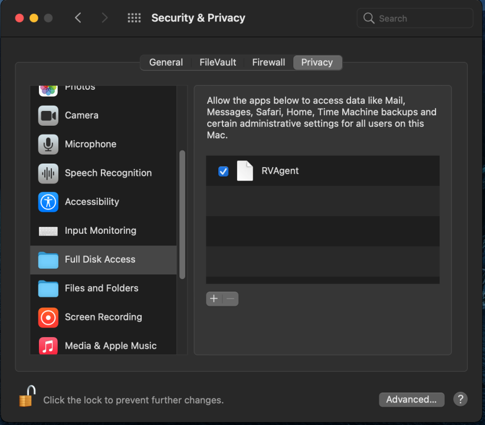
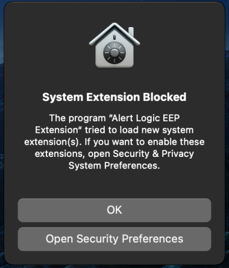
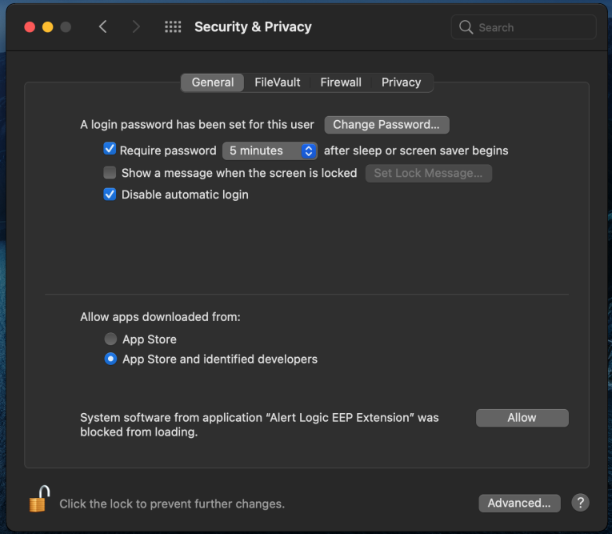
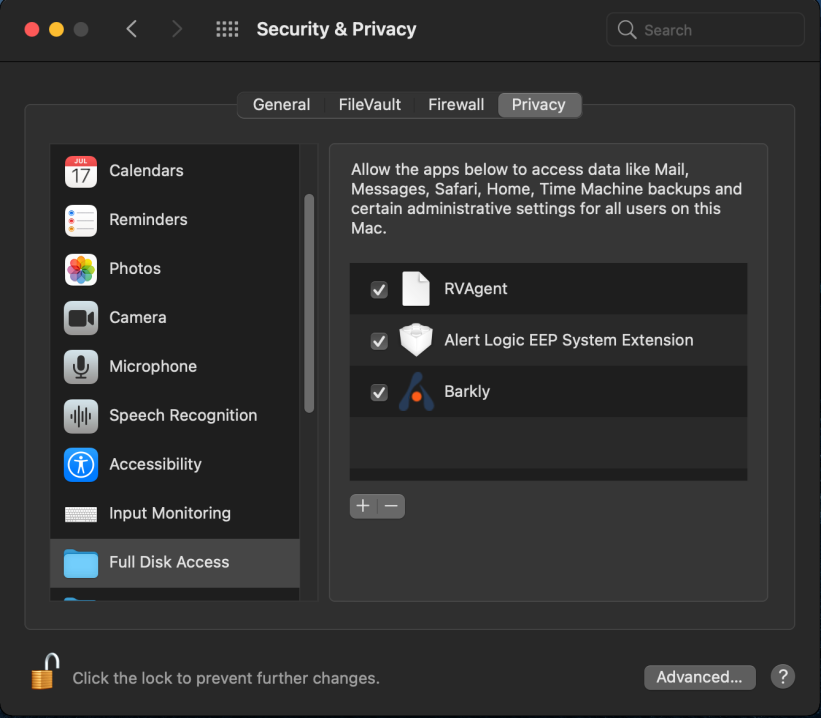

# Deploy Alert Logic Extended Endpoint Protection

Extended Endpoint Protection is built to provide value and scale immediately. You can silently install the agent on many endpoints in minutes using any tool that supports deploying EXE or MSI files, including system management tools or Windows Group Policy. Once you deploy Extended Endpoint Protection, the endpoints automatically register, and you can manage them in the Alert Logic console.

## Install Alert Logic Extended Endpoint Protection

The Extended Endpoint Protection installer is available in the Alert Logic console on the [**Endpoints** page](../configure/extended-endpoint-protection/manage-endpoints.md).

### Install Extended Endpoint Protection on Windows

To install Alert Logic Extended Endpoint Protection for Windows:

1. In the Alert Logic console, click the navigation menu icon (), click  **Configure**, click **Endpoints**, and then click the **Endpoints** tab.
2. Click **ADD ENDPOINTS**.
3. Click **DOWNLOAD** under Alert Logic Endpoint Protection for Windows.
4. Follow the instructions on the screen, and then install Extended Endpoint Protection  on your machine.
                  Do not shut down the endpoint for five minutes after installation. If you shut down the machine too quickly after installation, an Endpoint Error could appear in the Alert Logic console. You can resolve the error by powering on the machine.              6. Confirm that your new endpoint appears on the **Endpoints** page in the Alert Logic console.
7. (Optional) You can subscribe to the Service Status page and all appropriate components, including Extended Endpoint Protection, in the Alert Logic console. For more information about the Service Status page and subscribing to notifications, see [Service Status](../analyze/service-status.md).

You do not need to reinstall or upgrade the endpoint agent to benefit from future software updates. Alert Logic continuously and automatically updates the agent to ensure that you have the latest features and strongest protection.

### Install Extended Endpoint Protection on macOS

#### To install Alert Logic Extended Endpoint Protection for macOS 10.13 (High Sierra) , 10.14 (Mojave), and 10.15 (Catalina):

1. In the Alert Logic console, click the navigation menu icon (), click  **Configure**, click **Endpoints**, and then click the **Endpoints** tab.
2. Click **ADD ENDPOINTS**.
3. Click **DOWNLOAD** under Alert Logic Endpoint Protection for Mac.
4. Follow the instructions on the screen, and then install Extended Endpoint Protection  on your machine.
5. After installation, a dialog box will state that the extension was blocked. Click **Open Security Preferences** in the dialog box  to open Security &amp; Privacy preferences, and then click the **General** tab.  Alert Logic is aware that the messages list Barkly Protects, Inc. as the developer and is in the process of renaming it to Alert Logic.
6. If you do not see the dialog box, you must manually browse to **System Preferences** on your system to open Security &amp; Privacy preferences.
7. Toward the bottom of the Security &amp; Privacy window, next  to **System software from developer “Barkly Protects, Inc.” was blocked from loading**, click **Allow**.
8. Confirm that your new endpoint appears on the **Endpoints** page in the Alert Logic console.
9. (Optional) You can subscribe to the Service Status page and all appropriate components, including Extended Endpoint Protection, in the Alert Logic console. For more information about the Service Status page and subscribing to notifications, see [Service Status](../analyze/service-status.md).

You do not need to reinstall or upgrade the endpoint agent to benefit from future software updates. Alert Logic continuously and automatically updates the agent to ensure that you have the latest features and strongest protection.

#### Set up full disk access for 10.14 (Mojave) and 10.15 (Catalina)

For 10.14 (Mojave) and 10.15 (Catalina), you must setup full disk access. RVAgent must have full disk access for Alert Logic Extended Endpoint Protection to fully function:

1. In the **Security &amp; Privacy** window, click **Privacy**, and then on the left pane, click **Full Disk Access**.
2. If you need to, click the lock icon to ensure you can make changes.
3. Click **+** to add an application.
4. Browse to **/Library/AlertLogic/bin**, and then click **RVAgent**.
5. Make sure **RVAgent** is listed and allowed to access data and administrative settings for all users on your Mac device.
6. If **RVAgent** is already listed, remove it and add it again. After adding **RVAgent** again, you must restart the service.

#### To install Alert Logic Extended Endpoint Protection for macOS 11.0 (BigSur):

1. In the Alert Logic console, click the navigation menu icon (), click  **Configure**, click **Endpoints**, and then click the **Endpoints** tab.
2. Click **ADD ENDPOINTS**.
3. Click **DOWNLOAD** under Alert Logic Endpoint Protection for Mac.
4. Follow the instructions on the screen, and then install Extended Endpoint Protection  on your machine.
5. After installation, a dialog box will state that the extension was blocked. Click **Open Security Preferences** in the dialog box  to open Security &amp; Privacy preferences. 			

6. If you do not see the dialog box, you must manually browse to **System Preferences** on your system to open Security &amp; Privacy preferences, and then click the **General** tab.
7. Toward the bottom of the Security &amp; Privacy window, next  to **System software from application “Alert Logic EEP Extension” was blocked from loading**, click **Allow**.            

8. Confirm that your new endpoint appears on the **Endpoints** page in the Alert Logic console.
9. (Optional) You can subscribe to the Service Status page and all appropriate components, including Extended Endpoint Protection, in the Alert Logic console. For more information about the Service Status page and subscribing to notifications, see [Service Status](../analyze/service-status.md).

#### Set up full disk access for macOS 11.0 (BigSur)

For macOS 11.0 (BigSur), you must setup full disk access. Alert Logic EEP System Extension, RVAgent, and Barkly.app must have full disk access for Alert Logic Extended Endpoint Protection to fully function:

1. In the **Security &amp; Privacy** window, click **Privacy**, and then on the left pane, click **Full Disk Access**.
2. If you need to, click the lock icon to ensure you can make changes.
3. Make sure **Alert Logic EEP System Extension** is listed and allowed to access data and administrative settings for all users on your Mac device.
4. To allow full disk access to **RVAgent**, click **+** to add an application.
5. Browse to **/Library/AlertLogic/bin**, and then click **RVAgent**.
6. Make sure **RVAgent** is listed and allowed to access data and administrative settings for all users on your Mac device.
7. If **RVAgent** is already listed, remove it and add it again. After adding **RVAgent** again, you must restart the service.
8. To allow full disk access to **Barkly.app**, click **+** to add an application.
9. Browse to **/Library/AlertLogic/popup**, and then click **Barkly.app** (you may only see "Barkly").
10. Make sure **Barkly.app** is listed and allowed to access data and administrative settings for all users on your Mac device.

Your network connection must be stable and online to allow macOS to connect back to Apple servers for validation of System Extension and allow the activation of System Extension.

### Using MDM Solutions to deploy Extended Endpoint Protection

For macOS 10.15 and earlier, you can authorize the kernel extension through mobile device management (MDM) with the use of a team identifier. To authorize the kernel extension for Alert Logic Extended Endpoint Protection on macOS, use the team identifier N48R997F44.

For macOS 11.0 and later, you can authorize the system extension through MDM with the use of a team identifier. To authorize the Alert Logic Extended Endpoint Protection on macOS, use the team identifier N48R997F44.

## Mass deployments

If you want to deploy Extended Endpoint Protection to multiple endpoints at once, Alert Logic provides several options.

### Deploy using the EXE file

You can use your system management tool to distribute the installer the same way you currently distribute patches. If you use SCCM or other tools, you can run the executable file on the target machines directly and silently without the need for a restart.

Make sure you know the name of the installer for your organization, and type the following command into an administrative Windows command prompt:

<kbd>AL-Endpoint-Protection-Installer-[Organization].exe /C:"msiexec /i eep.msi /quiet /norestart"</kbd>

### Deploy using the MSI file

Do not change the name of eep.msi. Renaming the MSI file may disrupt updates.

You can deploy Extended Endpoint Protection using the  MSI file, but do not rename it.

To use an MSI to deploy Extended Endpoint Protection, extract the MSI file from the Alert Logic installer.

Make sure you know the name and file path for the installer, and type the following commands into an administrative Windows command prompt:

<kbd>mkdir C:\extract</kbd>

<kbd>C:\path\to\AL-Endpoint-Protection-Installer-[Organization].exe /C /T:C:\extract</kbd>

These commands extract the MSI file to "C:\extract".

You can run the MSI on the target machines directly and silently without the need for a restart. Type the following command into an administrative Windows command prompt:

<kbd>msiexec /i eep.msi /quiet /norestart</kbd>

### Deploy using Group Policy

Group Policy deployments are just a special case of using the MSI to deploy Extended Endpoint Protection. Follow the instructions above to extract the MSI, and make sure to keep the name alertlogic.msi. For additional guidance on using Group Policy, refer to [Deploy MSIs Through Your Network With GPO](https://community.spiceworks.com/how_to/8595-deploy-msi-s-through-your-network-with-gpo).

### Using a shared drive

You can save the Alert Logic installer on a shared drive so that users in your network can download and install it on their own devices. While Alert Logic auto-updates an older version to the current version, we recommend you download the latest installer to share.

## VDI settings

If you have a VDI environment, you can [mark an endpoint as the VDI master image](vdi.md).
