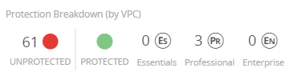

# Data Center Deployment for Google Cloud Platform (Professional Subscription)

Alert Logic allows you to use a Data Center deployment to monitor your assets on the Google Cloud Platform. Before your deployment can monitor your assets, you must install an Alert Logic appliance and agents to your Google Cloud environment.

## Before you begin

Before you create your first Data Center deployment for Google Cloud Platform, you must:

* Install the gcloud command line tool for use with your GCP account. For more information about the gcloud CLI, see [this Google Cloud Platform document](https://cloud.google.com/sdk/gcloud/).
* Configure your system to launch and use Jinja templates.

## Overview

The basic workflow to create a Data Center deployment to monitor your assets on the Google Cloud Platform is as follows:

1. Create a Data Center deployment in the Alert Logic console.
2. Create one or more appliance virtual machines (VM) in the Google Cloud Platform projects that are in the Data Center deployment scope of protection.
3. Claim the appliances.
4. Create one or more appliance virtual machines in the Google Cloud Platform projects that are in the deployment scope of protection.
5. Claim the appliance(s).
6. Install the Alert Logic agent on the hosts in the deployment scope of protection.

## Create a Data Center deployment for your Google Cloud Platform assets

You must create the Data Center deployment prior to creating and claiming the appliance VMs. The appliance claim process requires information from your Alert Logic account.

You can access the Deployments page from the **Configure** menu item in the Alert Logic console. To add a Data Center deployment, click the add icon (), and then click **Data Center**.

### Name your deployment

In the Deployment Name field, type a descriptive name for the deployment you want to create, and then click **SAVE AND CONTINUE**.

### Add assets

For Data Center deployments, Alert Logic suggests you add your assets using discovery scans. While you   can add your assets manually, weekly discovery scans ensure your Data Center deployments are configured with the right ranges.

You can manually add your assets by network, subnet, domain name, or IP address to be scanned. Add the requested information for every virtual network and subnet you want to monitor.

**To add a network:**

1. In the **Networks** tab, click the add icon (), and then select **Network**.
2. Type a name for the network, and add the **Private CIDR(s)** for each subnet.
Alert Logic recommends you add multiple /24 or smaller subnets instead of a CIDR over /16 to allow Alert Logic to operate and scan faster.
3. Select **Do not use agents for IDS traffic. My network automatically forwards traffic to my appliances through a port mirroring feature.** if your network equipment is configured to SPAN or another port mirroring feature.

A SPAN configured network forwards your Network IDS traffic to Alert Logic appliances, which allows Alert Logic to analyze that traffic.5. Click **SAVE**.

**To add a subnet:**

1. In the **Networks** tab, click the add icon (), and then select **Subnet**.
2. Name the subnet, select the network, add the **Private CIDR**, and then click **SAVE**.

**To add a domain name**:

1. In the **DNS Names and Public IPs** tab, click the add icon (), and then select **DNS Name**.
2. Add the domain name, and then click **SAVE**.

**To add an IP address: **

1. In the **DNS Names and Public IPs** tab, click the add icon (), and then select **Public IP**.
2. Name the IP address, add the CIDR, and then click **SAVE**.

When you are finished, click **NEXT**.

### Scope of protection

Alert Logic discovers and organizes deployments into a visual topology where you can select the desired levels of protection for your assets.

You can define the scope of your protection per region or network  or subnet. Each network and subnet appears within its protected region. Click a region or individual network or subnet to set the service level  or leave it unprotected, and then click **SAVE**.  You must choose one of the following levels of coverage:

* Unprotected
* Alert Logic Essentials coverage
* Alert Logic Professional coverage

The choices available for scope of protection correspond directly with your entitlement. Although a Professional subscription includes all the features of Essentials, a Professional customer cannot set the protection scope to Essentials unless the account has a separate Essentials subscription.

You can [change the protection level](change-protection.md) later as needed.

#### Exclusions

You can exclude assets or ports from external and internal scanning and Network IDS.

External scanning

**To exclude assets or ports from external scanning:**

1. Click **EXCLUSIONS**.
2. Click the **External Scanning** tab.
3. To exclude assets, click **ASSETS** to search for available assets to exclude, and then click **EXCLUDE** for the asset you want to exclude.               You can remove an asset from the exclusion list at any time to include the asset in scanning. To remove an asset from the exclusion list, click **CANCEL**.
4. To exclude ports, click **PORTS**, and then do the following:
   1. Search for the host, subnet, or network that has the ports you want to exclude from external scanning.
   2. In the **Protocol** field, select the port protocol: **UDP** or **TCP**.
   3. Enter one or more ports that you want to exclude. Use a dash or colon to indicate a range  (for example, 1-10001). Separate multiple ports or port ranges with a comma (for example, 11234, 11311, 12000-12010).
   4. Click **EXCLUDE AND ADD ANOTHER**.
      You can remove ports from the exclusion list at any time to include the ports in scanning. To remove ports from the exclusion list, click **REMOVE**.      9. After you apply your exclusions, close the **Exclusions** window.
10. On the **Scope of Protection** page, click **SAVE**.

    If you exclude assets or ports that are selected in the Scope or Ports tab in an active scan schedule, the assets or ports remain selected   but are not included in future scans.    
**Internal scanning**

To exclude assets or ports from internal scanning:

1. Click **EXCLUSIONS**.
2. Click the **Internal Scanning** tab.
3. To exclude assets, click **ASSETS** to search for available assets to exclude, and then click **EXCLUDE** for the asset you want to exclude.                 You can remove an asset from the exclusion list at any time to include the asset in scanning. To remove an asset from the exclusion list, click **CANCEL**.
4. To exclude ports, click **PORTS**, and then do the following:
   1. Search for the host, subnet, or network that has the ports you want to exclude from internal scanning.
   2. In the **Protocol** field, select the port protocol: **UDP** or **TCP**.
   3. Enter one or more ports that you want to exclude. Use a dash or colon to indicate a range  (for example, 1-10001). Separate multiple ports or port ranges with a comma (for example, 11234, 11311, 12000-12010).
   4. Click **EXCLUDE AND ADD ANOTHER**.
      You can remove ports from the exclusion list at any time to include the ports in scanning. To remove ports from the exclusion list, click **REMOVE**.      9. After you apply your exclusions, close the **Exclusions** window.
10. On the **Scope of Protection** page, click **SAVE**.

    If you exclude assets or ports that are selected  in an active scan schedule in the Scope or Ports tab, the items remain selected   but are not included in future scans.    
Network IDS** Whitelist**

**To whitelist assets from Network IDS:**

1. Click **EXCLUSIONS**.
2. Select the **Network IDS Whitelist** tab to exclude CIDRs.
3. In the **Network(s)** field, click the drop-down menu to select a network or leave **All networks** selected.
4. In the **Protocol(s)** field, click the drop-down menu to select a protocol.  Select **TCP**, **UDP**, or **ICMP**, or  select ***** to select all IP protocols.
5. Enter the network CIDR network address you want to exclude. You must enter a range of network addresses using CIDR format.
Enter 10.0.0.0/24 to exclude IP addresses in the range 10.0.0.0-10.0.0.255.
6. Click the drop-down menu to select the port. You can enter a single port, a port range, or ***** to select all ports.             
Enter 443 for a single port. Enter 1:1024 for a port range.
7. Click **EXCLUDE AND ADD ANOTHER**. Repeat the steps to add more CIDRs.               You can remove an asset from the exclusion list at any time  to include the asset in scanning. To remove an asset from the exclusion list, click **REMOVE**.
8. After you apply all the necessary exclusions, close  the **Exclusions** window.
9. On the **Scope of Protection** page, click **SAVE**.

### Scan Schedules

Alert Logic performs scans to protect your deployment. When you create a new Data Center deployment, Alert Logic automatically creates a default discovery scan schedule  to find new assets, and it creates default scan schedules to perform external and internal vulnerability scans on all non-excluded assets. The default scan schedules also perform external and internal vulnerability scans on all non-excluded TCP ports and common UDP ports. You can schedule when you want  to perform specific scans for all or selected assets  and ports  from the  **Discovery Scanning**, **Internal Scanning**, and **External Scanning** tabs. For more information, see [Manage Scan Schedules](../analyze/manage-scans-and-results/schedules.md).

    Port selection does not apply to discovery scan schedules.    
After reviewing the schedules and making any changes, click **NEXT**.

### Options

#### Configure Cross-Network Protection

You have the option to set up Cross-Network Protection to create connections across networks, in the same or different deployment, but within the same account. Cross-Network Protection allows other networks to use resources from a protecting network with an assigned network appliance. The common places for  Cross-Network Protection use are Amazon Web Services (AWS) VPC Peering, AWS Transit Gateway, and Microsoft Azure VNet Peering.

A protecting network hosts the appliance. The network protected by the  protecting network is the protected network. For more information on Cross-Network Protection, see [Cross-Network Protection](cross-network-protection.md).

**To configure Cross-Network Protection:**

1. On the side navigation, click **Options** under **Protection**.
2. On the Cross-Network Protection tab, click the network or region you want to protect in the topology diagram, or in the **Search Assets** field, search for the network or region you want to protect.
3. Click the search field to search or type the name of a protecting network, and then select one.
4. Click **SAVE**.

The protecting network and protected network are now visible in the topology diagram with distinguishing icons. The Cross-Network Protection** Breakdown**, on the top left of the topology graph, provides an overview of your Cross-Network Protection connections.

#### View protected networks 

**To view protected networks**:

1. Click the protecting network icon () to see the number of protected networks currently connected.
2. Click the details icon () to see a slideout panel that contains  protected network names.

#### View protecting networks 

To view protecting networks, click the protected network icon ().

## Agent-based Scanning

You have the option to enable agent-based scanning. Agent-based scanning improves the efficiency, accuracy, and usability of Alert Logic vulnerability scanning features. Agent-based scanning provides the vulnerability assessment coverage of authenticated network scanning without the need to manage credentials and with a reduction in network traffic and impact. To learn more about agent-based scanning, see [Agent-Based Scanning](../analyze/manage-scans-and-results/agent-based-scan.md).

### Configuration Topology

This topology diagram provides an overview of your scope of protection. You can see which assets are unprotected, or being scanned at the Essentials, Professional, or Enterprise levels.

The protection breakdown displays  how many assets are unprotected, excluded, and protected, along with the number of protected assets in each level.

You can search for specific assets. The protection breakdown updates as it finds specific assets.

### Installation Instructions

Do not follow the appliance or agent installation instructions on this screen. However, you do need the Unique Registration Key, located on the Appliances tab, when you claim your appliance and register your agents.

## Copy, deploy, and claim the appliance VM

To perform these tasks, you must use the gcloud command-line tool to log into your GCP account.

You must also be prepared to configure the [appliance firewall rules](../requirements/us-firewall-rules.md#Communic).

The project name and deployment name are both limited to 62 characters. A name longer than 62 characters can cause the provisioning to fail.

### Copy the appliance VM image to your GCP project

At the command line type the following commands:

<kbd>gcloud config set project &amp;lt;project name&amp;gt;</kbd>

<kbd>gcloud compute images create al-threat-appliance --source-uri=https://storage.googleapis.com/threat/al-threat-appliance.tar.gz</kbd>

### Deploy the appliance 

Alert Logic provides a Jinja template for GCP appliance deployment. You can download the template from [this location](https://github.com/al-deployment-services/al_tmc_gcloud_jinja).

The Jinja template uses the parameters described below:

* <kbd>region</kbd>: The region to deploy this appliance (us-central1)
* <kbd>zone</kbd>: The zone for the appliance (us-central1-a)
* <kbd>network</kbd>: The network name for the appliance
* <kbd>sub_network</kbd>: The name of the subnet inside the network
* <kbd>firewall_tag</kbd>: The target tag to be assigned for firewall rules
* <kbd>claim_cidr</kbd>: The source IP CIDR that is allowed to perform web claim on port 80, i.e. 0.0.0.0/0 or specific subnet range
* <kbd>network_cidr</kbd>: The network CIDR for the appliance (not subnet / sub network CIDR)
* <kbd>machine_image</kbd>: The image name for the appliance
* <kbd>machine_type</kbd>: The minimum recommendation is n1-standard-4

Use the gcloud command-line tool to deploy the appliance with the Jinja template. The following example CLI command illustrates usage of the template and its parameters:

| gcloud deployment-manager deployments create deployment-name --template ./al_tm_deploy.jinja --properties region:us-central1,zone:us-central1-a,network:default,sub_network:default,firewall_tag:al-tmc,claim_cidr:0.0.0.0/0,network_cidr:10.5.0.0/16,machine_image:al-threat-appliance,machine_type:n1-standard-4 |

<kbd>gcloud deployment-manager deployments create deployment-name --template ./al_tm_deploy.jinja --properties region:us-central1,zone:us-central1-a,network:default,sub_network:default,firewall_tag:al-tmc,claim_cidr:0.0.0.0/0,network_cidr:10.5.0.0/16,machine_image:al-threat-appliance,machine_type:n1-standard-4</kbd>### Claim the appliance

You must claim the appliance VM after it spins up. Appliance claim registers the appliance with the Alert Logic backend and links the appliance with your Alert Logic account. To claim your appliance, you will need the Unique Registration Key for every network you configured in the Data Center deployment. You can find the keys on the Installation Instructions  page of your Data Center deployment in the Alert Logic console.

**To claim your appliance:**

1. Open a web browser and enter the public IP address for the appliance as the URL.
2. When prompted, provide the Unique Registration Key associated with the network where the appliance resides.

As part of the provisioning process the appliance updates itself to the latest version of all its components and security content. This process can take 20-30 minutes. When the claiming process is complete, the appliance appears on the Health page in the Alert Logic console and is ready for use.

## Install the agent

Alert Logic provides a single agent that collects data used for analysis, such as log messages and network traffic, metadata, and host identification information. Click the links below for more information and to download the appropriate agent:

* [Install the Alert Logic Agent for Linux](../prepare/alert-logic-agent-linux.md)
* [Install the Alert Logic Agent for Windows](../prepare/alert-logic-agent-windows.md)

When you install the agent, you must be prepared to configure the [agent firewall rules](../requirements/us-firewall-rules.md#Agent).

## Configure log sources

If you have a Professional subscription, you can set up log collection. To add log sources for data you want to collect, see [Log Sources](log-sources.md#top).

## Verify the health of your deployment

After you create your deployment, access the Health console in the Alert Logic console to determine the health of your networks, appliances, and agents, and then make any necessary changes.
