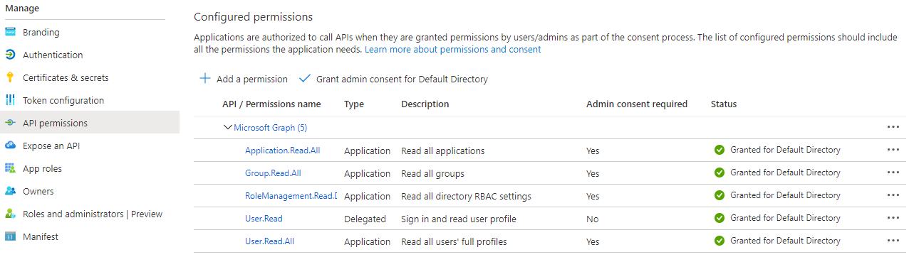

# Update Azure Deployment Configuration to Prepare for Upgrade

    This document is intended for customers with an Alert Logic Cloud Defender entitlement who are preparing to upgrade Microsoft Azure deployments to Managed Detection and Response.    
Prior to your upgrade to Managed Detection and Response, ensure your Azure deployments are configured properly.

## Check for and fix Azure credential problems

The most common issue with Azure deployments prior to upgrade is lack of credentials. For each of your Azure deployments, ensure that Role-Based Access Control (RBAC) is configured correctly with an app registration.

To check for this issue, browse to the Deployments page in the Alert Logic console, click an Azure deployment tile, and then click Azure** Subscription**. If the **Active Directory ID** and/or **Application ID** field is blank, you need to configure app registration and RBAC for the deployment.

To fix this issue, see the instructions in [Configure App Registration and RBAC for Microsoft Azure Resources](../prepare/azure-rbac-role-setup.md).

## Troubleshoot permission errors

If you complete the configuration as described in [Configure App Registration and RBAC for Microsoft Azure Resources](../prepare/azure-rbac-role-setup.md), your Azure deployments should be ready to upgrade. You can optionally check for the following problems to prevent permission errors that can occur if your Azure deployment is not configured correctly.

If the [migration precheck](../reference/migration-prechecks.md) finds permission errors in your deployments, Alert Logic notifies you and advises you to check one or both of the following items. You must fix permission errors prior to upgrade.

### Check for and fix permissions to access Microsoft Graph

To perform CIS benchmark checks, Alert Logic must have permission to access Microsoft Graph. If the correct permissions are not configured,  the [migration precheck](../reference/migration-prechecks.md) reports a permission error that you must resolve.

**To check for permissions to access Microsoft Graph**:

1. In the Azure portal, click **Azure Active Directory**.
2. On the left panel, click **App registrations**, and then select your app registration.
3. On the left panel, click **API permissions**.
4. Check that your configured permissions look like this:

If permissions are missing, you must grant them.

**To grant permissions to access Microsoft Graph**:

1. On the API permissions page in the Azure console, click **+ Add a permission**.
2. On the Request API permissions blade, click **Microsoft Graph**.
3. Click **Application permissions**, and then in the list, select the following permissions:
   1. Click **Application** to see permissions in this category, and then select **Application.Read.All**.
   2. Click **Group** to see permissions in this category, and then select **Group.Read.All**.
   3. Click **RoleManagement** to see permissions in this category, and then select **RoleManagement.Read.Directory**.
   4. Click **User**  to see permissions in this category, and then select **User.Read.All**.
5. Click **Add permissions**, and then on the API permissions pane, click **Grant admin consent for Default Directory**.
6. In  the pop-up window, click **Yes** to allow the changes you made on the permissions.

### Check for and fix  app registration role assignment

To prevent or fix permission errors, another item to check is that an RBAC role is assigned to your app registration.

The following procedures assume the RBAC role is created already, as described in [Configure App Registration and RBAC for Microsoft Azure Resources](../prepare/azure-rbac-role-setup.md).

**To check that the role is assigned to the app registration**:

1. In the Azure portal, click **Subscriptions**.
2. In the Subscriptions blade, select the subscription you want Alert Logic to protect, and then click **Access control (IAM)**.
3. Click the **Role assignments** tab.
4. Check that the RBAC role you created is assigned to the app registration.

If a role is not assigned to your app registration, you must assign it.

**To assign the role to the app registration**:

1. On the Role assignments tab in the Azure portal, click **+Add**, and then click **Add role assignment**.
2. Select the RBAC role you created.
3. From the list, click the app you registered earlier.
4. Click **SAVE**.
