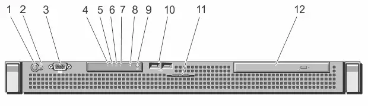
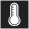
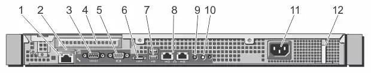
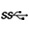
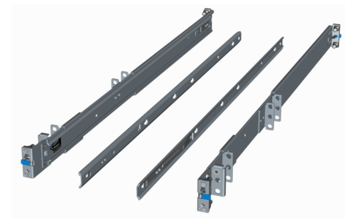

# Dell R220 physical appliance details

Included with your Dell™ PowerEdge™ R220 appliance, you will receive a chassis with front panel and back panel features, and rails for racking.

### Figure 1. Dell PowerEdge R220 Rack Server

The information below is excerpted from the [Dell PowerEdge R220 Systems Hardware Owner's Manual](http://downloads.dell.com/manuals/all-products/esuprt_ser_stor_net/esuprt_poweredge/poweredge-r220_owner's manual_en-us.pdf) and the [Dell PowerEdge R220 Technical Guide](http://cdn.cnetcontent.com/60/ca/60cafce9-16c7-402b-b79b-78a5682aed49.pdf), available on the Dell Web site.

## Technical specifications

<table>
  <col />
  <col />
  <thead>
    <tr>
      <th>Feature</th>
      <th>Technical Specifications</th>
    </tr>
  </thead>
  <tbody>
    <tr>
      <td>Processor</td>
      <td></td>
    </tr>
    <tr>
      <td>Processor type</td>
      <td>
        
Intel Core i3-4130 and Core i3-4330 processorproduct family

        
Intel Pentium processor G3430 and G3420

        
Intel Celeron processor G1820

      </td>
    </tr>
    <tr>
      <td>Expansion bus</td>
      <td></td>
    </tr>
    <tr>
      <td>Bus type</td>
      <td>PCI Express Generation 3</td>
    </tr>
    <tr>
      <td>Expansion slots using riser card</td>
      <td>One half-height, full-length x16 link</td>
    </tr>
    <tr>
      <td>Memory</td>
      <td></td>
    </tr>
    <tr>
      <td>Architecture</td>
      <td>1600 MT/s or 1333 MT/s unbuffered Error Correcting Code (ECC) DIMMs</td>
    </tr>
    <tr>
      <td>Memory module sockets</td>
      <td>Four 240-pin</td>
    </tr>
    <tr>
      <td>Memory module capacities</td>
      <td></td>
    </tr>
    <tr>
      <td>UDIMM</td>
      <td>4GB (single-rank) and 8 GB (dual-rank)</td>
    </tr>
    <tr>
      <td>Minimum RAM</td>
      <td>4GB</td>
    </tr>
    <tr>
      <td>Maximum RAM</td>
      <td>32 GB</td>
    </tr>
    <tr>
      <td>Drives</td>
      <td></td>
    </tr>
    <tr>
      <td>Hard drives</td>
      <td>Up to two 3.5 inch Enterprise Class and Entry Class SATA, SAS, or Nearline SAS hard drives, orUp to two 2.5 inch SAS, SATA, or Nearline SAS hard drives</td>
    </tr>
    <tr>
      <td>Optical drive</td>
      <td>
        
One optional slim 12.7 mm SATA DV-DROM or DVD+/-RW drive

        
NOTE: DVD devices are data only.

      </td>
    </tr>
    <tr>
      <td>Connectors</td>
      <td></td>
    </tr>
    <tr>
      <td>Back</td>
      <td></td>
    </tr>
    <tr>
      <td>NIC</td>
      <td>Two 10/100/1000 Mbps</td>
    </tr>
    <tr>
      <td>Serial</td>
      <td>	9-pin, DTE, 16550-compatible</td>
    </tr>
    <tr>
      <td>USB	</td>
      <td>Two 4-pin, USB 3.0-compliant</td>
    </tr>
    <tr>
      <td>Video	</td>
      <td>15-pin VGA</td>
    </tr>
    <tr>
      <td>Front</td>
      <td></td>
    </tr>
    <tr>
      <td>USB</td>
      <td>Two 4-pin, USB 2.0-compliant</td>
    </tr>
    <tr>
      <td>Video</td>
      <td>15-pin VGA</td>
    </tr>
    <tr>
      <td>Internal</td>
      <td></td>
    </tr>
    <tr>
      <td>USB</td>
      <td>One 4-pin, USB 2.0-compliant</td>
    </tr>
    <tr>
      <td>
        
Environmental

        
NOTE: For additional information about environmental measurements for specific system configurations, see <a href="http://dell.com/environmental_datasheets">dell.com/environmental_datasheets</a>.

      </td>
      <td></td>
    </tr>
    <tr>
      <td>Temperature</td>
      <td></td>
    </tr>
    <tr>
      <td>Maximum Temperature Gradient (Operating and Storage)	</td>
      <td>10 °C/h (50 °F/h)</td>
    </tr>
    <tr>
      <td>Storage Temperature Limits</td>
      <td>–40 °C to 65 °C (–40 °F to 149 °F)</td>
    </tr>
    <tr>
      <td>Temperature (continuous operation)</td>
      <td></td>
    </tr>
    <tr>
      <td>Temperature Ranges (for altitude less than 950 m or 3117 ft)</td>
      <td>10 °C to 35 °C (50 °F to 95 °F) with no direct sunlight on the equipment.</td>
    </tr>
    <tr>
      <td>Humidity Percentage Range</td>
      <td>10% to 80% Relative Humidity with 29 °C (84.2 °F) maximum dew point.</td>
    </tr>
    <tr>
      <td>Relative humidity</td>
      <td></td>
    </tr>
    <tr>
      <td>Storage</td>
      <td>5% to 95% RH with 33 °C (91 °F) maximum dew point. Atmosphere must be non-condensing at all times.</td>
    </tr>
    <tr>
      <td>Maximum vibration</td>
      <td></td>
    </tr>
    <tr>
      <td>Operating</td>
      <td>0.26 G rms at 5 Hz to 350 Hz for 15 minutes (all operation orientations).</td>
    </tr>
    <tr>
      <td>Storage</td>
      <td>1.88 G rms at 10 Hz to 500 Hz for 15 minutes (all six sides tested).</td>
    </tr>
    <tr>
      <td>Maximum shock</td>
      <td></td>
    </tr>
    <tr>
      <td>Operating</td>
      <td>One shock pulse (one pulse each side of the system) of 31 G for 2.6 ms in the operational orientation.</td>
    </tr>
    <tr>
      <td>Storage</td>
      <td>Six consecutively executed shock pulses in the positive and negative x, y, and z axes (one pulse on each side of the system) of 71 G for up to 2 ms.Six consecutively executed shock pulses in the positive and negative x, y, and z axes (one pulse on each side of the system) of 32 G faired square wave pulse with velocity change at 270 inches/second (686 centimeters/second).</td>
    </tr>
    <tr>
      <td>Maximum altitude</td>
      <td></td>
    </tr>
    <tr>
      <td>Operating</td>
      <td>3048 m (10,000)</td>
    </tr>
    <tr>
      <td>Storage</td>
      <td>12,000 m (39,370 ft).</td>
    </tr>
    <tr>
      <td>Operating altitude de-rating</td>
      <td></td>
    </tr>
    <tr>
      <td>≤ 35 °C (95 °F)</td>
      <td>Maximum temperature is reduced by 1 °C/300 m (1 °F/547 ft) above 950 m (3,117 ft).</td>
    </tr>
    <tr>
      <td>
        
Particulate contamination

        
NOTE: This section defines the limits to help avoid IT equipment damage and/or failure from particulates and gaseous contamination. If it is determined that levels of particulates or gaseous pollution are beyond the limits specified below and are the reason for the damage and/or failures to your equipment, it may be necessary for you to re-mediate the environmental conditions that are causing the damage and/or failures. Re-mediation of environmental conditions will be the responsibility of the customer.

      </td>
      <td></td>
    </tr>
    <tr>
      <td>Air filtration</td>
      <td>
        
NOTE: Applies to data center environments only. Air filtration requirements do not apply to IT equipment designed to be used outside a data center, in environments such as an office or factory floor.

        
Data center air filtration as defined by ISO Class 8 per ISO 14644-1 with a 95% upper confidence limit.

        
NOTE: Air entering the data center must have MERV11 or MERV13 filtration.

      </td>
    </tr>
    <tr>
      <td>Conductive dust</td>
      <td>
        
NOTE: Applies to data center and non-data center environments.

        
Air must be free of conductive dust, zinc whiskers, or other conductive particles.

        <ul>
          <li>Air must be free of corrosive dust.</li>
          <li>Residual dust present in the air must have a deliquescent point less than 60% relative humidity.</li>
        </ul>
      </td>
    </tr>
    <tr>
      <td>
        
Gaseous contamination

        
NOTE: Maximum corrosive contaminant levels measured at ≤50% relative humidity.

      </td>
      <td></td>
    </tr>
    <tr>
      <td>Copper Coupon Corrosion Rate</td>
      <td>&amp;lt;300 Å/month per Class G1 as defined by ANSI/ISA71.04-1985.</td>
    </tr>
    <tr>
      <td>Silver Coupon Corrosion Rate</td>
      <td>&amp;lt;200 Å/month as defined by AHSRAE TC9.9.</td>
    </tr>
  </tbody>
</table>## Dimensions and weight

| Unit | Measurement |
|---|---|
| Height | 1.66” (42.4 mm) (without ear/bezel) |
| Width | 17.09” (434 mm) (without ear/bezel) |
| Depth | 15.52” (394.3 mm) (without ear/bezel) |

## Specific measurements (corresponding with figure 2)

| Dimension | Measurement |
|---|---|
| Xa (width with rack latches) | 482.0 mm |
| Xb (width without rack latches) | 434.0 mm |
| Y (height) | 42.4 mm |
| Za (depth with bezel) | 35.0 mm |
| Za (depth without bezel) | 20.1 mm |
| Zb (depth without power supply and bezel) | 390.0 mm |
| Zc (depth with power supply) | 394.3 mm |

### Figure 2. Dell R220 PowerEdge dimensions

## Front panel features and indicators

### Figure 3. Dell PowerEdge R220 front panel features and indicators

The following table explains the Dell R220 front panel features and indicators. See Figure 3 for reference.

<table>
  <col />
  <col />
  <col />
  <col />
  <thead>
    <tr>
      <th>Item</th>
      <th>Indicator, button, or connector</th>
      <th>Icon</th>
      <th>Description</th>
    </tr>
  </thead>
  <tbody>
    <tr>
      <td>1</td>
      <td>Power-on indicator, power button</td>
      <td>
        
      </td>
      <td>
        
The power-on indicator lights when the system power is on. The power button controls the power supply output to the system.

        

          <b>Note</b> On ACPI-compliant operating systems, turning off the system using the power button causes the system to perform a graceful shutdown before power to the system is turned off. 

        
<![CDATA[
]]>

      </td>
    </tr>
    <tr>
      <td>2</td>
      <td>NMI button</td>
      <td>
        

          
        

      </td>
      <td>
        
Used to troubleshoot software and device driver errors when using certain operating systems. This button can be pressed using the end of a paper clip. 

        
Use this button only if directed to do so by qualified support personnel or by the operating system's documentation.

      </td>
    </tr>
    <tr>
      <td>3</td>
      <td>Video connector</td>
      <td>
        
      </td>
      <td>
        
Allows you to connect a VGA display to the system.

      </td>
    </tr>
    <tr>
      <td>4</td>
      <td>Health indicator</td>
      <td>
        
      </td>
      <td>
        
If the system is on, and in good health, the indicator lights solid blue.

        
The indicator blinks amber if the system is on or in standby, and any error exists (for example, a failed fan or hard drive).

      </td>
    </tr>
    <tr>
      <td>5</td>
      <td>Hard-drive indicator</td>
      <td>
        
      </td>
      <td>The indicator blinks green to indicate hard-drive activity.</td>
    </tr>
    <tr>
      <td>6</td>
      <td>Electrical indicator</td>
      <td>
        
      </td>
      <td>
        
The indicator blinks amber if the system experiences an electrical error (for example, voltage out of range, or a failed power supply or voltage regulator).

        
See the System Event Log or system messages for the specific issue. Re-seat the power supply by removing and reinstalling it. If the problem persists, see <a href="http://www.dell.com/support/manuals/us/en/19/poweredge-r220/PER220OMPublication/Getting-help?guid=GUID-BE16C181-0959-44C3-B434-E44A0A602A4C&amp;amp;lang=en-us">Getting help</a>.

      </td>
    </tr>
    <tr>
      <td>7</td>
      <td>Temperature indicator</td>
      <td>
        
      </td>
      <td>
        
The indicator blinks amber if the system experiences a thermal error (for example, a temperature out of range or fan failure).Ensure that none of the following conditions exist:

        <ul>
          <li>A cooling fan is removed or has failed.</li>
          <li>System cover, cooling shroud, EMI filler panel, memory-module blank, or back-filler bracket is removed.</li>
          <li>Ambient temperature is too high.</li>
          <li>External airflow is obstructed.</li>
        </ul>
        
See <a href="http://www.dell.com/support/manuals/us/en/19/poweredge-r220/PER220OMPublication/Getting-help?guid=GUID-BE16C181-0959-44C3-B434-E44A0A602A4C&amp;amp;lang=en-us">Getting help</a>.

      </td>
    </tr>
    <tr>
      <td>8</td>
      <td>System status indicator</td>
      <td> </td>
      <td>
        
Lights blue during normal system operation.

        
Lights amber when the system needs attention due to a problem.

        <ul>
          <li>See the System Event Log or system messages for the specific issue.</li>
          <li>Invalid memory configurations can cause the system to halt at startup without any video output. </li>
        </ul>
        
See <a href="http://www.dell.com/support/manuals/us/en/19/poweredge-r220/PER220OMPublication/Getting-help?guid=GUID-BE16C181-0959-44C3-B434-E44A0A602A4C&amp;amp;lang=en-us">Getting help</a>.

      </td>
    </tr>
    <tr>
      <td>5</td>
      <td>System identification button</td>
      <td>
        

          
        

      </td>
      <td>
        
The identification buttons on the front and back panels can be used to locate a particular system within a rack. When one of these buttons is pressed, the system status indicator on the front and the back of the system flashes until one of the buttons is pressed again.

        
Press to toggle the system ID on and off.

        
If the system stops responding during POST, press and hold the system ID button for more than five seconds to enter BIOS progress mode.

        
To reset iDRAC (if not disabled in the iDRAC Settings option) press and hold the button for more than 15 seconds.

      </td>
    </tr>
    <tr>
      <td>10</td>
      <td>USB connectors(2)</td>
      <td>
        
      </td>
      <td>Allow you to connect USB devices to the system. The ports are USB 2.0-compliant.</td>
    </tr>
    <tr>
      <td>11</td>
      <td>System service tag</td>
      <td> </td>
      <td>
        
A slide-out label panel that allows you to record system information such as Service Tag, NIC, MAC address, and so on as per your need.

      </td>
    </tr>
    <tr>
      <td>12</td>
      <td>Optical drive (optional)</td>
      <td> </td>
      <td>
        
One optional slim SATA DVD-ROM drive or DVD+/-RW drive.

      </td>
    </tr>
  </tbody>
</table>## Power indicator codes

An LED indicator on the power button indicates when power is supplied to the system and the system is operational. The power supplies have an indicator that shows whether power is present or whether a power fault has occurred.

* Not lit—AC power is not connected.
* Green—In standby mode, indicates that a valid AC source is connected to the power supply, and that the power supply is operational. When the system is on, it also indicates that the power supply is providing DC power to the system.
* Amber—Indicates a problem with the power supply.
* Alternating green and amber—When hot-adding a power supply, this indicates that the power supply is mismatched with the other power supply (a high output power supply and an Energy Smart power supply are installed in the same system). Replace the power supply that has the flashing indicator with a power supply that matches the capacity of the other installed power supply.

### Figure 4. Power supply status indicator

## Back panel features and indicators

### Figure 4. Dell PowerEdge R220 back panel features and indicators

The following table explains the Dell R220 back panel features and indicators. See Figure 4 for reference.

| Item | Indicator, button, or connector | Icon | Description |
|---|---|---|---|
| 1 | iDRAC6 Enterprise port (optional) |  | Dedicated management port for the optional iDRAC6 Enterprise card. |
| 2 | VFlash media slot (optional) |  | Connects an external SD memory card for the optional iDRAC6 Enterprise card. |
| 3 | Serial connector |  | Connects a serial device to the system. |
| 4 | PCIe expansion card slot |  | Allows you to connect one low-profile PCI Express expansion card. |
| 5 | Video connector |  | Allows you to connect a VGA display to the system. |
| 6 | eSATA |  | Allows you to connect additional storage devices. |
| 7 | USB connectors (2) |  | Allow you to connect USB devices to the system. The ports are USB 3.0-compliant. |
| 8 | Ethernet connectors (2) |  | Two integrated 10/100/1000 Mbps NIC connectors. |
| 9 | System status indicator |  | Indicates the status of the system. Lights blue during normal system operation. Lights amber when the system needs attention due to a problem. |
| 10 | System identification button |  | The identification buttons on the front and back panels can be used to locate a particular system within a rack. When one of these buttons is pressed, the system status indicator on the front and the back of the system flashes until one of the buttons is pressed again. Press to toggle the system ID on and off. If the system stops responding during POST, press and hold the system ID button for more than five seconds to enter BIOS progress mode. To reset iDRAC (if not disabled in the iDRAC Settings option) press and hold the button for more than 15 seconds. |
| 11 | Power supply |  | 250 W AC power supply. |
| 12 | Retention clip |  | Secures the power cable. |

## Rails

ReadyRails™ static rail system provides tool-less tool-less mounting in 19”-wide, EIA-310-E compliant square hole and unthreaded round hole racks via the ReadyRails mounting interface. The rails also offer tooled mounting support for 4-post threaded and 2-post (Telco) racks for added versatility.

### Figure 5. Dell PowerEdge R220 static rails
