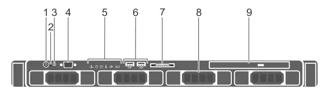

# Dell R230 physical appliance details

Included with your Dell™ PowerEdge™ R230 appliance, you will receive a chassis with front panel and back panel features, and rails for racking.

### Figure 1. Dell PowerEdge R230 Rack Server

The information below is excerpted from the [Dell PowerEdge R230 Systems Hardware Owner's Manual](http://topics-cdn.dell.com/pdf/poweredge-r230_Owner's Manual_en-us.pdf), available on the Dell Web site.

## Technical specifications

<table>
  <col />
  <col />
  <thead>
    <tr>
      <th>Feature</th>
      <th>Technical Specifications</th>
    </tr>
  </thead>
  <tbody>
    <tr>
      <td>Processor</td>
      <td></td>
    </tr>
    <tr>
      <td>Processor type</td>
      <td>
        
One Intel E3-1200 V5 series

      </td>
    </tr>
    <tr>
      <td>Expansion bus</td>
      <td></td>
    </tr>
    <tr>
      <td>PCIE_G3_X16</td>
      <td>
        
(Slot 1) one half-height, half-length x16 link for processor 1

        
(Slot 2) one full-height, half-length x16 link for processor 1

      </td>
    </tr>
    <tr>
      <td>PCIE_G3_X8</td>
      <td>
        
(Slot 1) one full-height, half-length x4 link for processor 1

        
(Slot 2) one half-height, half-length x8 link for processor 1

      </td>
    </tr>
    <tr>
      <td>Memory</td>
      <td></td>
    </tr>
    <tr>
      <td>Architecture</td>
      <td>
        
1600 MT/s, 1866 MT/s, or 2133 MT/s DDR4 Unbuffered DIMMs

        
Support for advanced ECC or memory optimized operation

      </td>
    </tr>
    <tr>
      <td>Memory module sockets</td>
      <td>Four 288-pin sockets</td>
    </tr>
    <tr>
      <td>Memory module capacities</td>
      <td></td>
    </tr>
    <tr>
      <td>UDIMM</td>
      <td>4 GB (single-rank), 8 GB (single- and dual-rank), 16 GB (single- and dual-rank)</td>
    </tr>
    <tr>
      <td>Minimum RAM</td>
      <td>4GB</td>
    </tr>
    <tr>
      <td>Maximum RAM</td>
      <td>64 GB</td>
    </tr>
    <tr>
      <td>Drives</td>
      <td></td>
    </tr>
    <tr>
      <td>Four hard drive systems</td>
      <td>Up to four 3.5-inch cabled hard drives, orUp to four 2.5-inch hot swappable SATA, or Nearline SAS hard drives in 3.5-inch adapters, orUp to four 3.5-inch hot swappable SATA, or Nearline SAS hard drives</td>
    </tr>
    <tr>
      <td>Two hard drive systems</td>
      <td>
        
Up to two 3.5-inch cabled hard drives

      </td>
    </tr>
    <tr>
      <td>Optical drive</td>
      <td>One optional slim SATA DVD-ROM or DVD+/-RW drive</td>
    </tr>
    <tr>
      <td>Connectors</td>
      <td></td>
    </tr>
    <tr>
      <td>Back</td>
      <td></td>
    </tr>
    <tr>
      <td>NIC</td>
      <td>Two 10/100/1000 Mbps</td>
    </tr>
    <tr>
      <td>Serial</td>
      <td>	9-pin, DTE, 16550-compatible</td>
    </tr>
    <tr>
      <td>USB	</td>
      <td>Two 9-pin, USB 3.0-compliant</td>
    </tr>
    <tr>
      <td>Video	</td>
      <td>15-pin VGA</td>
    </tr>
    <tr>
      <td>iDRAC8</td>
      <td>One optional 1 GbE Ethernet</td>
    </tr>
    <tr>
      <td>SD vFlash</td>
      <td>
        
One optional SD vFlash memory card

        
NOTE: The card slot is available for use only if the iDRAC8 Enterprise license is installed on your system.

      </td>
    </tr>
    <tr>
      <td>Front</td>
      <td></td>
    </tr>
    <tr>
      <td>USB</td>
      <td>Two 4-pin, USB 2.0-compliant</td>
    </tr>
    <tr>
      <td>Video</td>
      <td>15-pin VGA</td>
    </tr>
    <tr>
      <td>Internal</td>
      <td></td>
    </tr>
    <tr>
      <td>USB</td>
      <td>One 9-pin, USB 3.0-compliant</td>
    </tr>
    <tr>
      <td>
        
Environmental

        
NOTE: For additional information about environmental measurements for specific system configurations, see <a href="http://dell.com/environmental_datasheets">dell.com/environmental_datasheets</a>.

      </td>
      <td></td>
    </tr>
    <tr>
      <td>Temperature</td>
      <td></td>
    </tr>
    <tr>
      <td>Storage</td>
      <td>–40°C to 65°C (–40°F to 149°F)</td>
    </tr>
    <tr>
      <td>Continuous operation (for altitude less than 950 m or 3117 ft)</td>
      <td>10°C to 35°C (50°F to 95°F) with no direct sunlight on the equipment.</td>
    </tr>
    <tr>
      <td>Temperature Ranges (for altitude less than 950 m or 3117 ft)</td>
      <td>10 °C to 35 °C (50 °F to 95 °F) with no direct sunlight on the equipment.</td>
    </tr>
    <tr>
      <td>Maximum temperature gradient (operating and storage)</td>
      <td>20°C/h (36°F/h)</td>
    </tr>
    <tr>
      <td>Relative humidity</td>
      <td></td>
    </tr>
    <tr>
      <td>Storage</td>
      <td>5% to 95% RH with 33°C (91°F) maximum dew point. Atmosphere must be non-condensing at all times.</td>
    </tr>
    <tr>
      <td>Operating</td>
      <td>10% to 80% Relative Humidity with 29°C (84.2°F) maximum dew point.</td>
    </tr>
    <tr>
      <td>Maximum vibration</td>
      <td></td>
    </tr>
    <tr>
      <td>Operating</td>
      <td>0.26 G rms at 5 Hz to 350 Hz (all operation orientations).</td>
    </tr>
    <tr>
      <td>Storage</td>
      <td>1.88 G rms at 10 Hz to 500 Hz for 15 min (all six sides tested).</td>
    </tr>
    <tr>
      <td>Maximum shock</td>
      <td></td>
    </tr>
    <tr>
      <td>Operating</td>
      <td>Six consecutively executed shock pulses in the positive and negative x, y, and z axes of 40 G for up to 2.3 ms.</td>
    </tr>
    <tr>
      <td>Storage</td>
      <td>Six consecutively executed shock pulses in the positive and negative x, y, and z axes (one pulse on each side of the system) of 71 G for up to 2 ms.</td>
    </tr>
    <tr>
      <td>Maximum altitude</td>
      <td></td>
    </tr>
    <tr>
      <td>Operating</td>
      <td>3048 m (10,000 ft.)</td>
    </tr>
    <tr>
      <td>Storage</td>
      <td>12,000 m (39,370 ft).</td>
    </tr>
    <tr>
      <td>Operating altitude de-rating</td>
      <td></td>
    </tr>
    <tr>
      <td>Up to 35 °C (95 °F)</td>
      <td>Maximum temperature is reduced by 1°C/300 m (1°F/547 ft) above 950 m (3,117 ft)</td>
    </tr>
    <tr>
      <td>
        
Particulate contamination

        
NOTE: The following section defines the limits to help avoid IT equipment damage and/or failure from particulates and gaseous contamination. If the levels of particulates or gaseous pollution are beyond the specified limits and cause equipment damage or failure, you may need to rectify the environmental conditions. Remediation of environmental conditions is the responsibility of the customer.

      </td>
      <td></td>
    </tr>
    <tr>
      <td>Air filtration</td>
      <td>
        
Data center air filtration as defined by ISO Class 8 per ISO 14644-1 with a 95% upper confidence limit.

        
NOTE: Applies to data center environments only. Air filtration requirements do not apply to IT equipment designed to be used outside a data center, in environments such as an office or factory floor.

        
NOTE: Air entering the data center must have MERV11 or MERV13 filtration.

      </td>
    </tr>
    <tr>
      <td>Conductive dust</td>
      <td>
        
Air must be free of conductive dust, zinc whiskers, or other conductive particles.

        
NOTE: Applies to data center and non-data center environments.

      </td>
    </tr>
    <tr>
      <td>Corrosive dust</td>
      <td>
        <ul>
          <li>Air must be free of corrosive dust.</li>
          <li>Residual dust present in the air must have a deliquescent point less than 60% relative humidity.</li>
        </ul>
        
NOTE: Applies to data center and non-data center environments.

      </td>
    </tr>
    <tr>
      <td>
        
Gaseous contamination

        
NOTE: Maximum corrosive contaminant levels measured at ≤50% relative humidity.

      </td>
      <td></td>
    </tr>
    <tr>
      <td>Copper Coupon Corrosion Rate</td>
      <td>&amp;lt;300 Å/month per Class G1 as defined by ANSI/ISA71.04-1985.</td>
    </tr>
    <tr>
      <td>Silver Coupon Corrosion Rate</td>
      <td>&amp;lt;200 Å/month as defined by AHSRAE TC9.9.</td>
    </tr>
    <tr>
      <td>Power supply unit</td>
      <td></td>
    </tr>
    <tr>
      <td>Power rating per power supply unit (PSU)</td>
      <td>250 W (Bronze) AC (100–240 V, 50/60 Hz, 4.0 A-2.0 A)</td>
    </tr>
    <tr>
      <td>Heat dissipation</td>
      <td>
        
1039 BTU/hr maximum (250 W PSU)

        
NOTE: Heat dissipation is calculated using the PSU wattage rating.

      </td>
    </tr>
    <tr>
      <td>Voltage</td>
      <td>
        
100–240 V AC, autoranging, 50/60 Hz

        
NOTE: This system is also designed to be connected to IT power systems with a phase-to-phase voltage not exceeding 230 V.

      </td>
    </tr>
    <tr>
      <td>Storage controller</td>
      <td></td>
    </tr>
    <tr>
      <td>Storage controller type	</td>
      <td>
        
PERC H730, PERC H330, PERC H830, PERC S130.

        
NOTE: Your system supports software RAID S130 and a PERC card. For more information on software RAID, see the Dell PowerEdge RAID Controller (PERC) documentation at Dell.com/storagecontrollermanuals.

      </td>
    </tr>
    <tr>
      <td>Video</td>
      <td></td>
    </tr>
    <tr>
      <td>Video type</td>
      <td>Integrated Matrox G200</td>
    </tr>
    <tr>
      <td>Video memory</td>
      <td>16 MB shared</td>
    </tr>
  </tbody>
</table>## Dimensions and weight

| Unit | Measurement |
|---|---|
| Height | 42.8 mm (1.68 inch) |
| Width with rack latches | 482.38 mm (19 inch) |
| Width without rack latches | 434.15 mm (17.09 inch) |
| Depth without bezel | 497 mm (19.5 inch) |
| Maximum weight for two 2.5-inch hard drive chassis | 8.78 kg (19.35 lb) |
| Maximum weight for four 3.5-inch cabled hard drive chassis | 8.77 kg (19.32 lb) |
| Maximum weight for four 3.5-inch hot swappable hard drive chassis | 9.51 kg (20.96 lb) |
| Empty weight for two 2.5-inch cabled hard drive chassis | 5.58 kg (12.31 lb) |
| Empty weight for four 3.5-inch cabled hard drive chassis | 6.06 kg (13.36 lb) |
| Empty weight for four 3.5-inch hot swappable hard drive chassis | 5.25 kg (11.57 lb) |

## Specific measurements (corresponding with figure 2)

| Dimension | Measurement |
|---|---|
| Xa (width with rack latches) | 482.4 mm |
| Xb (width without rack latches) | 434.0 mm |
| Y (height) | 43.0 mm |
| Za (depth with bezel) | 35.0 mm |
| Za (depth without bezel) | 20.1 mm |
| Zb (depth without power supply and bezel) | 606.0 mm |
| Zc (depth with power supply) | 641.9 mm |

### Figure 2. Dell R220 PowerEdge dimensions

## Front panel features and indicators

### Four 3.5-inch or 2.5-inch hot swappable hard drive chassis

### Figure 2. Front panel features and indicators — four 3.5-inch or 2.5-inch hot swappable hard drive chassis

| Item | Indicator, button, or connector | Icon | Description |
|---|---|---|---|
| 1 | Power-on indicator, power button |  | Enables you to know the power status of the system. The power-on indicator glows when the system power is on. The power button controls the power supply output to the system. **Note** On ACPI-compliant operating systems, turning off the system using the power button causes the system to perform a graceful shutdown before power to the system is turned off. |
| 2 | NMI button |  | Enables you to troubleshoot software and device driver errors when running certain operating systems. This button can be pressed by using the end of a paper clip. Use this button only if directed to do so by qualified support personnel or by the operating system's documentation. |
| 3 | System identification button |  | Enables you to locate a particular system within a rack. The identification buttons are on the front and back panels. When one of these buttons is pressed, the LCD panel on the front and the system status indicator on the back flash until one of the buttons is pressed again.Press the button to turn the system ID on and off. If the system stops responding during POST, press and hold the system ID button for more than five seconds to enter BIOS progress mode. To reset iDRAC (if not disabled in F2 iDRAC setup) press and hold the button for more than 15 seconds. |
| 4 | Video connector |  | Enables you to connect a display to the system. |
| 5 | LCD menu buttons |  | Enable you to navigate the control panel LCD menu. |
| 6 | LCD panel |  | Displays system ID, status information, and system error messages. [See LCD panel features](http://www.dell.com/support/manuals/us/en/19/poweredge-r230/R230_OM-v1/LCD-panel-features?guid=GUID-86F8FF00-3353-48A4-B513-57606D77B511&amp;lang=en-us). NOTE: LCD panel is not available in a cabled hard drive chassis. |
| 7 | USB management port/iDRAC Direct port |  | Functions as a regular USB port or provides access to the iDRAC Direct features. For more information, see the iDRAC User’s Guide at Dell.com/idracmanuals. |
| 8 | USB connector |  | Enables you to connect USB devices to the system. The port is USB 2.0-compliant. |
| 9 | Information tag |  | Contains system information such as service tag, NIC, MAC address for your reference. The information tag is a slide-out label panel. |
| 10 | Hard drives |  | Enables you to install up to four 3.5-inch hot swappable hard drives or up to four 2.5-inch hot swappable hard drives in 3.5-inch hot swappable adapters. |
| 11 | Optical drive (optional) |  | Enables you to install an optional slim SATA DVD-ROM drive or DVD+/-RW drive. |

### Four 3.5-inch cabled hard drive chassis

### Figure 3. Front panel features and indicators — four 3.5-inch cabled hard drive chassis

| Item | Indicator, button, or connector | Icon | Description |
|---|---|---|---|
| 1 | Power-on indicator, power button |  | Enables you to know the power status of the system. The power-on indicator glows when the system power is on. The power button controls the power supply output to the system. **Note** On ACPI-compliant operating systems, turning off the system using the power button causes the system to perform a graceful shutdown before power to the system is turned off. |
| 2 | NMI button |  | Enables you to troubleshoot software and device driver errors when running certain operating systems. This button can be pressed by using the end of a paper clip. Use this button only if directed to do so by qualified support personnel or by the operating system's documentation. |
| 3 | System identification button |  | Enables you to locate a particular system within a rack. The identification buttons are on the front and back panels. When one of these buttons is pressed, the LCD panel on the front and the system status indicator on the back flash until one of the buttons is pressed again. Press the button to turn the system ID on and off. If the system stops responding during POST, press and hold the system ID button for more than five seconds to enter BIOS progress mode. To reset iDRAC (if not disabled in F2 iDRAC setup) press and hold the button for more than 15 seconds. |
| 4 | Video connector |  | Enables you to connect a display to the system. |
| 5 | Diagnostic indicators |  | The diagnostic indicator glows to display error status. For more information, see Diagnostic indicators. |
| 6 | USB connector |  | Enables you to connect USB devices to the system. The port is USB 2.0-compliant. |
| 7 | Information tag |  | Contains system information such as service tag, NIC, MAC address for your reference. The information tag is a slide-out label panel. |
| 8 | Hard drives |  | Enables you to install up to four 3.5-inch hot swappable hard drives or up to four 2.5-inch hot swappable hard drives in 3.5-inch hot swappable adapters. |
| 9 | Optical drive (optional) |  | Enables you to install an optional slim SATA DVD-ROM drive or DVD+/-RW drive. |

### Two 3.5-inch cabled hard drive chassis

### Figure 4. Front panel features and indicators — two 3.5-inch cabled hard drive chassis

| Item | Indicator, button, or connector | Icon | Description |
|---|---|---|---|
| 1 | Power-on indicator, power button |  | Enables you to know the power status of the system. The power-on indicator glows when the system power is on. The power button controls the power supply output to the system. **Note** On ACPI-compliant operating systems, turning off the system using the power button causes the system to perform a graceful shutdown before power to the system is turned off. |
| 2 | NMI button |  | Enables you to troubleshoot software and device driver errors when running certain operating systems. This button can be pressed by using the end of a paper clip. Use this button only if directed to do so by qualified support personnel or by the operating system's documentation. |
| 3 | System identification button |  | Enables you to locate a particular system within a rack. The identification buttons are on the front and back panels. When one of these buttons is pressed, the LCD panel on the front and the system status indicator on the back flash until one of the buttons is pressed again. Press the button to turn the system ID on and off. If the system stops responding during POST, press and hold the system ID button for more than five seconds to enter BIOS progress mode. To reset iDRAC (if not disabled in F2 iDRAC setup) press and hold the button for more than 15 seconds. |
| 4 | Video connector |  | Enables you to connect a display to the system. |
| 5 | Hard drives |  | Enables you to install up to four 3.5-inch hot swappable hard drives or up to four 2.5-inch hot swappable hard drives in 3.5-inch hot swappable adapters. |
| 6 | Diagnostic indicators |  | The diagnostic indicator glows to display error status. For more information, see Diagnostic indicators. |
| 7 | USB connector |  | Enables you to connect USB devices to the system. The port is USB 2.0-compliant. |
| 8 | Information tag |  | Contains system information such as service tag, NIC, MAC address for your reference. The information tag is a slide-out label panel. |
| 9 | Optical drive (optional) |  | Enables you to install an optional slim SATA DVD-ROM drive or DVD+/-RW drive. |

## Power indicator codes

An LED indicator on the power button indicates when power is supplied to the system and the system is operational. The power supplies have an indicator that shows whether power is present or whether a power fault has occurred.

* Not lit—AC power is not connected.
* Green—In standby mode, indicates that a valid AC source is connected to the power supply, and that the power supply is operational. When the system is on, it also indicates that the power supply is providing DC power to the system.
* Amber—Indicates a problem with the power supply.
* Alternating green and amber—When hot-adding a power supply, this indicates that the power supply is mismatched with the other power supply (a high output power supply and an Energy Smart power supply are installed in the same system). Replace the power supply that has the flashing indicator with a power supply that matches the capacity of the other installed power supply.

### Figure 4. Power supply status indicator

## Back panel features and indicators

### Figure 5. Dell PowerEdge R230 back panel features and indicators

| Item | Indicator, button, or connector | Icon | Description |
|---|---|---|---|
| 1 | Serial connector |  | Enables you to connect a serial device to the system. |
| 2 | System identification button |  | Enables you to locate a particular system within a rack. The identification buttons are on the front and back panels. When one of these buttons is pressed, the LCD panel on the front and the system status indicator on the back flash until one of the buttons is pressed again.Press the button to turn the system ID on or off. If the system stops responding during POST, press and hold the system ID button for more than five seconds to enter BIOS progress mode.To reset the iDRAC (if not disabled in F2 iDRAC setup) press and hold the button for more than 15 seconds. |
| 3 | vFlash card slot (optional) |  | Enables you to connect the vFlash card. |
| 4 | iDRAC port (optional) |  | Enables you to install a dedicated management port card. |
| 5 | USB connectors (2) |  | Allow you to connect USB devices to the system. The ports are USB 3.0-compliant. |
| 6 | PCIe expansion card slot (x8 slot, low profile) |  | Enables you to connect a PCI Express expansion card. |
| 7 | PCIe expansion card slot (x16 slot, full height) |  | Enables you to connect a PCI Express expansion card. |
| 8 | Power supply unit (PSU) |  | Enables you to install one 250 W AC PSU. |
| 9 | Ethernet connectors (2) |  | Enable you to connect integrated 10/100/1000 Mbps NIC connector. |
| 10 | System identification connector |  | Connects the optional system status indicator assembly through the optional cable management arm. |
| 11 | Video connector |  | Allows you to connect a VGA display to the system. |

## Rails

Your Alert Logic appliance ships with ReadyRails™ in the box. ReadyRails™ sliding and static rail systems for the R410 provide tool-less support for 4-post racks with square or unthreaded round mounting holes, including all generations of Dell racks. Both support tooled mounting in 4-post threaded racks (an optional adapter brackets kit is required for the sliding rails). The static rails also provide tooled mounting support for 2-post (Telco) racks for added versatility. The optional cable management (CMA) arm can be mounted on either the left or right side of the sliding rails without the use of tools for fast and easy deployment.

**Note** The R410 is not compatible with any other Dell rails, including previous generation rails, but it does use the same sliding rails as the R310 and the same static rails as the R210 and R310.

### Figure 7. Dell PowerEdge R410 sliding rails with optional CMA

### Figure 8. Dell PowerEdge R410 static rails
