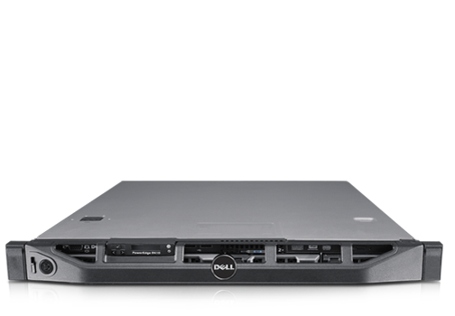
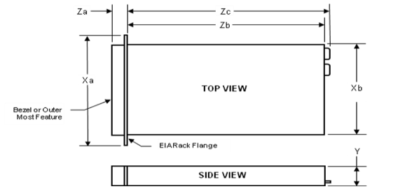
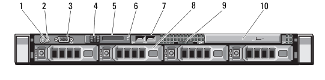
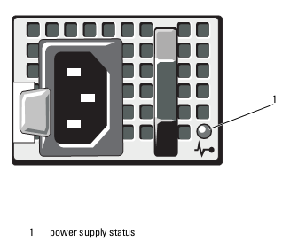
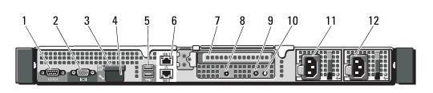
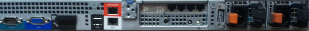
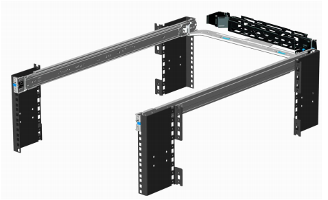
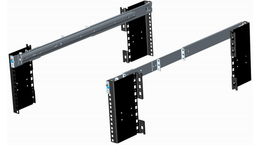

# Dell R410 physical appliance details

The Alert Logic appliance is a Dell™ PowerEdge™ R410 two-socket 1U rack server. Included with your appliance, you will receive a chassis with front panel and back panel features, and rails for racking.

### Figure 1. Dell PowerEdge R410 Rack Server

The information below is excerpted from the [Dell PowerEdge R410 Technical Guide](http://i.dell.com/sites/doccontent/business/solutions/engineering-docs/en/Documents/R410-TechGuide-10192010rev2-final.pdf) and [Dell PowerEdge R410 Systems Hardware Owner's Manual](http://downloads.dell.com/manuals/all-products/esuprt_ser_stor_net/esuprt_poweredge/poweredge-r410_owner's manual_en-us.pdf), available on the Dell Web site.

## Chassis

The Alert Logic appliance configuration details are as follows:

**Hard Drives:** Up to four 2.5 x 3.5” HDD hot swap carrier or up to four 3.5” cabled/hot swap

**Power Supply:** Redundant (500-W) or non-redundant PSU (480-W)

**Diagnostic Indicator:** LED indicators or LCD panel

## Dimensions and weight

| Unit | Measurement |
|---|---|
| Dimensions w/o rack latches, bezel, and power supply (HxWxD) | 43.0 x 434.0 x 606.0 mm |
| Maximum configuration weight | 15.9 kg (35.02 lb.) |

## Specific measurements (corresponding with figure 2)

| Dimension | Measurement |
|---|---|
| Xa (width with rack latches) | 482.4 mm |
| Xb (width without rack latches) | 434.0 mm |
| Y (height) | 43.0 mm |
| Za (depth with bezel) | 35.0 mm |
| Za (depth without bezel) | 20.1 mm |
| Zb (depth without power supply and bezel) | 606.0 mm |
| Zc (depth with power supply) | 641.9 mm |

### Figure 2. Dell R410 PowerEdge dimensions

## Front panel features and indicators

The following table explains the Dell R410 front panel features and indicators. See Figure 3 for reference.

| Item | Indicator, button, or connector | Icon | Description |
|---|---|---|---|
| 1 | Power-on indicator, power button |  | Indicates the system power is on. Controls the DC power supply output to the system. The power button is not accessible when the optional system bezel is installed. **Note** When powering on the system, the video monitor can take several seconds to over 2 minutes to display an image, depending on the amount of memory installed on the system. **Note** On ACPI-compliant operating systems, turning off the system using the power button causes the system to perform a graceful shutdown before power to the system is turned off. **Note** To force an ungraceful shutdown, press and hold the power button for five seconds. |
| 2 | NMI button |  | Used to troubleshoot software and device driver errors when using certain operating systems. This button can be pressed using the end of a paper clip. Use this button only if directed to do so by qualified support personnel or by the operating system's documentation. |
| 3 | Video connector |  | Connects a monitor to the system. |
| 4 | LCD menu buttons |  | Allows you to navigate the control panel LCD menu. |
| 5 | LED or LCD panel |  | **Note** Depending on the configuration, your system may have either LED diagnostic indicators or an LCD panel. LED panel: The four diagnostic indicator lights display error codes during system startup.  LCD panel: Provides system ID, status information, and system error messages.  The LCD lights during normal system operation. Both the systems management software and the identification buttons located on the front and back of the system can cause the LCD to flash blue to identify a particular system.  The LCD lights amber when the system needs attention, and the LCD panel displays an error code followed by descriptive text. **Note** If the system is connected to AC power and an error has been detected, the LCD lights amber regardless of whether the system has been powered on. |
| 6 | System identification button |  | The identification buttons on the front and back panels can be used to locate a particular system within a rack. When one of these buttons is pushed, the LCD panel on the front and the blue system status indicator on the back blink until one of the buttons are pushed again. |
| 7 | USB connectors |  | Connects USB devices to the system. The ports are USB 2.0-compliant. |
| 8 | Hard drives (4) |  | Up to four 2.5-inch in 3.5-inch HDD hot swap carrier or up to four 3.5-inch cabled/hot swap. |
| 9 | System identification panel |  | A slide-out panel for system information including the Express Service tag, embedded NIC MAC address, and iDRAC6 Enterprise card MAC address. |
| 10 | Optical drive (optional) |  | One optional slim-line SATA DVD-ROM drive or DVD+/-RW drive. **Note** DVD devices are data only. |

### Figure 3. Dell PowerEdge R410 front panel features and indicators

## Power indicator codes

An LED indicator on the power button indicates when power is supplied to the system and the system is operational. The power supplies have an indicator that shows whether power is present or whether a power fault has occurred.

* Not lit—AC power is not connected.
* Green—In standby mode, indicates that a valid AC source is connected to the power supply, and that the power supply is operational. When the system is on, it also indicates that the power supply is providing DC power to the system.
* Amber—Indicates a problem with the power supply.
* Alternating green and amber—When hot-adding a power supply, this indicates that the power supply is mismatched with the other power supply (a high output power supply and an Energy Smart power supply are installed in the same system). Replace the power supply that has the flashing indicator with a power supply that matches the capacity of the other installed power supply.

### Figure 4. Power supply status indicator

## Back panel features and indicators

The following table explains the Dell R410 back panel features and indicators. See Figure 5 for reference.

| Item | Indicator, button, or connector | Icon | Description |
|---|---|---|---|
| 1 | Serial connector |  | Connects a serial device to the system. |
| 2 | Video connector |  | Connects a VGA display to the system. |
| 3 | VFlash media slot (optional) |  | Connects an external SD memory card for the optional iDRAC6 Enterprise card. |
| 4 | iDRAC6 Enterprise port (optional) |  | Dedicated management port for the optional iDRAC6 Enterprise card. |
| 5 | USB connectors (2) |  | Connects USB devices to the system. The ports are USB 2.0-compliant. |
| 6 | Ethernet connectors (2) |  | Embedded 10/100/1000 NIC connectors. |
| 7 | PCIe slot 1 |  | PCI Express (generation 2) x16-wide expansion slot (full-height, half-length). |
| 8 | Active ID CMA connector |  | Connector for attaching a system indicator extension cable that is used on a cable management arm. |
| 9 | System status indicator light |  | Lights blue during normal system operation.  Both of the system's management software and the identification buttons located on the front and back of the system can cause the indicator to flash blue to identify a particular system.  Lights amber when the system needs attention due to a problem. |
| 10 | System identification button |  | Turns the system ID modes on and off.  The identification buttons on the front and back panels can be used to locate a particular system within a rack. When one of these buttons is pushed, the LCD panel on the front and the system status indicator on the chassis back panel light blue until one of the buttons are pushed again. |
| 11 | Power supply 1 (PS1) |  | 500-W power supply (redundant). |
| 12 | Power supply 2 (PS2) |  | 500-W power supply (redundant) or 480-W power supply (non-redundant). |

### Figure 5. Dell PowerEdge R410 back panel features and indicators

### Figure 6. Dell PowerEdge R410 back panel management port

## Rails

Your Alert Logic appliance ships with ReadyRails™ in the box. ReadyRails™ sliding and static rail systems for the R410 provide tool-less support for 4-post racks with square or unthreaded round mounting holes, including all generations of Dell racks. Both support tooled mounting in 4-post threaded racks (an optional adapter brackets kit is required for the sliding rails). The static rails also provide tooled mounting support for 2-post (Telco) racks for added versatility. The optional cable management (CMA) arm can be mounted on either the left or right side of the sliding rails without the use of tools for fast and easy deployment.

**Note** The R410 is not compatible with any other Dell rails, including previous generation rails, but it does use the same sliding rails as the R310 and the same static rails as the R210 and R310.

### Figure 7. Dell PowerEdge R410 sliding rails with optional CMA

### Figure 8. Dell PowerEdge R410 static rails
