# Dell R630 physical appliance details

Included with your Dell™ PowerEdge™ R630 appliance, you will receive a chassis with front panel and back panel features, and rails for racking.

### Figure 1. Dell PowerEdge R630 Rack Server

The information below is excerpted from the [Dell PowerEdge R630 Systems Hardware Owner's Manual](http://topics-cdn.dell.com/pdf/poweredge-r630_Owner's Manual_en-us.pdf) and the [Dell PowerEdge R630 Technical Guide](http://i.dell.com/sites/doccontent/shared-content/data-sheets/en/Documents/Dell-PowerEdge-R630-Technical-Guide-v1-6.pdf), available on the Dell Web available on the Dell Web site.

## Technical specifications

<table>
  <col />
  <col />
  <thead>
    <tr>
      <th>Feature</th>
      <th>Technical Specifications</th>
    </tr>
  </thead>
  <tbody>
    <tr>
      <td>Processor</td>
      <td></td>
    </tr>
    <tr>
      <td>Processor type</td>
      <td>
        
One or two Intel Xeon processor E5-2600 v3 product family

      </td>
    </tr>
    <tr>
      <td>
        
Expansion bus

        
PCI Express expansion slots using riser card

      </td>
      <td></td>
    </tr>
    <tr>
      <td>Slot 1</td>
      <td>
        
(Slot 1) One half-height, three fourth-length x8 link(Slot 1) One half-height, half-length x8 link or one half-height, half-length x8 link

      </td>
    </tr>
    <tr>
      <td>Slot 2	</td>
      <td>
        
(Slot 2) One half-height, half-length x8 link or one half-height, half-length x16 link

      </td>
    </tr>
    <tr>
      <td>Slot 3	</td>
      <td>(Slot 2) One half-height, half-length x8 link or one half-height, half-length x16 link</td>
    </tr>
    <tr>
      <td>Memory</td>
      <td></td>
    </tr>
    <tr>
      <td>Architecture</td>
      <td>
        
1333 MT/s, 1600MT/s, 1866 MT/s, and 2133 MT/s registered Error Correcting Code (ECC) DIMMs

        
Support for Advanced ECC or memory-optimized operation

        
Support for LRDIMMs

      </td>
    </tr>
    <tr>
      <td>Memory module sockets</td>
      <td>Twenty-four 288-pin</td>
    </tr>
    <tr>
      <td>Memory module capacities</td>
      <td></td>
    </tr>
    <tr>
      <td>LRDIMM</td>
      <td> 4 GB, 8 GB, 16 GB, or 32 GB single-, dual-, or quad-ranked or 64 GB quad-ranked.</td>
    </tr>
    <tr>
      <td>RDIMM</td>
      <td>
        
4 GB, 8 GB, or 32 GB single-, dual-, or quad-ranked

        
16 GB single- or dual-ranked, or 32 GB dual-ranked.

      </td>
    </tr>
    <tr>
      <td>Minimum RAM</td>
      <td>2 GB with a single processor4 GB with two processors</td>
    </tr>
    <tr>
      <td>Maximum RAM</td>
      <td>LRDIMM: Up to 1536 GBRDIMM: Up to 768 GB</td>
    </tr>
    <tr>
      <td>Drives</td>
      <td></td>
    </tr>
    <tr>
      <td>8–hard-drive systems</td>
      <td>Up to eight 2.5 inch, internal, hot-swappable SAS, SATA, or Nearline SAS hard drives</td>
    </tr>
    <tr>
      <td>10–hard-drive systems</td>
      <td>
        
Up to ten 2.5 inch, internal, hot-swappable SAS, SATA, or Nearline SAS hard drives

      </td>
    </tr>
    <tr>
      <td>24–hard-drive systems</td>
      <td>Up to 24 1.8 inch, internal, hot-swappable SAS, SATA, or Nearline SAS hard drives</td>
    </tr>
    <tr>
      <td>Optical drives</td>
      <td></td>
    </tr>
    <tr>
      <td>(8 hard-drive systems only)</td>
      <td>
        
One optional SATA DVD-ROM drive or DVD+/-RW drive

        
NOTE: DVD devices are data only.

      </td>
    </tr>
    <tr>
      <td>Connectors</td>
      <td></td>
    </tr>
    <tr>
      <td>Back</td>
      <td></td>
    </tr>
    <tr>
      <td>NIC</td>
      <td>Four 10/100/1000 Mbps or two 10/100/1000 Mbps and two 100 Mbps/1 Gbps/10 Gbps</td>
    </tr>
    <tr>
      <td>Serial</td>
      <td>DB-9 Serial Port connector</td>
    </tr>
    <tr>
      <td>USB	</td>
      <td>Two 9-pin, USB 3.0-compliant</td>
    </tr>
    <tr>
      <td>Video	</td>
      <td>15-pin VGA</td>
    </tr>
    <tr>
      <td>Front connectors (8 hard drive systems)</td>
      <td></td>
    </tr>
    <tr>
      <td>USB</td>
      <td>Two 4-pin, USB 2.0-compliant</td>
    </tr>
    <tr>
      <td>Video</td>
      <td>15-pin VGA</td>
    </tr>
    <tr>
      <td>External vFlash card</td>
      <td>vFlash memory card slotNOTE: The card slot is available for use only if the iDRAC8 Enterprise license is installed on your system.</td>
    </tr>
    <tr>
      <td>Front connectors (24 or 10 hard-drive systems)</td>
      <td></td>
    </tr>
    <tr>
      <td>USB</td>
      <td>One mini USB 2.0-compliant</td>
    </tr>
    <tr>
      <td>Internal</td>
      <td></td>
    </tr>
    <tr>
      <td>USB</td>
      <td>One 9-pin, USB 3.0-compliant</td>
    </tr>
    <tr>
      <td>Internal Dual SD Module (IDSDM)</td>
      <td>
        
Two optional flash memory card slots with the internal SD module

        
NOTE: One card slot is dedicated for redundancy.

      </td>
    </tr>
    <tr>
      <td>
        
Environmental

        
NOTE: For additional information about environmental measurements for specific system configurations, see <a href="http://dell.com/environmental_datasheets">dell.com/environmental_datasheets</a>.

      </td>
      <td></td>
    </tr>
    <tr>
      <td>Temperature</td>
      <td></td>
    </tr>
    <tr>
      <td>Storage temperature limits</td>
      <td>–40°C to 65°C (–40°F to 149°F)</td>
    </tr>
    <tr>
      <td>Maximum temperature gradient (operating and storage)</td>
      <td>20°C/h (36°F/h)</td>
    </tr>
    <tr>
      <td>Relative humidity</td>
      <td></td>
    </tr>
    <tr>
      <td>Storage</td>
      <td>5% to 95% RH with 33°C (91°F) maximum dew point. Atmosphere must be non-condensing at all times.</td>
    </tr>
    <tr>
      <td>Temperature (continuous operation)</td>
      <td></td>
    </tr>
    <tr>
      <td>Temperature ranges (for altitude less than 950 m or 3117 ft)</td>
      <td>10°C to 35°C (50°F to 95°F) with no direct sunlight on the equipment.NOTE: For information on restrictions, see Standard operating temperature .</td>
    </tr>
    <tr>
      <td>Fresh air</td>
      <td>For information on fresh air, see Expanded Operating Temperature.</td>
    </tr>
    <tr>
      <td>Humidity percentage range</td>
      <td>10% to 80% Relative Humidity with 26°C (78.8°F) maximum dew point.</td>
    </tr>
    <tr>
      <td>Maximum vibration</td>
      <td></td>
    </tr>
    <tr>
      <td>Operating</td>
      <td>0.26 G rms at 5 Hz to 350 Hz (all operation orientations).</td>
    </tr>
    <tr>
      <td>Storage</td>
      <td>Six consecutively executed shock pulses in the positive and negative x, y, and z axes (one pulse on each side of the system) of 71 G for up to 2 ms.</td>
    </tr>
    <tr>
      <td>Maximum shock</td>
      <td></td>
    </tr>
    <tr>
      <td>Operating</td>
      <td>Six consecutively executed shock pulses in the positive and negative x, y, and z axes of 40 G for up to 2.3 ms.</td>
    </tr>
    <tr>
      <td>Storage</td>
      <td>Six consecutively executed shock pulses in the positive and negative x, y, and z axes (one pulse on each side of the system) of 71 G for up to 2 ms.</td>
    </tr>
    <tr>
      <td>Maximum altitude</td>
      <td></td>
    </tr>
    <tr>
      <td>Operating</td>
      <td>3048 m (10,000 ft).</td>
    </tr>
    <tr>
      <td>Storage</td>
      <td>12,000 m (39,370 ft).</td>
    </tr>
    <tr>
      <td>Operating altitue de-rating</td>
      <td></td>
    </tr>
    <tr>
      <td>Up to 35 °C (95 °F)</td>
      <td>Maximum temperature is reduced by 1°C/300 m (1°F/547 ft) above 950 m (3,117 ft)</td>
    </tr>
    <tr>
      <td>35 °C to 40 °C (95 °F to 104 °F)</td>
      <td>Maximum temperature is reduced by 1°C/175 m (1°F/319 ft) above 950 m (3,117 ft).</td>
    </tr>
    <tr>
      <td>40 °C to 45 °C (104 °F to 113 °F)</td>
      <td>Maximum temperature is reduced by 1°C/125 m (1°F/228 ft) above 950 m (3,117 ft).</td>
    </tr>
    <tr>
      <td>NOTE: The following section defines the limits to help avoid IT equipment damage and/or failure from particulates and gaseous contamination. If the levels of particulates or gaseous pollution are beyond the specified limits and cause equipment damage or failure, you may need to rectify the environmental conditions. Remediation of environmental conditions is the responsibility of the customer.</td>
      <td></td>
    </tr>
    <tr>
      <td>Particulate contamination</td>
      <td></td>
    </tr>
    <tr>
      <td>Air filtration</td>
      <td>
        
Data center air filtration as defined by ISO Class 8 per ISO 14644-1 with a 95% upper confidence limit.

        
NOTE: Applies to data center environments only. Air filtration requirements do not apply to IT equipment designed to be used outside a data center, in environments such as an office or factory floor.

        
NOTE: Air entering the data center must have MERV11 or MERV13 filtration.

      </td>
    </tr>
    <tr>
      <td>Conductive dust</td>
      <td>Air must be free of conductive dust, zinc whiskers, or other conductive particles.NOTE: Applies to data center and non-data center environments.</td>
    </tr>
    <tr>
      <td>Corrosive dust</td>
      <td>
        <ul>
          <li>Air must be free of corrosive dust.</li>
          <li>Residual dust present in the air must have a deliquescent point less than 60% relative humidity.</li>
        </ul>
        
NOTE: Applies to data center and non-data center environments.

      </td>
    </tr>
    <tr>
      <td>Gaseous contamination</td>
      <td></td>
    </tr>
    <tr>
      <td>Copper coupon corrosion rate</td>
      <td>&amp;lt;300 Å/month per Class G1 as defined by ANSI/ISA71.04-1985.</td>
    </tr>
    <tr>
      <td>Silver coupon corrosion rate</td>
      <td>&amp;lt;200 Å/month as defined by AHSRAE TC9.9.</td>
    </tr>
    <tr>
      <td>NOTE: Maximum corrosive contaminant levels measured at ≤50% relative humidity.</td>
      <td></td>
    </tr>
    <tr>
      <td>Power supply unit</td>
      <td></td>
    </tr>
    <tr>
      <td>Wattage</td>
      <td>495 W, 750 W, or 1100 W</td>
    </tr>
    <tr>
      <td>Heat dissipation</td>
      <td>
        
1908 BTU/hr maximum (495 W power supply)

        
2891 BTU/hr maximum (750 W power supply)

        
2843 BTU/hr maximum (750 W Titanium power supply)

        
4100 BTU/hr maximum (1100 W power supply)

        
NOTE: Heat dissipation is calculated using the power supply wattage rating.

      </td>
    </tr>
    <tr>
      <td>Voltage</td>
      <td>
        
100–240 V AC, autoranging, 50/60 Hz

        
or200–240 V AC, autoranging, 50/60 Hz, for 750 W Titanium power supply

        
NOTE: This system is also designed to be connected to IT power systems with a phase-to-phase voltage not exceeding 230 V.

      </td>
    </tr>
    <tr>
      <td>Wattage</td>
      <td>1100 W or 750 W (Platinum power supply for China only)</td>
    </tr>
    <tr>
      <td>Heat dissipation</td>
      <td>
        
4416 BTU/hour maximum

        
NOTE: Heat dissipation is calculated using the power supply wattage rating.

      </td>
    </tr>
    <tr>
      <td>Voltage</td>
      <td>
        
–(48–60) V DC

        
NOTE: This system is also designed to be connected to IT power systems with a phase to phase voltage not exceeding 230 V.

      </td>
    </tr>
    <tr>
      <td>System battery</td>
      <td>CR 2032 3.0-V lithium coin cell</td>
    </tr>
    <tr>
      <td>Standard operating temperature</td>
      <td></td>
    </tr>
    <tr>
      <td>Temperature ranges (for altitude less than 950 metres or 3117 feet)</td>
      <td>
        
10°C to 35°C (50°F to 95°F) with no direct sunlight on the equipment.

        
NOTE: Maximum of 145 W 14–core processor is supported in systems with eight 2.5 inches drives 2–PCI slot chassis, and 75 W single wide active GPU.

      </td>
    </tr>
    <tr>
      <td>Standard operating temperature restrictions</td>
      <td>
        <ul>
          <li>Ambient temperature is restricted to 30°C for systems with eight 2.5 inches drives or ten 2.5 inches drives chassis, with no PCIe SSD and a maximum of 160 W workstation processor.</li>
          <li>Ambient temperature is restricted to 30°C for systems with ten 2.5 inches drives chassis, PCIe SSD and a maximum of 135 W processor.</li>
          <li>Ambient temperature is restricted to 35°C for systems with ten 2.5 inches drives chassis, PCIe SSD and a maximum of 120 W processor.</li>
          <li>Ambient temperature is restricted to 35°C for systems with twenty four 1.8 inches drives chassis, PCIe SSD, and a maximum of 135 W processor.</li>
        </ul>
      </td>
    </tr>
    <tr>
      <td>
        
Expanded operating temperature

        
NOTE: When operating in the expanded temperature range, system performance may be impacted.

        
NOTE: When operating in the expanded temperature range, ambient temperature warnings may be reported on the LCD and in the System Event Log.

      </td>
      <td></td>
    </tr>
    <tr>
      <td>Continuous Operation</td>
      <td>
        
5°C to 40°C at 5% to 85% RH with 29°C dew point.

        
NOTE: Outside the standard operating temperature (10°C to 35°C), the system can operate continuously down to 5°C or as high as 40°C.

        
For temperatures between 35°C and 40°C, de-rate maximum allowable temperature by 1°C per 175 m above 950 m (1°F per 319 ft).

      </td>
    </tr>
    <tr>
      <td>&amp;lt; 1% of annual operating hours</td>
      <td>
        
–5°C to 45°C at 5% to 90% RH with 29°C (84.2°F) maximum dew point.

        
NOTE: Outside the standard operating temperature (10°C to 35°C), the system can operate down to –5°C or up to 45°C for a maximum of 1% of its annual operating hours.

        
For temperatures between 40 °C and 45 °C, de-rate maximum allowable dry bulb temperature by 1°C per 125 m above 950 m (1°F per 228 ft).

      </td>
    </tr>
    <tr>
      <td>Expanded Operating Temperature Restrictions</td>
      <td>
        <ul>
          <li>Do not perform a cold startup below 5°C.</li>
          <li>The operating temperature specified is for a maximum altitude of 3048 m (10,000 ft).</li>
          <li>PCIe SSD and 1.8 inch SSDs are not supported.</li>
          <li>GPU is not supported.</li>
          <li>145 W and Workstation CPU (160 W) processors are not supported.</li>
          <li>Two power supply units are required and one power supply unit failure is not supported.</li>
          <li>Non Dell qualified peripheral cards and/or peripheral cards greater than 25 W are not supported.</li>
        </ul>
      </td>
    </tr>
    <tr>
      <td>Video</td>
      <td></td>
    </tr>
    <tr>
      <td>Video type</td>
      <td>Integrated VGA controller</td>
    </tr>
    <tr>
      <td>Video memory</td>
      <td>16 MB shared</td>
    </tr>
    <tr>
      <td>Video modes</td>
      <td></td>
    </tr>
    <tr>
      <td>
        <table>
          <col />
          <col />
          <col />
          <tbody>
            <tr>
              <td>Resolution</td>
              <td>Refresh rate (Hz)</td>
              <td>Color depth (bit)</td>
            </tr>
            <tr>
              <td>640 X 480</td>
              <td>60, 70</td>
              <td>8, 16, 32</td>
            </tr>
            <tr>
              <td>800 X 600</td>
              <td>60, 75, 85</td>
              <td>8, 16, 32</td>
            </tr>
            <tr>
              <td>1024 X 768</td>
              <td>60, 75, 85</td>
              <td>8, 16, 32</td>
            </tr>
            <tr>
              <td>1152 X 864</td>
              <td>60, 75, 85</td>
              <td>8, 16, 32</td>
            </tr>
            <tr>
              <td>1280 X 1024</td>
              <td>60, 75</td>
              <td>8, 16, 32</td>
            </tr>
            <tr>
              <td>1440 X 900</td>
              <td>60</td>
              <td>8, 16, 32</td>
            </tr>
          </tbody>
        </table>
      </td>
      <td></td>
    </tr>
  </tbody>
</table>## Dimensions

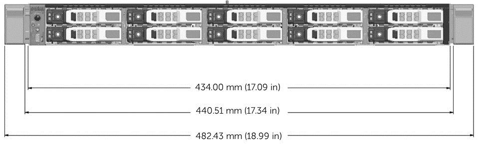

### Figure 2. Chassis width for 10-drive and 24-drive chassis options

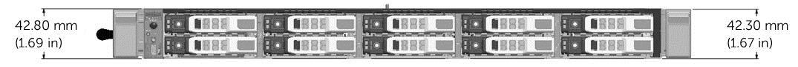

### Figure 3. Chassis height for 10-drive and 24-drive chassis options

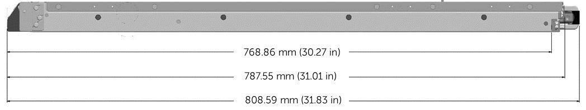

### Figure 4. Chassis depth with bezel for 10-drive and 24-drive chassis options

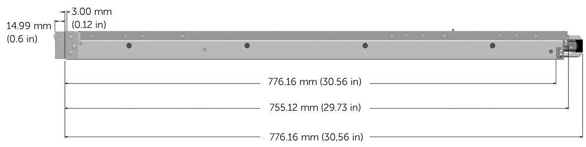

### Figure 5. Chassis depth without bezel for 10-drive and 24-drive chassis options

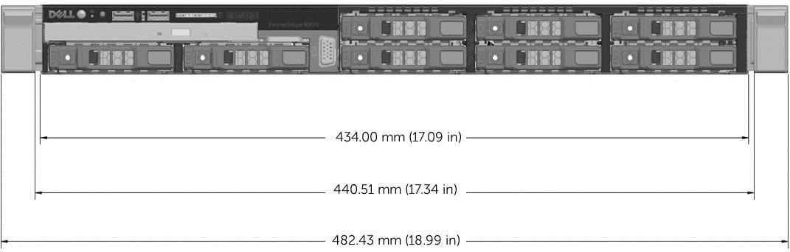

### Figure 6. Chassis width for 8-drive chassis option

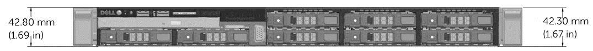

### Figure 7. Chassis height for 8-drive chassis option

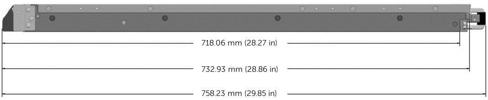

### Figure 8. Chassis depth with bezel for 8-drive chassis option

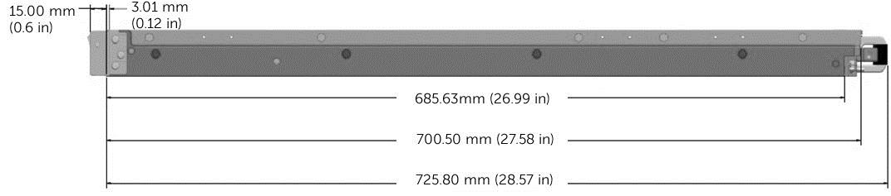

### Figure 9. Chassis depth without bezel for 8-drive chassis option

## Maximum Weight configuration

| 8-drive bay chassis | 10-drive bay chassis | 24 drive bay chassis |
|---|---|---|
| 16.9 kg (37 lb) | 18.4 kg (40.5 lb) | 17.4 kg (38.3 lb) |

## Specific measurements (corresponding with figure 2)

| Dimension | Measurement |
|---|---|
| Xa (width with rack latches) | 482.4 mm |
| Xb (width without rack latches) | 434.0 mm |
| Y (height) | 43.0 mm |
| Za (depth with bezel) | 35.0 mm |
| Za (depth without bezel) | 20.1 mm |
| Zb (depth without power supply and bezel) | 606.0 mm |
| Zc (depth with power supply) | 641.9 mm |

### Figure 2. Dell R220 PowerEdge dimensions

## Front panel features and indicators

### Eight hard drive system

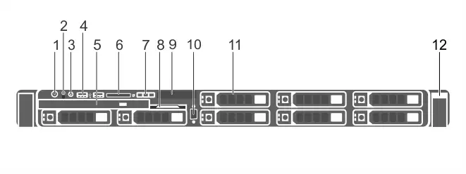

### Figure 10. Front-panel features and indicators–8 hard-drive system

<table>
  <thead>
    <tr>
      <th>Item</th>
      <th>Indicator, Button, or Connector                                          </th>
      <th>Icon</th>
      <th>Description</th>
    </tr>
  </thead>
  <tbody>
    <tr>
      <td>1</td>
      <td>Power-on indicator, power button                                          </td>
      <td>
        
      </td>
      <td>The power-on indicator lights when the system power is on. The power button controls the power supply output to the system.                                             <!-- --><ul><li>NOTE: On ACPI-compliant operating systems, turning off the system using the power button causes the system to perform a graceful shutdown before power to the system is turned off.                                                   </li></ul></td>
    </tr>
    <tr>
      <td>2</td>
      <td>NMI button</td>
      <td>
        
      </td>
      <td>
        
Used to troubleshoot software and device driver errors when running certain operating systems. This button can be pressed using the end of a paper clip.                                              

        
Use this button only if directed to do so by qualified support personnel or by the operating system documentation.                                             

      </td>
    </tr>
    <tr>
      <td>3</td>
      <td>System identification button</td>
      <td>
        
      </td>
      <td>The identification buttons on the front and back panels can be used to locate a particular system within a rack. When one of these buttons is pressed, the LCD panel on the front and the system status indicator on the back flashes blue until one of the buttons is pressed again.                                             
Press to toggle the system ID to ON or OFF. If the system stops responding during POST, press and hold the system ID button for more than five seconds to enter BIOS progress mode.                                             

To reset the iDRAC (if not disabled in F2 iDRAC setup) press and hold the button for more than 15 seconds.                                             
</td>
    </tr>
    <tr>
      <td>4</td>
      <td>USB management port/iDRAC Direct (2)                                          </td>
      <td>
        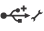
      </td>
      <td>Allows you to connect USB devices to the system or provides access to the iDRAC Direct features. For more information, see the Integrated Dell Remote Access Controller User's Guide at                                              <strong>dell.com/esmmanuals</strong>. The ports are USB 3.0-compliant.                                          </td>
    </tr>
    <tr>
      <td>5</td>
      <td>Optical drive (optional)</td>
      <td> </td>
      <td>One optional SATA DVD-ROM drive or DVD+/-RW drive.                                             <!-- --><ul><li>NOTE: DVD devices are data only.                                                   </li></ul></td>
    </tr>
    <tr>
      <td>6</td>
      <td>SD vFlash media card slot</td>
      <td> </td>
      <td>Allows you to insert a vFlash media card.                                           </td>
    </tr>
    <tr>
      <td>7</td>
      <td>LCD menu buttons</td>
      <td> </td>
      <td>Allows you to navigate the control panel LCD menu.                                          </td>
    </tr>
    <tr>
      <td>8</td>
      <td>Information tag</td>
      <td> </td>
      <td>A slide-out label panel, which allows you to record system information, such as Service Tag, NIC, and MAC address.                                          </td>
    </tr>
    <tr>
      <td>9</td>
      <td>LCD panel</td>
      <td> </td>
      <td>Displays system ID, status information, and system error messages. The LCD lights blue during normal system operation. When the system needs attention, the LCD lights amber and the LCD panel displays an error code followed by descriptive text.                                             <!-- --><ul><li>NOTE: If the system is connected to AC power and an error is detected, the LCD lights amber regardless of whether the system is turned on or off.                                                   </li></ul></td>
    </tr>
    <tr>
      <td>10</td>
      <td>Video connector</td>
      <td>
        
      </td>
      <td>Allows you to connect a VGA display to the system.                                          </td>
    </tr>
    <tr>
      <td>11</td>
      <td>Hard drives (8)</td>
      <td> </td>
      <td>Up to eight 2.5 inch hot-swappable hard drives.                                          </td>
    </tr>
    <tr>
      <td>12.</td>
      <td>Quick Sync</td>
      <td> </td>
      <td>
        
Indicates a Quick Sync enabled system. The Quick Sync feature is optional and requires a Quick Sync bezel. This feature allows management of the system using mobile devices. This feature aggregates hardware/firmware inventory and various system level diagnostic/error information that can be used in troubleshooting the system. For more information, see the Integrated Dell Remote Access Controller User’s Guide at                                                 <strong>dell.com/esmmanuals</strong>.                                             

      </td>
    </tr>
  </tbody>
</table>

### Ten hard drive system

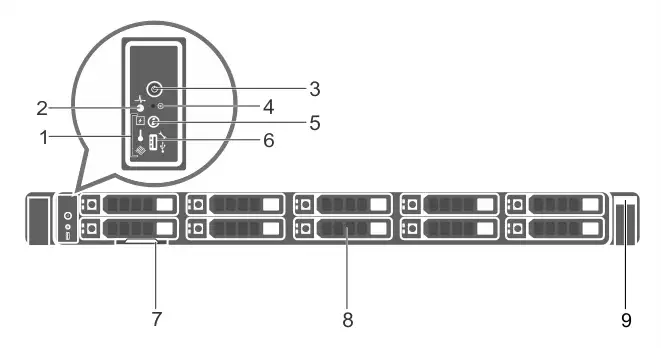

### Figure 11. Front-panel features and indicators–10 hard-drive system

<table>
  <thead>
    <tr>
      <th>Item</th>
      <th>Indicator, Button, or Connector                                          </th>
      <th>Icon</th>
      <th>Description</th>
    </tr>
  </thead>
  <tbody>
    <tr>
      <td>1</td>
      <td>Diagnostic indicators</td>
      <td> </td>
      <td>The diagnostic indicators light up to display error status.                                          </td>
    </tr>
    <tr>
      <td>2</td>
      <td>System health indicator</td>
      <td>
        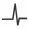
      </td>
      <td>The system health indicator blinks amber when a system fault is detected.                                          </td>
    </tr>
    <tr>
      <td>3</td>
      <td>Power-on indicator, power button                                          </td>
      <td>
        
      </td>
      <td>The power-on indicator lights when the system power is on. The power button controls the power supply output to the system.                                             <!-- --><ul><li>NOTE: On ACPI-compliant operating systems, turning off the system using the power button causes the system to perform a graceful shutdown before power to the system is turned off.                                                   </li></ul></td>
    </tr>
    <tr>
      <td>4</td>
      <td>NMI button</td>
      <td>
        
      </td>
      <td>
        
Used to troubleshoot software and device driver errors when running certain operating systems. This button can be pressed using the end of a paper clip.                                              

        
Use this button only if directed to do so by qualified support personnel or by the operating system documentation.                                             

      </td>
    </tr>
    <tr>
      <td>5</td>
      <td>System identification button</td>
      <td>
        
      </td>
      <td>The identification buttons on the front and back panels can be used to locate a particular system within a rack. When one of these buttons is pressed, the system status indicator on the back flashes until one of the buttons is pressed again.                                             
Press to toggle the system ID on and off.

 If the system stops responding during POST, press and hold the system ID button for more than five seconds to enter BIOS progress mode.                                             

To reset the iDRAC (if not disabled in F2 iDRAC setup) press and hold the button for more than 15 seconds.                                             
</td>
    </tr>
    <tr>
      <td>6</td>
      <td>Mini USB connector/iDRAC Direct</td>
      <td>
        
      </td>
      <td>Allows you to connect USB devices to the system or provides access to the iDRAC Direct features. For more information, see the Integrated Dell Remote Access Controller User's Guide at                                              <strong>dell.com/esmmanuals</strong>. The port is USB 3.0-compliant.                                          </td>
    </tr>
    <tr>
      <td>7</td>
      <td>Information tag</td>
      <td> </td>
      <td>A slide-out label panel, which allows you to record system information, such as Service Tag, NIC, and MAC address as per your need.                                          </td>
    </tr>
    <tr>
      <td>8</td>
      <td>Hard drives (10)</td>
      <td> </td>
      <td>Up to ten 2.5 inch hot-swappable hard drives. Up to six 2.5 hot-swappable hard drives and up to four 2.5 inch Dell PowerEdge Express Flash devices (PCIe SSDs).                                          </td>
    </tr>
    <tr>
      <td>9</td>
      <td>Quick Sync</td>
      <td> </td>
      <td>
        
Indicates a Quick Sync enabled system. The Quick Sync feature is optional and requires a Quick Sync bezel. This feature allows management of the system using mobile devices. This feature aggregates hardware/firmware inventory and various system level diagnostic/error information that can be used in troubleshooting the system. For more information, see the Integrated Dell Remote Access Controller User’s Guide at                                                 <strong>dell.com/esmmanuals</strong>.                                             

      </td>
    </tr>
  </tbody>
</table>

### Twenty-four hard drive system

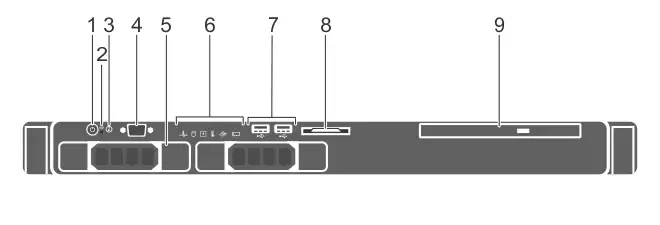

### Figure 12. Front-panel features and indicators–24 hard-drive system

<table>
  <thead>
    <tr>
      <th>Item</th>
      <th>Indicator, Button, or Connector                                          </th>
      <th>Icon</th>
      <th>Description</th>
    </tr>
  </thead>
  <tbody>
    <tr>
      <td>1</td>
      <td>Diagnostic indicators</td>
      <td> </td>
      <td>The diagnostic indicators light up to display error status.                                          </td>
    </tr>
    <tr>
      <td>2</td>
      <td>System health indicator</td>
      <td>
        
      </td>
      <td>The system health indicator blinks amber when a system fault is detected.                                          </td>
    </tr>
    <tr>
      <td>3</td>
      <td>Power-on indicator, power button                                          </td>
      <td>
        
      </td>
      <td>The power-on indicator lights when the system power is on. The power button controls the power supply output to the system.                                             <!-- --><ul><li>NOTE: On ACPI-compliant operating systems, turning off the system using the power button causes the system to perform a graceful shutdown before power to the system is turned off.                                                   </li></ul></td>
    </tr>
    <tr>
      <td>4</td>
      <td>NMI button</td>
      <td>
        
      </td>
      <td>
        
Used to troubleshoot software and device driver errors when running certain operating systems. This button can be pressed using the end of a paper clip.                                              

        
Use this button only if directed to do so by qualified support personnel or by the operating system documentation.                                             

      </td>
    </tr>
    <tr>
      <td>5</td>
      <td>System identification button</td>
      <td>
        
      </td>
      <td>The identification buttons on the front and back panels can be used to locate a particular system within a rack. When one of these buttons is pressed, the system status indicator on the back flashes until one of the buttons is pressed again.                                             
Press to toggle the system ID on and off.

 If the system stops responding during POST, press and hold the system ID button for more than five seconds to enter BIOS progress mode.                                             

To reset the iDRAC (if not disabled in F2 iDRAC setup) press and hold the button for more than 15 seconds.                                             
</td>
    </tr>
    <tr>
      <td>6</td>
      <td>Mini USB connector</td>
      <td>
        
      </td>
      <td>Allows you to connect USB devices to the system or provides access to the iDRAC Direct features. For more information, see the Integrated Dell Remote Access Controller User's Guide at                                              <strong>dell.com/esmmanuals</strong>. The port is USB 3.0-compliant.                                          </td>
    </tr>
    <tr>
      <td>7</td>
      <td>Information tag</td>
      <td> </td>
      <td>A slide-out label panel, which allows you to record system information, such as Service Tag, NIC, MAC address, and so on as per your need.                                          </td>
    </tr>
    <tr>
      <td>8</td>
      <td>Hard drives (24)</td>
      <td> </td>
      <td>Up to 24 1.8 inch hot-swappable hard drives.                                          </td>
    </tr>
    <tr>
      <td>9</td>
      <td>Quick Sync</td>
      <td> </td>
      <td>
        
Indicates a Quick Sync enabled system. The Quick Sync feature is optional and requires a Quick Sync bezel. This feature allows management of the system using mobile devices. This feature aggregates hardware/firmware inventory and various system level diagnostic/error information that can be used in troubleshooting the system. For more information, see the Integrated Dell Remote Access Controller User’s Guide at                                                 <strong>dell.com/esmmanuals</strong>.                                             

      </td>
    </tr>
  </tbody>
</table>

## Power indicator codes

An LED indicator on the power button indicates when power is supplied to the system and the system is operational. The power supplies have an indicator that shows whether power is present or whether a power fault has occurred.

* Not lit—AC power is not connected.
* Green—In standby mode, indicates that a valid AC source is connected to the power supply, and that the power supply is operational. When the system is on, it also indicates that the power supply is providing DC power to the system.
* Amber—Indicates a problem with the power supply.
* Alternating green and amber—When hot-adding a power supply, this indicates that the power supply is mismatched with the other power supply (a high output power supply and an Energy Smart power supply are installed in the same system). Replace the power supply that has the flashing indicator with a power supply that matches the capacity of the other installed power supply.

### Figure 4. Power supply status indicator

## Back panel features and indicators

### Eight hard drive system

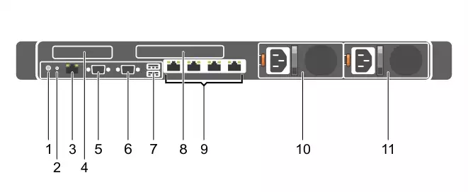

### Figure 13. Back-panel features and indicators—8 hard-drive system (2 PCIe expansion cards)

<table>
  <thead>
    <tr>
      <th>Item</th>
      <th>Indicator, Button, or Connector                                          </th>
      <th>Icon</th>
      <th>Description</th>
    </tr>
  </thead>
  <tbody>
    <tr>
      <td>1</td>
      <td>System identification button</td>
      <td>
        
      </td>
      <td>The identification buttons on the front and back panels can be used to locate a particular system within a rack. When one of these buttons is pressed, the LCD panel on the front and the system status indicator on the back blink until one of the buttons is pressed again.                                             
Press to toggle the system ID on and off. If the system stops responding during POST, press and hold the system ID button for more than five seconds to enter BIOS progress mode.                                             

To reset iDRAC (if not disabled in F2 iDRAC setup) press and hold for more than 15 seconds.                                             
</td>
    </tr>
    <tr>
      <td>2</td>
      <td>System identification connector</td>
      <td> </td>
      <td>Allows you to connect the optional system status indicator assembly through the optional cable management arm.                                          </td>
    </tr>
    <tr>
      <td>3</td>
      <td>iDRAC8 Enterprise port</td>
      <td>
        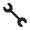
      </td>
      <td>Dedicated management port.                                             <!-- --><ul><li>NOTE: The port is available for use only if the iDRAC8 Enterprise license is installed on your system.                                                   </li></ul></td>
    </tr>
    <tr>
      <td>4</td>
      <td>PCIe expansion card slot (riser 1)                                          </td>
      <td> </td>
      <td>Allows you to connect a low profile PCIe expansion card.                                          </td>
    </tr>
    <tr>
      <td>5</td>
      <td>Serial connector</td>
      <td>
        
      </td>
      <td>Allows you to connect a serial device to the system.                                          </td>
    </tr>
    <tr>
      <td>6</td>
      <td>Video connector</td>
      <td>
        
      </td>
      <td>Allows you to connect a VGA display to the system.                                          </td>
    </tr>
    <tr>
      <td>7</td>
      <td>USB connectors (2)</td>
      <td>
        
      </td>
      <td>Allows you to connect USB devices to the system. The ports are USB 3.0-compliant.                                          </td>
    </tr>
    <tr>
      <td>8</td>
      <td>PCIe expansion card slot (riser 2)                                          </td>
      <td> </td>
      <td>Allows you to connect a full height three-fourth length PCIe expansion card.                                          </td>
    </tr>
    <tr>
      <td>9</td>
      <td>Ethernet connectors (4)</td>
      <td>
        
      </td>
      <td>Four integrated 10/100/1000 Mbps NIC connectors                                              
or 
Four integrated connectors:                                              <!-- --><ul><li>Two integrated 10/100/1000 Mbps NIC connectors </li><li>Two integrated 100 Mbps/1 Gbps/10 Gbps SFP+ connectors</li></ul></td>
    </tr>
    <tr>
      <td>10</td>
      <td>Power supply (PSU1)</td>
      <td> </td>
      <td>
        <table>
          <colgroup>
            <col />
            <col />
          </colgroup>
          <tbody>
            <tr>
              <td>
                <!-- -->AC                                                      </td>
              <td> 495 W, 750 W, or 1100 W</td>
            </tr>
            <tr>
              <td>
                <!-- -->Or                                                      </td>
              <td />
            </tr>
            <tr>
              <td>
                <!-- -->DC                                                      </td>
              <td>750 W or 1100 W</td>
            </tr>
          </tbody>
        </table>
      </td>
    </tr>
    <tr>
      <td>11</td>
      <td>Power supply (PSU2)</td>
    </tr>
  </tbody>
</table>

### Twenty-four hard drive system

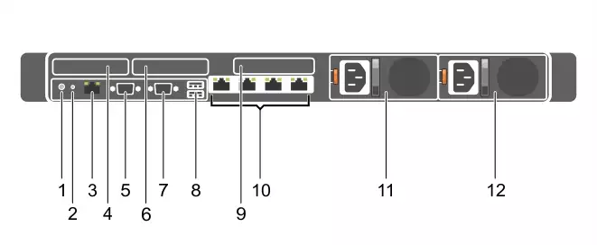

### Figure 14. Back-panel features and indicators—24 hard-drive system, 10 hard-drive system, and 8 hard-drive system (3 PCIe expansion cards)

<table>
  <thead>
    <tr>
      <th>Item</th>
      <th>Indicator, Button, or Connector                                          </th>
      <th>Icon</th>
      <th>Description</th>
    </tr>
  </thead>
  <tbody>
    <tr>
      <td>1</td>
      <td>System identification button</td>
      <td>
        
      </td>
      <td>The identification buttons on the front and back panels can be used to locate a particular system within a rack.                                              <table><colgroup><col /><col /></colgroup><tbody><tr><td><!-- -->10/24 Hard-Drive System                                                      </td><td>When one of these buttons is pressed, the system status indicator on the back flashes until one of the buttons is pressed again.                                                      </td></tr><tr><td><!-- -->8 Hard-Drive System                                                      </td><td>When one of these buttons is pressed, the LCD panel on the front and the system status indicator on the back flashes until one of the buttons is pressed again.                                                      </td></tr></tbody></table>
Press to toggle the system ID on and off. If the system stops responding during POST, press and hold the system ID button for more than five seconds to enter BIOS progress mode.                                             

To reset iDRAC (if not disabled in F2 iDRAC setup) press and hold for more than 15 seconds.                                             
</td>
    </tr>
    <tr>
      <td>2</td>
      <td>System identification connector</td>
      <td> </td>
      <td>Allows you to connect the optional system status indicator assembly through the optional cable management arm.                                          </td>
    </tr>
    <tr>
      <td>3</td>
      <td>iDRAC8 Enterprise port</td>
      <td>
        
      </td>
      <td>Dedicated management port.                                             <!-- --><ul><li>NOTE: The port is available for use only if the iDRAC8 Enterprise license is installed on your system.                                                   </li></ul></td>
    </tr>
    <tr>
      <td>4</td>
      <td>LP PCIe expansion card slot (riser 1)                                          </td>
      <td> </td>
      <td>Allows you to connect a low profile PCIe expansion card.                                          </td>
    </tr>
    <tr>
      <td>5</td>
      <td>Serial connector</td>
      <td>
        
      </td>
      <td>Allows you to connect a serial device to the system.                                          </td>
    </tr>
    <tr>
      <td>6</td>
      <td>LP PCIe expansion card slot (riser 2)                                          </td>
      <td> </td>
      <td>Allows you to connect a low profile PCIe expansion card.                                          </td>
    </tr>
    <tr>
      <td>7</td>
      <td>Video connector</td>
      <td>
        
      </td>
      <td>Allows you to connect a VGA display to the system.                                          </td>
    </tr>
    <tr>
      <td>8</td>
      <td>USB connectors (2)</td>
      <td>
        
      </td>
      <td>Allows you to connect USB devices to the system. The ports are USB 3.0-compliant.                                          </td>
    </tr>
    <tr>
      <td>9</td>
      <td>LP PCIe expansion card slot (riser 3)                                          </td>
      <td> </td>
      <td>Allows you to connect a LP PCIe expansion card.                                          </td>
    </tr>
    <tr>
      <td>10</td>
      <td>Ethernet connectors (4)</td>
      <td>
        
      </td>
      <td>Four integrated 10/100/1000 Mbps NIC connectors                                              
or 
Four integrated connectors:                                              <!-- --><ul><li>Two integrated 10/100/1000 Mbps NIC connectors </li><li>Two integrated 100 Mbps/1 Gbps/10 Gbps SFP+ connectors</li></ul></td>
    </tr>
    <tr>
      <td>11</td>
      <td>Power supply (PSU1)</td>
      <td> </td>
      <td>
        <table>
          <colgroup>
            <col />
            <col />
          </colgroup>
          <tbody>
            <tr>
              <td>
                <!-- -->AC                                                      </td>
              <td> 495 W, 750 W, or 1100 W</td>
            </tr>
            <tr>
              <td>
                <!-- -->Or                                                      </td>
              <td />
            </tr>
            <tr>
              <td>
                <!-- -->DC                                                      </td>
              <td>750 W or 1100 W </td>
            </tr>
          </tbody>
        </table>
      </td>
    </tr>
    <tr>
      <td>12</td>
      <td>Power supply (PSU2)</td>
    </tr>
  </tbody>
</table>

## Rails

The rack rail systems for the Dell PowerEdge R630 provide tool-less support for 4-post racks with square or unthreaded round mounting holes. The R630 also supports tooled mounting in 4-post threaded racks and static rail tooled mounting in 2-post (Telco) racks for added versatility.

### Sliding and static rail systems

The sliding rails for the R630 offer native support for threaded hole racks via the ReadyRails II mounting interface. The rails ship in the tool-less mounting configuration but can be converted to the tooled configuration very quickly and easily. With the sliding rails, you can fully extend a system out of the rack for servicing. Rails are available with or without the optional cable management arm (CMA).

### Figure 15. Dell PowerEdge R630 sliding rails with optional CMA

### Figure 16. Dell PowerEdge R630 static rails
