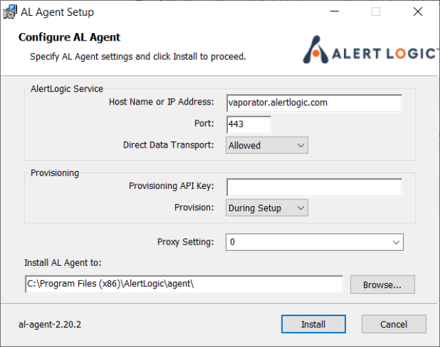

# Install the Alert Logic Agent for Windows

Alert Logic provides an agent that gathers data that Alert Logic must collect for analysis, such as log messages and network traffic, as well as metadata and host identification information. You must download the agent, and then deploy it to each host you want to monitor, or collect log messages. Alert Logic provides agents for Windows and Linux hosts. For more information, see [Requirements for the Alert Logic Agent](../requirements/agent.md#reqsAgent).

    If you have Amazon Web Services (AWS) Systems Manager managed instances, you can use [AWS Systems Manager Distributor](https://docs.aws.amazon.com/systems-manager/latest/userguide/distributor.html)     to install the  Alert Logic agent on the instances instead of installing the agent on each host manually. For more information, see [Automate Alert Logic Agent Installation with AWS Systems Manager Distributor](agent-install-automated-aws.md).    ## Download the agent

To download the agent, select the link of the desired Windows Agent Installers agent:

| Agent Installer  | Link |
|---|---|
| MSI file | [Latest Windows Agent Installer (MSI format)](https://scc.alertlogic.net/software/al_agent-LATEST.msi) |
| Compressed file | [Latest Windows Agent Installer (ZIP format)](https://scc.alertlogic.net/software/al_agent-LATEST.zip) |

## Install the agent

### Install the agent via the GUI

To install the agent:

This method does not support image capture.

1. Run the MSI package.

2. For AWS and Azure deployments, leave the **Provisioning API Key** field blank. For Data Center deployments, paste your **Unique Registration Key** in the **Provisioning API Key** field.
      If you have Data Center deployments, Alert Logic uses the Unique Registration Key to specify where the agent is located. 
To access your Unique Registration Key:   1. In the Alert Logic console, open the relevant data center deployment.
   2. Under **Configuration Overview**, click **Installation Instructions**.
   3. Copy your Unique Registration Key.
6. In **Provision**, select **During Setup**.
7. In **Proxy Setting**, select a connection method if you want traffic to pass through a proxy. You can connect via Direct Connection or a web proxy. You can also enter the URL of the proxy server.
8. Click **Install**.
9. Verify that the agent has registered with the Alert Logic console.

Agent registration can take several minutes.

### Install the agent via command prompt with image capture

To install the agent:

1. Copy the MSI file to the target machine.
2. Type the following command: 

<kbd>msiexec /i [path to MSI file] prov_key=[unique registration key] install_only=1 /q</kbd>
Your system may reboot to complete the installation. If you want to avoid the system reboot, and consequently pause the installation process until you manually reboot, append  to the command prompt: 
<kbd>REBOOT=ReallySuppress</kbd>
The system may reboot if you have previously installed the agent, if you are running a Windows Server 2019 variant, or other reasons.
   * <kbd>/i</kbd> installs the agent normally
   * <kbd>prov_key=[unique registration key]</kbd> is your Unique Registration Key. Enter this for Data Center deployments only. For AWS and Azure deployments, do not enter the key.
   * Command prompt example: 
   msiexec /i c:\downloads\al-agent-2.1.2.msi prov_key=da39EXAMPLEd3255bfef95641890dnu80799 install_only=1 /q
4. For Amazon Web Services (AWS) or Microsoft Azure deployments, type the following command: 

<kbd>msiexec /i [path to MSI file] install_only=1 /q</kbd>
Your system may reboot to complete the installation. If you want to avoid the system reboot, and consequently pause the installation process until you manually reboot, append  to the command prompt: 
<kbd>REBOOT=ReallySuppress</kbd>
The system may reboot if you have previously installed the agent, if you are running a Windows Server 2019 variant, or other reasons.
   * <kbd>/i</kbd> installs the agent normally
   * Command prompt example: 
   msiexec /i c:\downloads\al-agent-2.1.2.msi install_only=1 /q
6. For Data Center deployments, type the following command: 

<kbd>msiexec /i [path to MSI file] prov_key=[unique registration key] install_only=1 /q</kbd>
Your system may reboot to complete the installation. If you want to avoid the system reboot, and consequently pause the installation process until you manually reboot, append  to the command prompt: 
<kbd>REBOOT=ReallySuppress</kbd>
The system may reboot if you have previously installed the agent, if you are running a Windows Server 2019 variant, or other reasons.
   * <kbd>/i</kbd> installs the agent normally
   * <kbd>prov_key=[unique registration key]</kbd> is your Unique Registration Key, which is required for Data Center deployments only.
   * Command prompt example: 
   msiexec /i c:\downloads\al-agent-2.1.2.msi prov_key=da39EXAMPLEd3255bfef95641890dnu80799 install_only=1 /q
8. When you are finished preparing the image, set the agent service start type to "Automatic":
sc config al_agent start= auto
Do not start the agent or reboot the image before capturing the image of your virtual machine.
If you start the agent or reboot the image before capturing the image on your virtual machine, the agent reaches out to the Alert Logic backend to be claimed.  Once claimed, the agent host identity is fixed and will be copied to any new instances spun up with this image.  To validate that claiming has not occurred (and ensure that you avoid this problem), go to the Alert Logic console and ensure the agent is not present before cloning the image.
9. (Optional) You can capture an image of the virtual machine that contains the installed agent.
10. (Optional) Start an instance of the saved image and verify that the agent has registered with the Alert Logic console.
If you need to edit your OS image at any point, you must ensure when saving that the Alert Logic agent is not registered. You can accomplish this by stopping the agent with:
<kbd>sc stop al_agent</kbd>
Then, if it is present, remove the files:
<kbd>%CommonProgramFiles(x86)%\AlertLogic\host_crt.pem</kbd>
<kbd>%CommonProgramFiles(x86)%\AlertLogic\host_key.pem</kbd>
 where %CommonProgramFiles(x86)% refers to "C:\Program Files\Common Files" for x86 versions of windows and "C:\Program Files (x86)\Common Files" for amd64 and ia64 versions.
11. Type <kbd>sc start al_agent</kbd> to start the agent.

##  (Optional) Windows command-prompt installation parameters 

To use optional command-prompt parameters during the Alert Logic agent installation, review the following:

<table>
  <col />
  <col />
  <thead>
    <tr>
      <th>Optional command-prompt parameters</th>
      <th>Description</th>
    </tr>
  </thead>
  <tbody>
    <tr>
      <td>
        <kbd>/quiet</kbd> or <kbd>/q[level]</kbd></td>
      <td>
        
Use this option to create different levels of user access. Use the following values for <kbd>[level]</kbd>:

        <ul>
          <li>
            <kbd>f</kbd> permits a full Alert Logic console mode, which shows all dialog. This value is the default setting when <kbd>/q </kbd>is omitted.</li>
          <li>
            <kbd>r</kbd> permits a reduced Alert Logic console mode, which does not show any dialog requiring user input, other than error popups. Normally, this mode shows the progress status only.</li>
          <li>
            <kbd>b</kbd> permits a basic Alert Logic console mode, which shows error popups and a simple progress bar only.</li>
          <li>
            <kbd>n</kbd> is similar to  to <kbd>/q</kbd> or <kbd>/quiet</kbd>, which does not show any Alert Logic console. </li>
        </ul>
      </td>
    </tr>
    <tr>
      <td>
        <kbd>/log [log file]</kbd> (or for a verbose log <kbd>/l*vx [log file]</kbd>)</td>
      <td>Use this option to troubleshoot installation failures. <kbd>[log file]</kbd> is the path, created by the installer, to the log file.</td>
    </tr>
    <tr>
      <td>
        <kbd>sensor_host=[host]</kbd>
      </td>
      <td>Use <kbd>[host]</kbd> to specify the IP address where the agent should forward logs.</td>
    </tr>
    <tr>
      <td>
        <kbd>sensor_port=[port]</kbd>
      </td>
      <td>Use <kbd>[port]</kbd> to specify the TCP port where the agent should connect.</td>
    </tr>
    <tr>
      <td>
        <kbd>use_proxy={0|1}</kbd>
      </td>
      <td>Use this option to specify whether the agent should use WinHTTP proxy settings.</td>
    </tr>
    <tr>
      <td>
        <kbd>installdir=[directory]</kbd>
      </td>
      <td>Use <kbd>[directory]</kbd> to specify the folder where the agent files should be installed.</td>
    </tr>
    <tr>
      <td>
        <kbd>reboot=ReallySuppress</kbd>
      </td>
      <td>Use this option to suppress any reboot prompts, leaving the installation incomplete until the next restart.</td>
    </tr>
  </tbody>
</table>## Uninstall the agent

For more information about uninstalling the Windows agent, see [Uninstall the Alert Logic Agent for Windows](alert-logic-agent-windows-uninstall.md).
